# Behavior and activity statistics

## Load library

``` r
library(here)         # Relative file path tracking

library(tidyverse)    
library(readr)        
library(dplyr)        
library(tidyr)        

library(lme4)         
library(lmerTest)     
library(glmmTMB)      

library(DHARMa)      
library(car)         
library(emmeans)     

library(vegan)        
library(dimensio)    

library(ggplot2)      
library(ggbeeswarm)
library(patchwork)
library(scales)

set.seed(67)
options(contrasts = c("contr.sum", "contr.poly"))
```

# Data pre-processing

### Behavioral data

``` r
categories_all <- list(
  control  = c(5, 8, 13, 40, 41, 42, 43),
  low_ant  = c(2, 14, 15, 16, 24, 25, 26, 27),
  high_ant = c(3, 7, 10, 18, 28, 29, 30, 31),
  low_gut  = c(1, 6, 12, 20, 21, 22, 23, 34),
  high_gut = c(4, 11, 17, 19, 32, 33),
  gut_ctrl = c(35, 36, 37, 38, 39) # 2025 dataset only
)

category_conditions <- tibble(
  treatment    = c('control', 'low_ant', 'high_ant', 'low_gut', 'high_gut', 'gut_ctrl'),
  antibiotic  = c('zero',    'low',     'high',     'low',     'high',     'zero'),
  reinoculation = c('no',      'no',      'no',       'yes',     'yes',      'yes')
)

data_list <- list()
counter <- 1
for (cat_name in names(categories_all)) {
  cat_files <- categories_all[[cat_name]]
  for (x in cat_files) {
    # Determine the experimental year based on the dish index threshold
    year <- if_else(x <= 15, 2024, 2025)
    file_name <- paste0(year, "_petridish", x, ".csv")
    full_path <- here::here("activity-and-behavior", "data", "behavior_csv_raw", file_name) 
    if (!file.exists(full_path)) {
      warning(paste("File not found:", file_name))
      next
    }
    
    df <- read_csv(full_path, show_col_types = FALSE)
    df_filtered <- df %>% filter(time < 1800) #we get exactly 30min
    
    bump_count      <- sum(df_filtered$class == 1, na.rm = TRUE)
    touch_count     <- sum(df_filtered$class == 2, na.rm = TRUE)
    avoidance_count <- sum(df_filtered$class == 5, na.rm = TRUE)
    head_count      <- sum(df_filtered$class == 6, na.rm = TRUE)
    
    data_list[[counter]] <- tibble(
      `petridish number` = x,
      treatment = cat_name,
      year = year,
      `nb of bump` = bump_count,
      `nb of avoidance` = avoidance_count,
      `nb of head-to-head` = head_count,
      `nb of touch` = touch_count
    )
    counter <- counter + 1
  }
}

if (length(data_list) > 0) {
  df_behavior <- bind_rows(data_list) %>% 
    left_join(category_conditions, by = "treatment") %>% 
    dplyr::select(
      `petridish number`, treatment, antibiotic, reinoculation, year,
      `nb of bump`, `nb of avoidance`, `nb of head-to-head`, `nb of touch`
    )
}

colnames(df_behavior)<- c("arena", "treatment", "antibiotic", "reinoculation",
                   "year", "nb.of.bump", "nb.of.avoidance", "nb.of.head.to.head",
                   "nb.of.touch")

df_behavior <- df_behavior %>%
  mutate(treatment = dplyr::recode(
      treatment,
      control  = "zero_no",
      low_ant  = "low_no",
      high_ant = "high_no",
      low_gut  = "low_yes",
      high_gut = "high_yes",
      gut_ctrl = "zero_yes"
    )
  )

df_behavior$antibiotic <- factor(df_behavior$antibiotic, levels = c("zero", "low", "high"))
df_behavior$reinoculation <- factor(df_behavior$reinoculation)
df_behavior$reinoculation <- relevel(df_behavior$reinoculation, ref = "no")
df_behavior$year <- factor(df_behavior$year)

df_behavior
```

    ## # A tibble: 42 × 9
    ##    arena treatment antibiotic reinoculation year  nb.of.bump nb.of.avoidance
    ##    <dbl> <chr>     <fct>      <fct>         <fct>      <int>           <int>
    ##  1     5 zero_no   zero       no            2024           7               0
    ##  2     8 zero_no   zero       no            2024          16               7
    ##  3    13 zero_no   zero       no            2024          10               0
    ##  4    40 zero_no   zero       no            2025           9               1
    ##  5    41 zero_no   zero       no            2025           5               3
    ##  6    42 zero_no   zero       no            2025          15               3
    ##  7    43 zero_no   zero       no            2025           6               0
    ##  8     2 low_no    low        no            2024          26               0
    ##  9    14 low_no    low        no            2024          19               2
    ## 10    15 low_no    low        no            2024          11               2
    ## # ℹ 32 more rows
    ## # ℹ 2 more variables: nb.of.head.to.head <int>, nb.of.touch <int>

### Inter-individual distance data

``` r
data_dir <- here::here("activity-and-behavior", "data", "animal_ta")
file_path <- file.path(data_dir, "inderindividual_dist.csv")
           
df_interind <- read_delim(file_path,
                       delim = ";",
                       locale = locale(decimal_mark = ","),
                       trim_ws = TRUE,
                       col_names = TRUE,
                       progress = FALSE,
                       guess_max = 2000)

colnames(df_interind)<- c("treatment", "antibiotic", "reinoculation",
                   "year", "arena", "mean.dist")

df_interind <- df_interind %>%
  mutate(treatment = factor(treatment),      
    treatment = relevel(treatment, ref = "zero_no"),
    antibiotic = factor(antibiotic, levels = c("zero", "low", "high")),
    reinoculation = factor(reinoculation),
    reinoculation = relevel(reinoculation, ref = "no"),
    year = factor(year)   
  )
df_interind
```

    ## # A tibble: 42 × 6
    ##    treatment antibiotic reinoculation year  arena mean.dist
    ##    <fct>     <fct>      <fct>         <fct> <dbl>     <dbl>
    ##  1 low_yes   low        yes           2024      1      4.46
    ##  2 low_no    low        no            2024      2      4.80
    ##  3 high_no   high       no            2024      3      5.58
    ##  4 high_yes  high       yes           2024      4      4.20
    ##  5 zero_no   zero       no            2024      5      4.64
    ##  6 low_yes   low        yes           2024      6      6.49
    ##  7 high_no   high       no            2024      7      4.09
    ##  8 zero_no   zero       no            2024      8      5.43
    ##  9 high_no   high       no            2024     10      2.42
    ## 10 high_yes  high       yes           2024     11      4.78
    ## # ℹ 32 more rows

### Activity data

``` r
data_dir <- here::here("activity-and-behavior", "data", "animal_ta")
file_path <- file.path(data_dir, "moving.csv")

df_move <- read_delim(file = file_path,
                       delim = ";",
                       locale = locale(decimal_mark = ","),
                       trim_ws = TRUE,
                       col_names = TRUE,
                       progress = FALSE,
                       guess_max = 2000)

colnames(df_move)<- c("treatment", "antibiotic", "reinoculation",
                   "year", "arena", "prop.time.moving", "average.speed")

df_move <- df_move %>%
  mutate(treatment = factor(treatment), 
    treatment = relevel(treatment, ref = "zero_no"),
    antibiotic = factor(antibiotic, levels = c("zero", "low", "high")),
    reinoculation = factor(reinoculation),
    reinoculation = relevel(reinoculation, ref = "no"),
    year = factor(year), 
    arena = factor(arena)
  )
df_move
```

    ## # A tibble: 84 × 7
    ##    treatment antibiotic reinoculation year  arena prop.time.moving average.speed
    ##    <fct>     <fct>      <fct>         <fct> <fct>            <dbl>         <dbl>
    ##  1 low_yes   low        yes           2024  1               0.0314         0.104
    ##  2 low_yes   low        yes           2024  1               0.510          0.994
    ##  3 low_no    low        no            2024  2               0.695          1.31 
    ##  4 low_no    low        no            2024  2               0.751          1.62 
    ##  5 high_no   high       no            2024  3               0.107          0.216
    ##  6 high_no   high       no            2024  3               0.561          1.03 
    ##  7 high_yes  high       yes           2024  4               0.423          0.645
    ##  8 high_yes  high       yes           2024  4               0.445          0.667
    ##  9 zero_no   zero       no            2024  5               0.238          0.412
    ## 10 zero_no   zero       no            2024  5               0.102          0.216
    ## # ℹ 74 more rows

### PCA on the 7 metrics

``` r
df_move_aggregated <- df_move %>%
  group_by(year, arena, treatment, antibiotic, reinoculation) %>%
  summarise(moy_prop_time_moving = mean(prop.time.moving, na.rm = TRUE),
    moy_average_speed    = mean(average.speed, na.rm = TRUE),
    .groups = "drop"
  ) %>%
  mutate(arena = as.numeric(as.character(arena)))

df_behavior <- df_behavior %>%
  mutate(arena = as.numeric(arena))

df_interind <- df_interind %>%
  mutate(arena = as.numeric(as.character(arena)))

df_pca_7 <- df_move_aggregated %>%
  left_join(df_behavior, by = c("year", "arena", "antibiotic", "reinoculation", "treatment")) %>%
  left_join(df_interind, by = c("year", "arena", "antibiotic", "reinoculation", "treatment")) %>%
  mutate(
    year        = factor(year),
    arena       = factor(arena),
    treatment   = factor(treatment),
    treatment   = relevel(treatment, ref = "zero_no"),
    antibiotic  = factor(antibiotic, levels = c("zero", "low", "high")),
    reinoculation = factor(reinoculation, levels = c("no", "yes"))
  )

df_pca_7
```

    ## # A tibble: 42 × 12
    ##    year  arena treatment antibiotic reinoculation moy_prop_time_moving
    ##    <fct> <fct> <fct>     <fct>      <fct>                        <dbl>
    ##  1 2024  1     low_yes   low        yes                         0.271 
    ##  2 2024  2     low_no    low        no                          0.723 
    ##  3 2024  3     high_no   high       no                          0.334 
    ##  4 2024  4     high_yes  high       yes                         0.434 
    ##  5 2024  5     zero_no   zero       no                          0.170 
    ##  6 2024  6     low_yes   low        yes                         0.0343
    ##  7 2024  7     high_no   high       no                          0.273 
    ##  8 2024  8     zero_no   zero       no                          0.677 
    ##  9 2024  10    high_no   high       no                          0.212 
    ## 10 2024  11    high_yes  high       yes                         0.498 
    ## # ℹ 32 more rows
    ## # ℹ 6 more variables: moy_average_speed <dbl>, nb.of.bump <int>,
    ## #   nb.of.avoidance <int>, nb.of.head.to.head <int>, nb.of.touch <int>,
    ## #   mean.dist <dbl>

# ==============================

Now that the data is correctly pre-processed, we can start the EDA and
the analysis

## Behavioral analysis

### Basic stats

``` r
moyenne_bump <- tapply(df_behavior$nb.of.bump, df_behavior$treatment, mean, na.rm = TRUE)
ecarts_bump <- tapply(df_behavior$nb.of.bump, df_behavior$treatment, sd, na.rm = TRUE)

resultats_bump <- data.frame(
  Moyenne = moyenne_bump,
  Ecart_Type = ecarts_bump
)

moyenne_avoidance <- tapply(df_behavior$nb.of.avoidance, df_behavior$treatment, mean, na.rm = TRUE)
ecarts_avoidance <- tapply(df_behavior$nb.of.avoidance, df_behavior$treatment, sd, na.rm = TRUE)

resultats_avoidance <- data.frame(
  Moyenne = moyenne_avoidance,
  Ecart_Type = ecarts_avoidance
)

moyenne_head_to_head <- tapply(df_behavior$nb.of.head.to.head, df_behavior$treatment, mean, na.rm = TRUE)
ecarts_head_to_head <- tapply(df_behavior$nb.of.head.to.head, df_behavior$treatment, sd, na.rm = TRUE)

resultats_head_to_head <- data.frame(
  Moyenne = moyenne_head_to_head,
  Ecart_Type = ecarts_head_to_head
)

moyenne_touch <- tapply(df_behavior$nb.of.touch, df_behavior$treatment, mean, na.rm = TRUE)
ecarts_touch <- tapply(df_behavior$nb.of.touch, df_behavior$treatment, sd, na.rm = TRUE)

resultats_touch <- data.frame(
  Moyenne = moyenne_touch,
  Ecart_Type = ecarts_touch
)

formater_stats <- function(moyenne, et) {
  paste0(round(moyenne, 1), " \u00B1 ", round(et, 1)) # \u00B1 is the symbol +/-
}

tableau_publication <- data.frame(
  Category = rownames(resultats_bump), 
  stringsAsFactors = FALSE
)

tableau_publication$`Random bump` <- formater_stats(
  moyenne_bump, 
  ecarts_bump
)

tableau_publication$`Short antennal touch` <- formater_stats(
  moyenne_touch, 
  ecarts_touch
)

tableau_publication$`Head-to-head interaction` <- formater_stats(
  moyenne_head_to_head, 
  ecarts_head_to_head
)

tableau_publication$Avoidance <- formater_stats(
  moyenne_avoidance, 
  ecarts_avoidance
)

colnames(tableau_publication)[1] <- "Treatment"

tableau_publication
```

    ##   Treatment Random bump Short antennal touch Head-to-head interaction Avoidance
    ## 1   high_no   7.1 ± 5.4             10 ± 5.2                2.9 ± 3.2 0.9 ± 1.5
    ## 2  high_yes  13.2 ± 6.1           16.7 ± 7.7                  3 ± 2.5 2.8 ± 1.6
    ## 3    low_no 12.4 ± 10.1            18 ± 11.5                  3 ± 3.5   1 ± 1.2
    ## 4   low_yes   9.5 ± 8.9          12.5 ± 10.1                0.5 ± 0.9   1 ± 1.6
    ## 5   zero_no   9.7 ± 4.3             12.4 ± 8                1.4 ± 1.1   2 ± 2.6
    ## 6  zero_yes   5.6 ± 5.5            6.6 ± 6.5                1.4 ± 1.1 0.4 ± 0.5

``` r
#Save table 
result_dir <- here::here("activity-and-behavior", "result", "behavior")

if (!dir.exists(result_dir)) {
  dir.create(result_dir, recursive = TRUE)
}
output_file_path <- file.path(result_dir, "table_behavior_stats.csv")
write.csv(tableau_publication, file = output_file_path, row.names = FALSE)
```

\#—————————————————— \## Linear mixed models (3 x 2 model) \### Single
antennal touch

``` r
aggregate(nb.of.touch ~ antibiotic, df_behavior, sum) 
```

    ##   antibiotic nb.of.touch
    ## 1       zero         120
    ## 2        low         244
    ## 3       high         180

``` r
# Full model
model_nb2_single_touch <- glmmTMB(
  nb.of.touch ~ antibiotic * reinoculation + (1 | year),
  family = nbinom2,
  data = df_behavior
)
Anova(model_nb2_single_touch, type=3)
```

    ## Analysis of Deviance Table (Type III Wald chisquare tests)
    ## 
    ## Response: nb.of.touch
    ##                             Chisq Df Pr(>Chisq)    
    ## (Intercept)              493.9995  1    < 2e-16 ***
    ## antibiotic                 3.3609  2    0.18629    
    ## reinoculation              0.5244  1    0.46896    
    ## antibiotic:reinoculation   4.6528  2    0.09765 .  
    ## ---
    ## Signif. codes:  0 '***' 0.001 '**' 0.01 '*' 0.05 '.' 0.1 ' ' 1

``` r
#Additive model
model_nb2_add_single_touch <- glmmTMB(
  nb.of.touch ~ antibiotic + reinoculation + (1 | year),
  family = nbinom2,
  data = df_behavior
)
Anova(model_nb2_add_single_touch, type = 2)
```

    ## Analysis of Deviance Table (Type II Wald chisquare tests)
    ## 
    ## Response: nb.of.touch
    ##                Chisq Df Pr(>Chisq)
    ## antibiotic    2.3044  2     0.3159
    ## reinoculation 0.3201  1     0.5716

``` r
#to test if the interaction if significant
anova(model_nb2_single_touch,model_nb2_add_single_touch)
```

    ## Data: df_behavior
    ## Models:
    ## model_nb2_add_single_touch: nb.of.touch ~ antibiotic + reinoculation + (1 | year), zi=~0, disp=~1
    ## model_nb2_single_touch: nb.of.touch ~ antibiotic * reinoculation + (1 | year), zi=~0, disp=~1
    ##                            Df    AIC    BIC  logLik deviance  Chisq Chi Df
    ## model_nb2_add_single_touch  6 306.07 316.50 -147.03   294.07              
    ## model_nb2_single_touch      8 305.68 319.58 -144.84   289.68 4.3912      2
    ##                            Pr(>Chisq)
    ## model_nb2_add_single_touch           
    ## model_nb2_single_touch         0.1113

``` r
#pairwise comparison
emm_antibio <- emmeans(model_nb2_add_single_touch, ~ antibiotic)
summary(emm_antibio, type = "response")
```

    ##  antibiotic response   SE  df asymp.LCL asymp.UCL
    ##  zero           9.75 2.19 Inf      6.28      15.1
    ##  low           15.11 2.80 Inf     10.51      21.7
    ##  high          12.94 2.60 Inf      8.74      19.2
    ## 
    ## Results are averaged over the levels of: reinoculation 
    ## Confidence level used: 0.95 
    ## Intervals are back-transformed from the log scale

``` r
pairs(emm_antibio, adjust = "tukey", type = "response") # HSD for the 3 doses
```

    ##  contrast    ratio    SE  df null z.ratio p.value
    ##  zero / low  0.645 0.187 Inf    1  -1.516  0.2834
    ##  zero / high 0.753 0.228 Inf    1  -0.935  0.6178
    ##  low / high  1.168 0.320 Inf    1   0.566  0.8383
    ## 
    ## Results are averaged over the levels of: reinoculation 
    ## P value adjustment: tukey method for comparing a family of 3 estimates 
    ## Tests are performed on the log scale

``` r
emm_reino <- emmeans(model_nb2_add_single_touch, ~ reinoculation)
summary(emm_reino, type = "response")
```

    ##  reinoculation response   SE  df asymp.LCL asymp.UCL
    ##  no                13.3 2.08 Inf      9.75      18.0
    ##  yes               11.6 2.05 Inf      8.21      16.4
    ## 
    ## Results are averaged over the levels of: antibiotic 
    ## Confidence level used: 0.95 
    ## Intervals are back-transformed from the log scale

``` r
pairs(emm_reino, type = "response")
```

    ##  contrast ratio    SE  df null z.ratio p.value
    ##  no / yes  1.14 0.271 Inf    1   0.566  0.5716
    ## 
    ## Results are averaged over the levels of: antibiotic 
    ## Tests are performed on the log scale

### Head to head interaction

``` r
aggregate(nb.of.head.to.head ~ antibiotic, df_behavior, sum)
```

    ##   antibiotic nb.of.head.to.head
    ## 1       zero                 17
    ## 2        low                 28
    ## 3       high                 41

``` r
# Full model
model_nb2_head <- glmmTMB(
  nb.of.head.to.head ~ antibiotic * reinoculation + (1 | year),
  family = nbinom2,
  data = df_behavior
)
Anova(model_nb2_head, type=3)
```

    ## Analysis of Deviance Table (Type III Wald chisquare tests)
    ## 
    ## Response: nb.of.head.to.head
    ##                           Chisq Df Pr(>Chisq)   
    ## (Intercept)              9.3001  1   0.002291 **
    ## antibiotic               5.4292  2   0.066231 . 
    ## reinoculation            2.7511  1   0.097190 . 
    ## antibiotic:reinoculation 5.4737  2   0.064774 . 
    ## ---
    ## Signif. codes:  0 '***' 0.001 '**' 0.01 '*' 0.05 '.' 0.1 ' ' 1

``` r
#Additive model
model_nb2_head_add <- glmmTMB(
  nb.of.head.to.head ~ antibiotic + reinoculation + (1 | year),
  family = nbinom2,
  data = df_behavior
)
Anova(model_nb2_head_add, type=2)
```

    ## Analysis of Deviance Table (Type II Wald chisquare tests)
    ## 
    ## Response: nb.of.head.to.head
    ##                Chisq Df Pr(>Chisq)
    ## antibiotic    3.4899  2     0.1747
    ## reinoculation 2.3287  1     0.1270

``` r
#to test if the interaction if significant
anova(model_nb2_head,model_nb2_head_add)
```

    ## Data: df_behavior
    ## Models:
    ## model_nb2_head_add: nb.of.head.to.head ~ antibiotic + reinoculation + (1 | year), zi=~0, disp=~1
    ## model_nb2_head: nb.of.head.to.head ~ antibiotic * reinoculation + (1 | year), zi=~0, disp=~1
    ##                    Df    AIC    BIC  logLik deviance  Chisq Chi Df Pr(>Chisq)  
    ## model_nb2_head_add  6 168.82 179.25 -78.411   156.82                           
    ## model_nb2_head      8 167.24 181.15 -75.622   151.24 5.5768      2    0.06152 .
    ## ---
    ## Signif. codes:  0 '***' 0.001 '**' 0.01 '*' 0.05 '.' 0.1 ' ' 1

``` r
#pairwise comparison
emm_antibio <- emmeans(model_nb2_head_add, ~ antibiotic)
summary(emm_antibio, type = "response")
```

    ##  antibiotic response    SE  df asymp.LCL asymp.UCL
    ##  zero           1.35 0.474 Inf     0.679      2.69
    ##  low            1.57 0.466 Inf     0.879      2.81
    ##  high           2.86 0.801 Inf     1.656      4.96
    ## 
    ## Results are averaged over the levels of: reinoculation 
    ## Confidence level used: 0.95 
    ## Intervals are back-transformed from the log scale

``` r
pairs(emm_antibio, adjust = "tukey", type = "response") # HSD for the 3 doses
```

    ##  contrast    ratio    SE  df null z.ratio p.value
    ##  zero / low  0.860 0.391 Inf    1  -0.332  0.9412
    ##  zero / high 0.472 0.212 Inf    1  -1.676  0.2146
    ##  low / high  0.549 0.223 Inf    1  -1.475  0.3029
    ## 
    ## Results are averaged over the levels of: reinoculation 
    ## P value adjustment: tukey method for comparing a family of 3 estimates 
    ## Tests are performed on the log scale

``` r
emm_reino <- emmeans(model_nb2_head_add, ~ reinoculation)
summary(emm_reino, type = "response")
```

    ##  reinoculation response    SE  df asymp.LCL asymp.UCL
    ##  no                2.40 0.550 Inf     1.534      3.76
    ##  yes               1.39 0.387 Inf     0.804      2.40
    ## 
    ## Results are averaged over the levels of: antibiotic 
    ## Confidence level used: 0.95 
    ## Intervals are back-transformed from the log scale

``` r
pairs(emm_reino, type = "response")
```

    ##  contrast ratio    SE  df null z.ratio p.value
    ##  no / yes  1.73 0.622 Inf    1   1.526  0.1270
    ## 
    ## Results are averaged over the levels of: antibiotic 
    ## Tests are performed on the log scale

### Avoidance

``` r
aggregate(nb.of.avoidance ~ antibiotic, df_behavior, sum) 
```

    ##   antibiotic nb.of.avoidance
    ## 1       zero              16
    ## 2        low              16
    ## 3       high              24

``` r
#Full model
model_nb2_avoid <- glmmTMB(
  nb.of.avoidance ~ antibiotic * reinoculation + (1 | year),
  family = nbinom2,
  data = df_behavior
)
Anova(model_nb2_avoid, type=3)
```

    ## Analysis of Deviance Table (Type III Wald chisquare tests)
    ## 
    ## Response: nb.of.avoidance
    ##                           Chisq Df Pr(>Chisq)  
    ## (Intercept)              0.2673  1    0.60517  
    ## antibiotic               1.3498  2    0.50920  
    ## reinoculation            0.1076  1    0.74291  
    ## antibiotic:reinoculation 6.0418  2    0.04876 *
    ## ---
    ## Signif. codes:  0 '***' 0.001 '**' 0.01 '*' 0.05 '.' 0.1 ' ' 1

``` r
#Additive model
model_nb2_add_avoid <- glmmTMB(
  nb.of.avoidance ~ antibiotic + reinoculation + (1 | year),
  family = nbinom2,
  data = df_behavior
)
Anova(model_nb2_add_avoid, type=2)
```

    ## Analysis of Deviance Table (Type II Wald chisquare tests)
    ## 
    ## Response: nb.of.avoidance
    ##                Chisq Df Pr(>Chisq)
    ## antibiotic    1.0157  2     0.6018
    ## reinoculation 0.0312  1     0.8599

``` r
#to test if the interaction if significant
anova(model_nb2_avoid, model_nb2_add_avoid)
```

    ## Data: df_behavior
    ## Models:
    ## model_nb2_add_avoid: nb.of.avoidance ~ antibiotic + reinoculation + (1 | year), zi=~0, disp=~1
    ## model_nb2_avoid: nb.of.avoidance ~ antibiotic * reinoculation + (1 | year), zi=~0, disp=~1
    ##                     Df    AIC    BIC  logLik deviance  Chisq Chi Df Pr(>Chisq)
    ## model_nb2_add_avoid  6 144.31 154.74 -66.157   132.31                         
    ## model_nb2_avoid      8 142.49 156.39 -63.243   126.49 5.8287      2    0.05424
    ##                      
    ## model_nb2_add_avoid  
    ## model_nb2_avoid     .
    ## ---
    ## Signif. codes:  0 '***' 0.001 '**' 0.01 '*' 0.05 '.' 0.1 ' ' 1

``` r
#pairwise comparison
emm_antibio <- emmeans(model_nb2_add_avoid, ~ antibiotic)
summary(emm_antibio, type = "response")
```

    ##  antibiotic response    SE  df asymp.LCL asymp.UCL
    ##  zero           1.36 0.587 Inf     0.586      3.17
    ##  low            1.00 0.378 Inf     0.477      2.10
    ##  high           1.70 0.626 Inf     0.824      3.50
    ## 
    ## Results are averaged over the levels of: reinoculation 
    ## Confidence level used: 0.95 
    ## Intervals are back-transformed from the log scale

``` r
pairs(emm_antibio, adjust = "tukey", type = "response") # HSD for the 3 doses
```

    ##  contrast    ratio    SE  df null z.ratio p.value
    ##  zero / low  1.363 0.780 Inf    1   0.541  0.8509
    ##  zero / high 0.803 0.464 Inf    1  -0.379  0.9238
    ##  low / high  0.589 0.311 Inf    1  -1.003  0.5752
    ## 
    ## Results are averaged over the levels of: reinoculation 
    ## P value adjustment: tukey method for comparing a family of 3 estimates 
    ## Tests are performed on the log scale

``` r
emm_reino <- emmeans(model_nb2_add_avoid, ~ reinoculation)
summary(emm_reino, type = "response")
```

    ##  reinoculation response    SE  df asymp.LCL asymp.UCL
    ##  no                1.27 0.387 Inf     0.698      2.31
    ##  yes               1.38 0.470 Inf     0.706      2.69
    ## 
    ## Results are averaged over the levels of: antibiotic 
    ## Confidence level used: 0.95 
    ## Intervals are back-transformed from the log scale

``` r
pairs(emm_reino, type = "response")
```

    ##  contrast ratio   SE  df null z.ratio p.value
    ##  no / yes 0.921 0.43 Inf    1  -0.177  0.8599
    ## 
    ## Results are averaged over the levels of: antibiotic 
    ## Tests are performed on the log scale

### Bumps

``` r
aggregate(nb.of.bump ~ antibiotic, df_behavior, sum) 
```

    ##   antibiotic nb.of.bump
    ## 1       zero         96
    ## 2        low        175
    ## 3       high        136

``` r
#Full model
model_nb2_bump <- glmmTMB(
  nb.of.bump ~ antibiotic * reinoculation + (1 | year),
  family = nbinom2,
  data = df_behavior
)
Anova(model_nb2_bump, type=3)
```

    ## Analysis of Deviance Table (Type III Wald chisquare tests)
    ## 
    ## Response: nb.of.bump
    ##                             Chisq Df Pr(>Chisq)    
    ## (Intercept)              208.1089  1     <2e-16 ***
    ## antibiotic                 1.2096  2     0.5462    
    ## reinoculation              0.0465  1     0.8293    
    ## antibiotic:reinoculation   3.2862  2     0.1934    
    ## ---
    ## Signif. codes:  0 '***' 0.001 '**' 0.01 '*' 0.05 '.' 0.1 ' ' 1

``` r
#Additive model
model_nb2_add_bump <- glmmTMB(
  nb.of.bump ~ antibiotic + reinoculation + (1 | year),
  family = nbinom2,
  data = df_behavior
)
Anova(model_nb2_add_bump, type = 2)
```

    ## Analysis of Deviance Table (Type II Wald chisquare tests)
    ## 
    ## Response: nb.of.bump
    ##                Chisq Df Pr(>Chisq)
    ## antibiotic    0.6976  2     0.7055
    ## reinoculation 0.0062  1     0.9370

``` r
#to test if the interaction if significant
anova(model_nb2_bump, model_nb2_add_bump)
```

    ## Data: df_behavior
    ## Models:
    ## model_nb2_add_bump: nb.of.bump ~ antibiotic + reinoculation + (1 | year), zi=~0, disp=~1
    ## model_nb2_bump: nb.of.bump ~ antibiotic * reinoculation + (1 | year), zi=~0, disp=~1
    ##                    Df    AIC    BIC  logLik deviance  Chisq Chi Df Pr(>Chisq)
    ## model_nb2_add_bump  6 286.48 296.91 -137.24   274.48                         
    ## model_nb2_bump      8 287.24 301.14 -135.62   271.24 3.2442      2     0.1975

``` r
#pairwise comparison
emm_antibio <- emmeans(model_nb2_add_bump, ~ antibiotic)
summary(emm_antibio, type = "response")
```

    ##  antibiotic response   SE  df asymp.LCL asymp.UCL
    ##  zero           8.36 2.37 Inf      4.79      14.6
    ##  low           10.95 2.58 Inf      6.90      17.4
    ##  high          10.02 2.55 Inf      6.09      16.5
    ## 
    ## Results are averaged over the levels of: reinoculation 
    ## Confidence level used: 0.95 
    ## Intervals are back-transformed from the log scale

``` r
pairs(emm_antibio, adjust = "tukey", type = "response") # HSD for the 3 doses
```

    ##  contrast    ratio    SE  df null z.ratio p.value
    ##  zero / low  0.763 0.248 Inf    1  -0.831  0.6836
    ##  zero / high 0.834 0.278 Inf    1  -0.545  0.8493
    ##  low / high  1.093 0.331 Inf    1   0.293  0.9538
    ## 
    ## Results are averaged over the levels of: reinoculation 
    ## P value adjustment: tukey method for comparing a family of 3 estimates 
    ## Tests are performed on the log scale

``` r
emm_reino <- emmeans(model_nb2_add_bump, ~ reinoculation)
summary(emm_reino, type = "response")
```

    ##  reinoculation response   SE  df asymp.LCL asymp.UCL
    ##  no                9.82 2.08 Inf      6.48      14.9
    ##  yes               9.62 2.25 Inf      6.08      15.2
    ## 
    ## Results are averaged over the levels of: antibiotic 
    ## Confidence level used: 0.95 
    ## Intervals are back-transformed from the log scale

``` r
pairs(emm_reino, type = "response")
```

    ##  contrast ratio    SE  df null z.ratio p.value
    ##  no / yes  1.02 0.266 Inf    1   0.079  0.9370
    ## 
    ## Results are averaged over the levels of: antibiotic 
    ## Tests are performed on the log scale

## Test residuals

``` r
### Function to run DHARMa diagnostics
check_my_model <- function(model, title = "Model Diagnostics") {
  cat("\n--- Diagnostics for:", title, "---\n")
  res <- simulateResiduals(fittedModel = model, plot = FALSE)
  plot(res)
  print(testDispersion(res))      # Over/Under-dispersion
  print(testZeroInflation(res))   # Zero-inflation
  print(testOutliers(res))        # Outlier detection
}

check_my_model(model_nb2_single_touch, "3x2 Single Antennal Touch")
```

    ## 
    ## --- Diagnostics for: 3x2 Single Antennal Touch ---

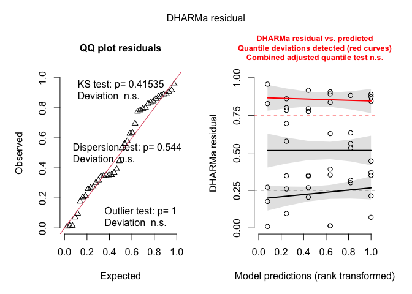<!-- -->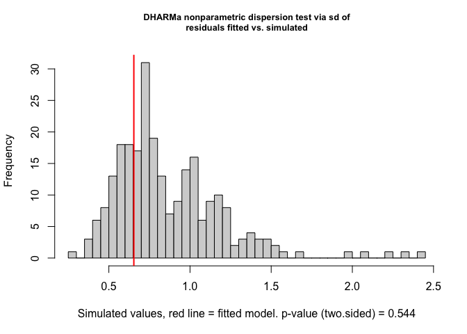<!-- -->

    ## 
    ##  DHARMa nonparametric dispersion test via sd of residuals fitted vs.
    ##  simulated
    ## 
    ## data:  simulationOutput
    ## dispersion = 0.75619, p-value = 0.544
    ## alternative hypothesis: two.sided

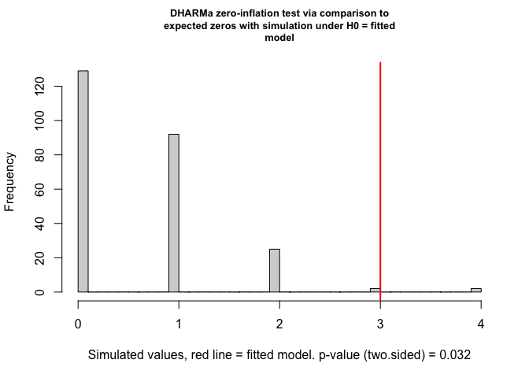<!-- -->

    ## 
    ##  DHARMa zero-inflation test via comparison to expected zeros with
    ##  simulation under H0 = fitted model
    ## 
    ## data:  simulationOutput
    ## ratioObsSim = 4.8077, p-value = 0.032
    ## alternative hypothesis: two.sided

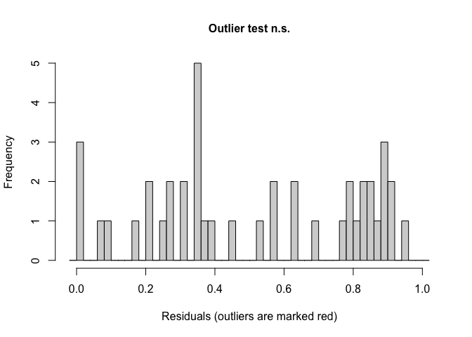<!-- -->

    ## 
    ##  DHARMa bootstrapped outlier test
    ## 
    ## data:  res
    ## outliers at both margin(s) = 0, observations = 42, p-value = 1
    ## alternative hypothesis: two.sided
    ##  percent confidence interval:
    ##  0.00000000 0.04761905
    ## sample estimates:
    ## outlier frequency (expected: 0.00904761904761905 ) 
    ##                                                  0

``` r
check_my_model(model_nb2_head, "3x2 Head to Head")
```

    ## 
    ## --- Diagnostics for: 3x2 Head to Head ---

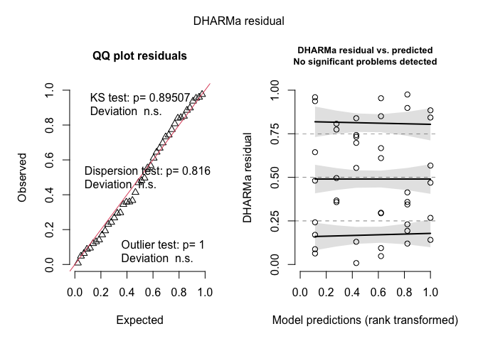<!-- -->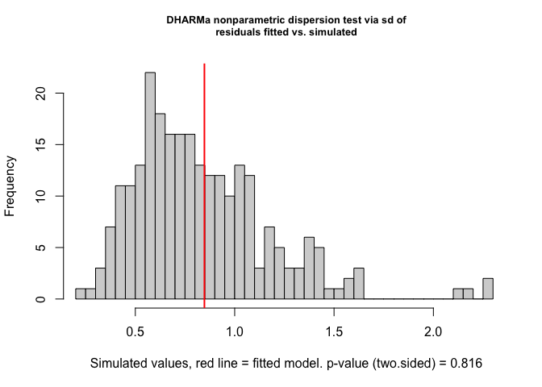<!-- -->

    ## 
    ##  DHARMa nonparametric dispersion test via sd of residuals fitted vs.
    ##  simulated
    ## 
    ## data:  simulationOutput
    ## dispersion = 1.015, p-value = 0.816
    ## alternative hypothesis: two.sided

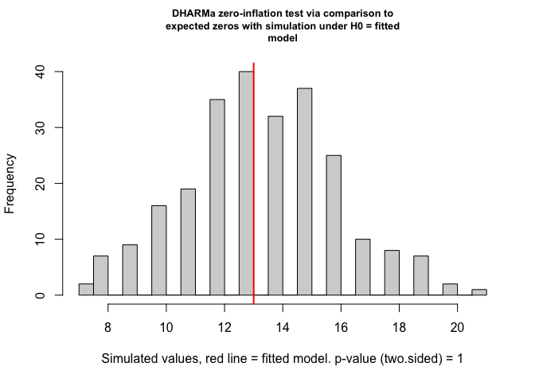<!-- -->

    ## 
    ##  DHARMa zero-inflation test via comparison to expected zeros with
    ##  simulation under H0 = fitted model
    ## 
    ## data:  simulationOutput
    ## ratioObsSim = 0.96411, p-value = 1
    ## alternative hypothesis: two.sided

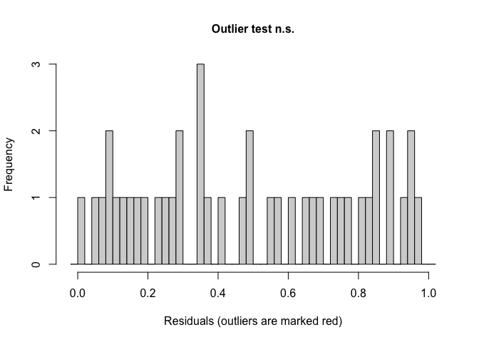<!-- -->

    ## 
    ##  DHARMa bootstrapped outlier test
    ## 
    ## data:  res
    ## outliers at both margin(s) = 0, observations = 42, p-value = 1
    ## alternative hypothesis: two.sided
    ##  percent confidence interval:
    ##  0.00000000 0.02380952
    ## sample estimates:
    ## outlier frequency (expected: 0.00404761904761905 ) 
    ##                                                  0

``` r
check_my_model(model_nb2_avoid, "3x2 Avoidance")
```

    ## 
    ## --- Diagnostics for: 3x2 Avoidance ---

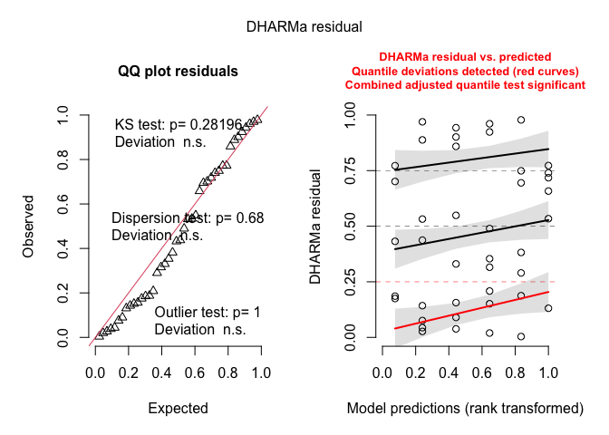<!-- -->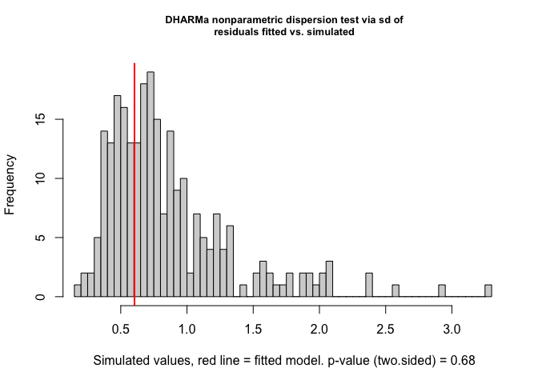<!-- -->

    ## 
    ##  DHARMa nonparametric dispersion test via sd of residuals fitted vs.
    ##  simulated
    ## 
    ## data:  simulationOutput
    ## dispersion = 0.70624, p-value = 0.68
    ## alternative hypothesis: two.sided

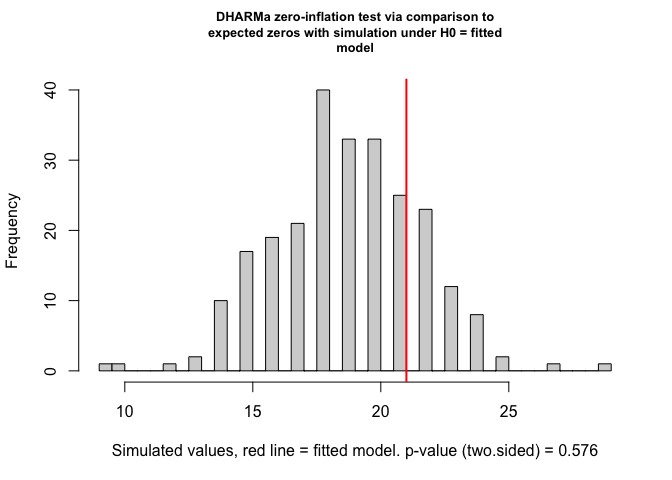<!-- -->

    ## 
    ##  DHARMa zero-inflation test via comparison to expected zeros with
    ##  simulation under H0 = fitted model
    ## 
    ## data:  simulationOutput
    ## ratioObsSim = 1.1111, p-value = 0.576
    ## alternative hypothesis: two.sided

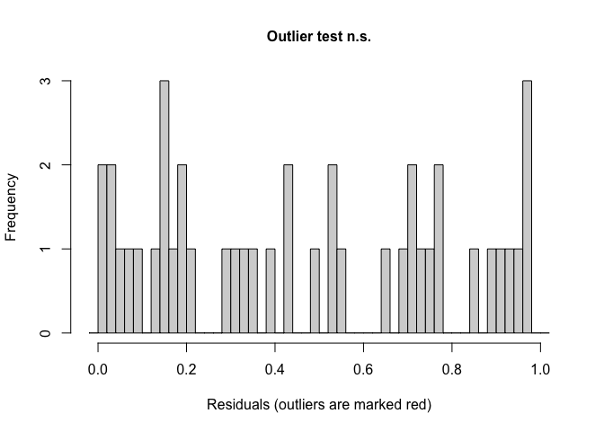<!-- -->

    ## 
    ##  DHARMa bootstrapped outlier test
    ## 
    ## data:  res
    ## outliers at both margin(s) = 0, observations = 42, p-value = 1
    ## alternative hypothesis: two.sided
    ##  percent confidence interval:
    ##  0.00000000 0.02380952
    ## sample estimates:
    ## outlier frequency (expected: 0.00476190476190476 ) 
    ##                                                  0

``` r
check_my_model(model_nb2_bump, "3x2 Bump")
```

    ## 
    ## --- Diagnostics for: 3x2 Bump ---

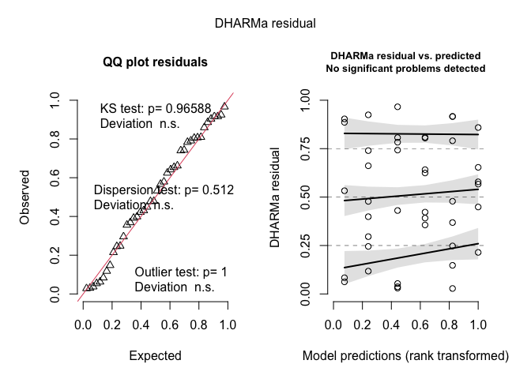<!-- -->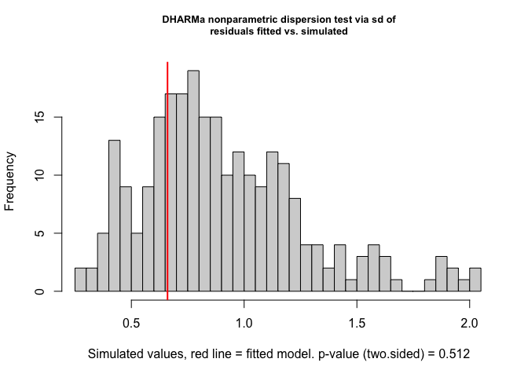<!-- -->

    ## 
    ##  DHARMa nonparametric dispersion test via sd of residuals fitted vs.
    ##  simulated
    ## 
    ## data:  simulationOutput
    ## dispersion = 0.72889, p-value = 0.512
    ## alternative hypothesis: two.sided

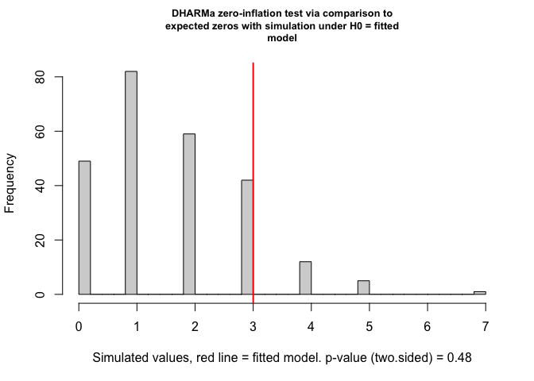<!-- -->

    ## 
    ##  DHARMa zero-inflation test via comparison to expected zeros with
    ##  simulation under H0 = fitted model
    ## 
    ## data:  simulationOutput
    ## ratioObsSim = 1.8473, p-value = 0.48
    ## alternative hypothesis: two.sided

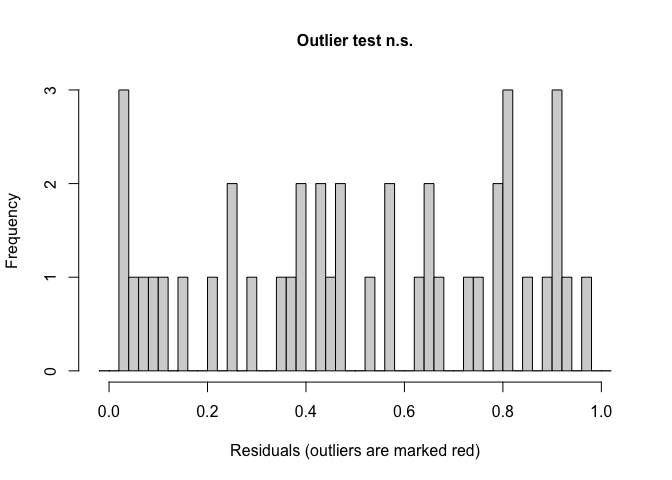<!-- -->

    ## 
    ##  DHARMa bootstrapped outlier test
    ## 
    ## data:  res
    ## outliers at both margin(s) = 0, observations = 42, p-value = 1
    ## alternative hypothesis: two.sided
    ##  percent confidence interval:
    ##  0.00000000 0.02380952
    ## sample estimates:
    ## outlier frequency (expected: 0.005 ) 
    ##                                    0

## Visualisation behaviors

``` r
### Extraction of predictions (EMMEANS) for the 4 behavioral metrics (additive model as they were the one retained)
get_emm_data <- function(model, label_name) {
  emm <- emmeans(model, ~ antibiotic + reinoculation, type = "response")
  df <- as.data.frame(emm)
  df$Behavior <- label_name
  return(df)
}

df_touch <- get_emm_data(model_nb2_single_touch, "Single Antennal Touch")
df_head  <- get_emm_data(model_nb2_head, "Head to Head")
df_avoid <- get_emm_data(model_nb2_avoid, "Avoidance")
df_bump  <- get_emm_data(model_nb2_bump, "Bump")

emm_all <- rbind(df_touch, df_head, df_avoid, df_bump)
```

### Preparation of raw data (long format)

``` r
df_behavior_long <- df_behavior %>%
  pivot_longer(
    cols = c("nb.of.touch", "nb.of.head.to.head", "nb.of.avoidance", "nb.of.bump"),
    names_to = "variable",
    values_to = "Count"
  ) %>%
  mutate(Behavior = case_when(
    variable == "nb.of.touch" ~ "Single Antennal Touch",
    variable == "nb.of.head.to.head" ~ "Head to Head",
    variable == "nb.of.avoidance" ~ "Avoidance",
    variable == "nb.of.bump" ~ "Bump"
  ))

#In order to have the right order for the plot
emm_all$Behavior <- factor(emm_all$Behavior, 
                           levels = c("Single Antennal Touch", "Bump", "Head to Head", "Avoidance"))
df_behavior_long$Behavior <- factor(df_behavior_long$Behavior, 
                             levels = c("Single Antennal Touch", "Bump","Head to Head", "Avoidance"))
```

### Boxplot

``` r
p_combined_boxplot <- ggplot(df_behavior_long, aes(x = antibiotic, y = Count, fill = reinoculation)) +
  stat_boxplot(
    geom = "errorbar",
    width = 0.1,
    linewidth = 0.5,
    position = position_dodge(0.8)
  ) +
  stat_summary(
    fun = median,
    geom = "crossbar",
    mapping = aes(ymin = after_stat(y), ymax = after_stat(y)),
    width = 0.3,
    linewidth = 0.8,
    position = position_dodge(0.8)
  ) +
  geom_point(
    shape = 21,
    colour = "black",
    stroke = 0.3,
    size = 3.5,         
    alpha = 0.9,         
    position = position_jitterdodge(jitter.width = 0.37, dodge.width = 0.8, seed = 32)
  ) +
  facet_wrap(~ Behavior, scales = "free_y") +
  scale_fill_manual(
    values = c("no" = "#4F77B4", "yes" = "#FFBF00"),
    labels = c("No", "Yes")
  ) +
  scale_x_discrete(expand = expansion(mult = c(0.05, 0.05))) +
  theme_classic() + 
  theme(
    panel.border = element_rect(color = "black", fill = NA, linewidth = 1),
    legend.position = "bottom",
    axis.text.x = element_text(margin = margin(t = 5))
  ) +
  labs(
    x = "Antibiotic dose",
    y = "Number of interactions",
    fill = "Re-inoculation"
  )

p_combined_boxplot
```

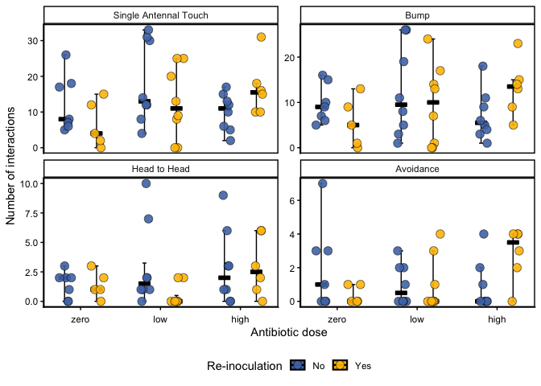<!-- -->

``` r
ggsave(
  filename = here::here("activity-and-behavior","result", "behavior","behavior_combined_3x2_boxplot.png"), 
  plot = p_combined_boxplot, 
  width = 10, 
  height = 7, 
  dpi = 300
)
```

### Model prediction plot

``` r
p_model_pred <- ggplot() +
  geom_errorbar(
    data = as.data.frame(emm_all),
    aes(x = antibiotic, ymin = asymp.LCL, ymax = asymp.UCL, group = reinoculation),
    width = 0.1, 
    linewidth = 0.5,
    position = position_dodge(0.8)
  ) +
  geom_errorbar(
    data = as.data.frame(emm_all),
    aes(x = antibiotic, ymin = response, ymax = response, group = reinoculation),
    width = 0.5, 
    linewidth = 1.2,
    position = position_dodge(0.8)
  ) +
  geom_point(
    data = df_behavior_long,
    aes(x = antibiotic, y = Count, fill = reinoculation),
    shape = 21,
    colour = "black",
    stroke = 0.3,
    size = 3.5,         
    alpha = 0.9,         
    position = position_jitterdodge(jitter.width = 0.37, dodge.width = 0.8, seed = 32)
  ) +
  facet_wrap(~ Behavior, scales = "free_y") +
  scale_fill_manual(
    values = c("no" = "#4F77B4", "yes" = "#FFBF00"),
    labels = c("No", "Yes")
  ) +
  scale_x_discrete(expand = expansion(mult = c(0.05, 0.05))) +
  theme_classic() + 
  theme(
    panel.border = element_rect(color = "black", fill = NA, linewidth = 1),
    legend.position = "bottom",
    axis.text.x = element_text(margin = margin(t = 5))
  ) +
  labs(
    x = "Antibiotic dose",
    y = "Number of interactions",
    fill = "Re-inoculation"
  )

p_model_pred
```

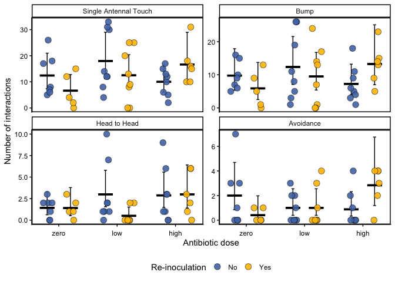<!-- -->

``` r
ggsave(
  filename = here::here("activity-and-behavior","result", "behavior","behavior_combined_3x2_model_prediction.png"), 
  plot = p_model_pred, 
  width = 10, 
  height = 7, 
  dpi = 300
)
```

## PCA on 3 x 2 model

### PCA for Treatment (3X2)

``` r
set.seed(67) 

data2 <- df_behavior[, !(names(df_behavior) %in% c("antibiotic", "reinoculation", "year", "arena"))]
head(data2)
```

    ## # A tibble: 6 × 5
    ##   treatment nb.of.bump nb.of.avoidance nb.of.head.to.head nb.of.touch
    ##   <chr>          <int>           <int>              <int>       <int>
    ## 1 zero_no            7               0                  3           5
    ## 2 zero_no           16               7                  2          26
    ## 3 zero_no           10               0                  1           8
    ## 4 zero_no            9               1                  0           7
    ## 5 zero_no            5               3                  2          17
    ## 6 zero_no           15               3                  2          18

``` r
X <- dimensio::pca(data2, center = TRUE, scale = FALSE, sup_quali = "treatment")
get_eigenvalues(X)
```

    ##    eigenvalues  variance cumulative
    ## F1  116.049596 85.627858   85.62786
    ## F2   14.336117 10.577986   96.20584
    ## F3    5.142138  3.794156  100.00000

``` r
screeplot(X, cumulative = TRUE)
```

<!-- -->

``` r
biplot(X, type = "form", labels = "variables")
```

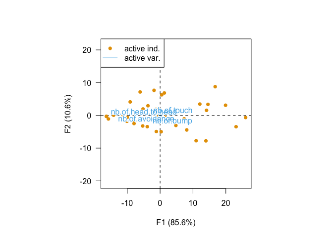<!-- -->

``` r
biplot(X, type = "covariance", labels = "variables")
```

<!-- -->

``` r
viz_variables(X)
```

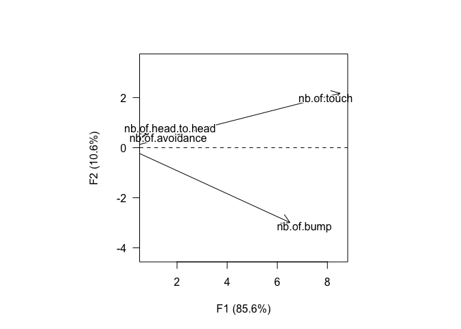<!-- -->

``` r
p1 <- viz_individuals(
  x = X,
  extra_quali = data2$treatment,
  color = c("#4477AA", "#EE6677", "#228833", "#9477AA", "#AE6677", "#E28833"),
  legend = list(x = "topright") ,
  ellipse = list(type = "tolerance", level = 0.95)
)
```

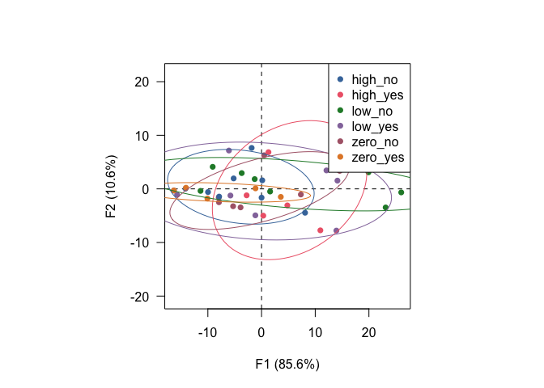<!-- -->

``` r
# Data Preparation for Vegan
stats_matrix <- data2[, sapply(data2, is.numeric)]
# Calculate Euclidean Distance Matrix // We use Euclidean because PCA preserves Euclidean distances.
dist_matrix <- vegdist(stats_matrix, method = "euclidean")

# Check for Homogeneity of Dispersion (Betadisper). This tests: "Do some groups have more variable behavior than others?" If this is significant, the groups have different shapes/spreads.
dispersion_mod <- betadisper(dist_matrix, df_behavior$treatment)
plot(dispersion_mod, main = "Multivariate Dispersion (Betadisper)")
```

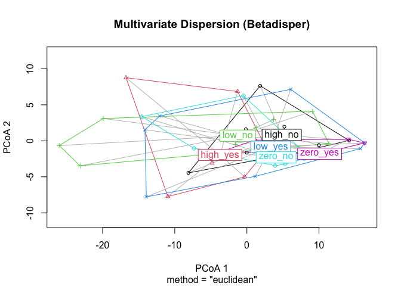<!-- -->

``` r
boxplot(dispersion_mod, main = "Distance to Centroid per Group")
```

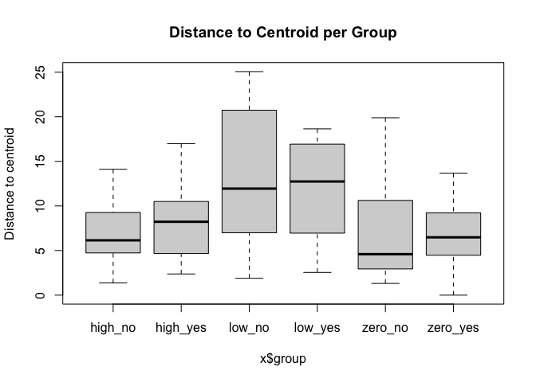<!-- -->

``` r
# BETADIASPER RESULT - Test significance of dispersion
permu_treat <- permutest(dispersion_mod, permutations = 10000)
permu_treat
```

    ## 
    ## Permutation test for homogeneity of multivariate dispersions
    ## Permutation: free
    ## Number of permutations: 10000
    ## 
    ## Response: Distances
    ##           Df  Sum Sq Mean Sq      F N.Perm Pr(>F)
    ## Groups     5  277.49  55.498 1.5102  10000 0.2102
    ## Residuals 36 1322.94  36.748

``` r
# PERMANOVA (Adonis2) "Are the centers of the groups significantly different?"
ado_treat <- adonis2(dist_matrix ~ antibiotic*reinoculation, strata=df_behavior$year, data = df_behavior, method = "euclidean", permutations = 10000)
ado_treat
```

    ## Permutation test for adonis under reduced model
    ## Blocks:  strata 
    ## Permutation: free
    ## Number of permutations: 10000
    ## 
    ## adonis2(formula = dist_matrix ~ antibiotic * reinoculation, data = df_behavior, permutations = 10000, method = "euclidean", strata = df_behavior$year)
    ##          Df SumOfSqs     R2      F Pr(>F)
    ## Model     5    895.0 0.1551 1.3217 0.2277
    ## Residual 36   4875.2 0.8449              
    ## Total    41   5770.1 1.0000

``` r
ado_ant <- adonis2(dist_matrix ~ antibiotic, strata = df_behavior$year, data = df_behavior, permutations = 10000)
ado_gut <- adonis2(dist_matrix ~ reinoculation, strata = df_behavior$year, data = df_behavior, permutations = 10000)
```

## Save result for LMM and PCA 3 x 2 model

``` r
sink(here::here("activity-and-behavior", "result", "behavior", "behavior_3x2_summary.txt"), split = TRUE)

cat("=========================================================================\n")
```

    ## =========================================================================

``` r
cat("            3 x 2 FACTORIAL MODEL — BEHAVIORAL GLMM RESULTS\n")
```

    ##             3 x 2 FACTORIAL MODEL — BEHAVIORAL GLMM RESULTS

``` r
cat("=========================================================================\n\n")
```

    ## =========================================================================

``` r
cat("\n=====================================\n")
```

    ## 
    ## =====================================

``` r
cat("--- 1. Single Antennal Touch ---\n")
```

    ## --- 1. Single Antennal Touch ---

``` r
cat("=====================================\n")
```

    ## =====================================

``` r
cat("\n[1A. Interaction & Model Comparison (LRT)]\n")
```

    ## 
    ## [1A. Interaction & Model Comparison (LRT)]

``` r
print(Anova(model_nb2_single_touch, type = "III"))
```

    ## Analysis of Deviance Table (Type III Wald chisquare tests)
    ## 
    ## Response: nb.of.touch
    ##                             Chisq Df Pr(>Chisq)    
    ## (Intercept)              493.9995  1    < 2e-16 ***
    ## antibiotic                 3.3609  2    0.18629    
    ## reinoculation              0.5244  1    0.46896    
    ## antibiotic:reinoculation   4.6528  2    0.09765 .  
    ## ---
    ## Signif. codes:  0 '***' 0.001 '**' 0.01 '*' 0.05 '.' 0.1 ' ' 1

``` r
cat("\n--> Model Comparison (Full vs Additive):\n")
```

    ## 
    ## --> Model Comparison (Full vs Additive):

``` r
print(anova(model_nb2_single_touch, model_nb2_add_single_touch))
```

    ## Data: df_behavior
    ## Models:
    ## model_nb2_add_single_touch: nb.of.touch ~ antibiotic + reinoculation + (1 | year), zi=~0, disp=~1
    ## model_nb2_single_touch: nb.of.touch ~ antibiotic * reinoculation + (1 | year), zi=~0, disp=~1
    ##                            Df    AIC    BIC  logLik deviance  Chisq Chi Df
    ## model_nb2_add_single_touch  6 306.07 316.50 -147.03   294.07              
    ## model_nb2_single_touch      8 305.68 319.58 -144.84   289.68 4.3912      2
    ##                            Pr(>Chisq)
    ## model_nb2_add_single_touch           
    ## model_nb2_single_touch         0.1113

``` r
cat("\n[1B. Main Effects Test (Additive Model Type II)]\n")
```

    ## 
    ## [1B. Main Effects Test (Additive Model Type II)]

``` r
print(Anova(model_nb2_add_single_touch, type = "II"))
```

    ## Analysis of Deviance Table (Type II Wald chisquare tests)
    ## 
    ## Response: nb.of.touch
    ##                Chisq Df Pr(>Chisq)
    ## antibiotic    2.3044  2     0.3159
    ## reinoculation 0.3201  1     0.5716

``` r
cat("\n[1C. Pairwise Comparisons: Antibiotic Doses (Tukey HSD)]\n")
```

    ## 
    ## [1C. Pairwise Comparisons: Antibiotic Doses (Tukey HSD)]

``` r
print(pairs(emmeans(model_nb2_add_single_touch, ~ antibiotic), adjust = "tukey", type = "response"))
```

    ##  contrast    ratio    SE  df null z.ratio p.value
    ##  zero / low  0.645 0.187 Inf    1  -1.516  0.2834
    ##  zero / high 0.753 0.228 Inf    1  -0.935  0.6178
    ##  low / high  1.168 0.320 Inf    1   0.566  0.8383
    ## 
    ## Results are averaged over the levels of: reinoculation 
    ## P value adjustment: tukey method for comparing a family of 3 estimates 
    ## Tests are performed on the log scale

``` r
cat("\n[1D. Pairwise Comparisons: Reinoculation (Yes vs No)]\n")
```

    ## 
    ## [1D. Pairwise Comparisons: Reinoculation (Yes vs No)]

``` r
print(pairs(emmeans(model_nb2_add_single_touch, ~ reinoculation), type = "response"))
```

    ##  contrast ratio    SE  df null z.ratio p.value
    ##  no / yes  1.14 0.271 Inf    1   0.566  0.5716
    ## 
    ## Results are averaged over the levels of: antibiotic 
    ## Tests are performed on the log scale

``` r
cat("\n=====================================\n")
```

    ## 
    ## =====================================

``` r
cat("--- 2. Head-to-Head Interaction ---\n")
```

    ## --- 2. Head-to-Head Interaction ---

``` r
cat("=====================================\n")
```

    ## =====================================

``` r
cat("\n[2A. Interaction & Model Comparison (LRT)]\n")
```

    ## 
    ## [2A. Interaction & Model Comparison (LRT)]

``` r
print(Anova(model_nb2_head, type = "III"))
```

    ## Analysis of Deviance Table (Type III Wald chisquare tests)
    ## 
    ## Response: nb.of.head.to.head
    ##                           Chisq Df Pr(>Chisq)   
    ## (Intercept)              9.3001  1   0.002291 **
    ## antibiotic               5.4292  2   0.066231 . 
    ## reinoculation            2.7511  1   0.097190 . 
    ## antibiotic:reinoculation 5.4737  2   0.064774 . 
    ## ---
    ## Signif. codes:  0 '***' 0.001 '**' 0.01 '*' 0.05 '.' 0.1 ' ' 1

``` r
cat("\n--> Model Comparison (Full vs Additive):\n")
```

    ## 
    ## --> Model Comparison (Full vs Additive):

``` r
print(anova(model_nb2_head, model_nb2_head_add))
```

    ## Data: df_behavior
    ## Models:
    ## model_nb2_head_add: nb.of.head.to.head ~ antibiotic + reinoculation + (1 | year), zi=~0, disp=~1
    ## model_nb2_head: nb.of.head.to.head ~ antibiotic * reinoculation + (1 | year), zi=~0, disp=~1
    ##                    Df    AIC    BIC  logLik deviance  Chisq Chi Df Pr(>Chisq)  
    ## model_nb2_head_add  6 168.82 179.25 -78.411   156.82                           
    ## model_nb2_head      8 167.24 181.15 -75.622   151.24 5.5768      2    0.06152 .
    ## ---
    ## Signif. codes:  0 '***' 0.001 '**' 0.01 '*' 0.05 '.' 0.1 ' ' 1

``` r
cat("\n[2B. Main Effects Test (Additive Model Type II)]\n")
```

    ## 
    ## [2B. Main Effects Test (Additive Model Type II)]

``` r
print(Anova(model_nb2_head_add, type = "II"))
```

    ## Analysis of Deviance Table (Type II Wald chisquare tests)
    ## 
    ## Response: nb.of.head.to.head
    ##                Chisq Df Pr(>Chisq)
    ## antibiotic    3.4899  2     0.1747
    ## reinoculation 2.3287  1     0.1270

``` r
cat("\n[2C. Pairwise Comparisons: Antibiotic Doses (Tukey HSD)]\n")
```

    ## 
    ## [2C. Pairwise Comparisons: Antibiotic Doses (Tukey HSD)]

``` r
print(pairs(emmeans(model_nb2_head_add, ~ antibiotic), adjust = "tukey", type = "response"))
```

    ##  contrast    ratio    SE  df null z.ratio p.value
    ##  zero / low  0.860 0.391 Inf    1  -0.332  0.9412
    ##  zero / high 0.472 0.212 Inf    1  -1.676  0.2146
    ##  low / high  0.549 0.223 Inf    1  -1.475  0.3029
    ## 
    ## Results are averaged over the levels of: reinoculation 
    ## P value adjustment: tukey method for comparing a family of 3 estimates 
    ## Tests are performed on the log scale

``` r
cat("\n[2D. Pairwise Comparisons: Reinoculation (Yes vs No)]\n")
```

    ## 
    ## [2D. Pairwise Comparisons: Reinoculation (Yes vs No)]

``` r
print(pairs(emmeans(model_nb2_head_add, ~ reinoculation), type = "response"))
```

    ##  contrast ratio    SE  df null z.ratio p.value
    ##  no / yes  1.73 0.622 Inf    1   1.526  0.1270
    ## 
    ## Results are averaged over the levels of: antibiotic 
    ## Tests are performed on the log scale

``` r
cat("\n=====================================\n")
```

    ## 
    ## =====================================

``` r
cat("--- 3. Avoidance ---\n")
```

    ## --- 3. Avoidance ---

``` r
cat("=====================================\n")
```

    ## =====================================

``` r
cat("\n[3A. Interaction & Model Comparison (LRT)]\n")
```

    ## 
    ## [3A. Interaction & Model Comparison (LRT)]

``` r
print(Anova(model_nb2_avoid, type = "III"))
```

    ## Analysis of Deviance Table (Type III Wald chisquare tests)
    ## 
    ## Response: nb.of.avoidance
    ##                           Chisq Df Pr(>Chisq)  
    ## (Intercept)              0.2673  1    0.60517  
    ## antibiotic               1.3498  2    0.50920  
    ## reinoculation            0.1076  1    0.74291  
    ## antibiotic:reinoculation 6.0418  2    0.04876 *
    ## ---
    ## Signif. codes:  0 '***' 0.001 '**' 0.01 '*' 0.05 '.' 0.1 ' ' 1

``` r
cat("\n--> Model Comparison (Full vs Additive):\n")
```

    ## 
    ## --> Model Comparison (Full vs Additive):

``` r
print(anova(model_nb2_avoid, model_nb2_add_avoid))
```

    ## Data: df_behavior
    ## Models:
    ## model_nb2_add_avoid: nb.of.avoidance ~ antibiotic + reinoculation + (1 | year), zi=~0, disp=~1
    ## model_nb2_avoid: nb.of.avoidance ~ antibiotic * reinoculation + (1 | year), zi=~0, disp=~1
    ##                     Df    AIC    BIC  logLik deviance  Chisq Chi Df Pr(>Chisq)
    ## model_nb2_add_avoid  6 144.31 154.74 -66.157   132.31                         
    ## model_nb2_avoid      8 142.49 156.39 -63.243   126.49 5.8287      2    0.05424
    ##                      
    ## model_nb2_add_avoid  
    ## model_nb2_avoid     .
    ## ---
    ## Signif. codes:  0 '***' 0.001 '**' 0.01 '*' 0.05 '.' 0.1 ' ' 1

``` r
cat("\n[3B. Main Effects Test (Additive Model Type II)]\n")
```

    ## 
    ## [3B. Main Effects Test (Additive Model Type II)]

``` r
print(Anova(model_nb2_add_avoid, type = "II"))
```

    ## Analysis of Deviance Table (Type II Wald chisquare tests)
    ## 
    ## Response: nb.of.avoidance
    ##                Chisq Df Pr(>Chisq)
    ## antibiotic    1.0157  2     0.6018
    ## reinoculation 0.0312  1     0.8599

``` r
cat("\n[3C. Pairwise Comparisons: Antibiotic Doses (Tukey HSD)]\n")
```

    ## 
    ## [3C. Pairwise Comparisons: Antibiotic Doses (Tukey HSD)]

``` r
print(pairs(emmeans(model_nb2_add_avoid, ~ antibiotic), adjust = "tukey", type = "response"))
```

    ##  contrast    ratio    SE  df null z.ratio p.value
    ##  zero / low  1.363 0.780 Inf    1   0.541  0.8509
    ##  zero / high 0.803 0.464 Inf    1  -0.379  0.9238
    ##  low / high  0.589 0.311 Inf    1  -1.003  0.5752
    ## 
    ## Results are averaged over the levels of: reinoculation 
    ## P value adjustment: tukey method for comparing a family of 3 estimates 
    ## Tests are performed on the log scale

``` r
cat("\n[3D. Pairwise Comparisons: Reinoculation (Yes vs No)]\n")
```

    ## 
    ## [3D. Pairwise Comparisons: Reinoculation (Yes vs No)]

``` r
print(pairs(emmeans(model_nb2_add_avoid, ~ reinoculation), type = "response"))
```

    ##  contrast ratio   SE  df null z.ratio p.value
    ##  no / yes 0.921 0.43 Inf    1  -0.177  0.8599
    ## 
    ## Results are averaged over the levels of: antibiotic 
    ## Tests are performed on the log scale

``` r
cat("\n=====================================\n")
```

    ## 
    ## =====================================

``` r
cat("--- 4. Bumps ---\n")
```

    ## --- 4. Bumps ---

``` r
cat("=====================================\n")
```

    ## =====================================

``` r
cat("\n[4A. Interaction & Model Comparison (LRT)]\n")
```

    ## 
    ## [4A. Interaction & Model Comparison (LRT)]

``` r
print(Anova(model_nb2_bump, type = "III"))
```

    ## Analysis of Deviance Table (Type III Wald chisquare tests)
    ## 
    ## Response: nb.of.bump
    ##                             Chisq Df Pr(>Chisq)    
    ## (Intercept)              208.1089  1     <2e-16 ***
    ## antibiotic                 1.2096  2     0.5462    
    ## reinoculation              0.0465  1     0.8293    
    ## antibiotic:reinoculation   3.2862  2     0.1934    
    ## ---
    ## Signif. codes:  0 '***' 0.001 '**' 0.01 '*' 0.05 '.' 0.1 ' ' 1

``` r
cat("\n--> Model Comparison (Full vs Additive):\n")
```

    ## 
    ## --> Model Comparison (Full vs Additive):

``` r
print(anova(model_nb2_bump, model_nb2_add_bump))
```

    ## Data: df_behavior
    ## Models:
    ## model_nb2_add_bump: nb.of.bump ~ antibiotic + reinoculation + (1 | year), zi=~0, disp=~1
    ## model_nb2_bump: nb.of.bump ~ antibiotic * reinoculation + (1 | year), zi=~0, disp=~1
    ##                    Df    AIC    BIC  logLik deviance  Chisq Chi Df Pr(>Chisq)
    ## model_nb2_add_bump  6 286.48 296.91 -137.24   274.48                         
    ## model_nb2_bump      8 287.24 301.14 -135.62   271.24 3.2442      2     0.1975

``` r
cat("\n[4B. Main Effects Test (Additive Model Type II)]\n")
```

    ## 
    ## [4B. Main Effects Test (Additive Model Type II)]

``` r
print(Anova(model_nb2_add_bump, type = "II"))
```

    ## Analysis of Deviance Table (Type II Wald chisquare tests)
    ## 
    ## Response: nb.of.bump
    ##                Chisq Df Pr(>Chisq)
    ## antibiotic    0.6976  2     0.7055
    ## reinoculation 0.0062  1     0.9370

``` r
cat("\n[4C. Pairwise Comparisons: Antibiotic Doses (Tukey HSD)]\n")
```

    ## 
    ## [4C. Pairwise Comparisons: Antibiotic Doses (Tukey HSD)]

``` r
print(pairs(emmeans(model_nb2_add_bump, ~ antibiotic), adjust = "tukey", type = "response"))
```

    ##  contrast    ratio    SE  df null z.ratio p.value
    ##  zero / low  0.763 0.248 Inf    1  -0.831  0.6836
    ##  zero / high 0.834 0.278 Inf    1  -0.545  0.8493
    ##  low / high  1.093 0.331 Inf    1   0.293  0.9538
    ## 
    ## Results are averaged over the levels of: reinoculation 
    ## P value adjustment: tukey method for comparing a family of 3 estimates 
    ## Tests are performed on the log scale

``` r
cat("\n[4D. Pairwise Comparisons: Reinoculation (Yes vs No)]\n")
```

    ## 
    ## [4D. Pairwise Comparisons: Reinoculation (Yes vs No)]

``` r
print(pairs(emmeans(model_nb2_add_bump, ~ reinoculation), type = "response"))
```

    ##  contrast ratio    SE  df null z.ratio p.value
    ##  no / yes  1.02 0.266 Inf    1   0.079  0.9370
    ## 
    ## Results are averaged over the levels of: antibiotic 
    ## Tests are performed on the log scale

``` r
cat("\n=====================================\n")
```

    ## 
    ## =====================================

``` r
cat("--- 5. PERMANOVA & PCA 3x2 ---\n")
```

    ## --- 5. PERMANOVA & PCA 3x2 ---

``` r
cat("=====================================\n")
```

    ## =====================================

``` r
cat("\n[5A. Homogeneity of Multivariate Dispersions]\n")
```

    ## 
    ## [5A. Homogeneity of Multivariate Dispersions]

``` r
print(permu_treat)
```

    ## 
    ## Permutation test for homogeneity of multivariate dispersions
    ## Permutation: free
    ## Number of permutations: 10000
    ## 
    ## Response: Distances
    ##           Df  Sum Sq Mean Sq      F N.Perm Pr(>F)
    ## Groups     5  277.49  55.498 1.5102  10000 0.2102
    ## Residuals 36 1322.94  36.748

``` r
cat("\n[5B. Global PERMANOVA (Treatment)]\n")
```

    ## 
    ## [5B. Global PERMANOVA (Treatment)]

``` r
print(ado_treat)
```

    ## Permutation test for adonis under reduced model
    ## Blocks:  strata 
    ## Permutation: free
    ## Number of permutations: 10000
    ## 
    ## adonis2(formula = dist_matrix ~ antibiotic * reinoculation, data = df_behavior, permutations = 10000, method = "euclidean", strata = df_behavior$year)
    ##          Df SumOfSqs     R2      F Pr(>F)
    ## Model     5    895.0 0.1551 1.3217 0.2277
    ## Residual 36   4875.2 0.8449              
    ## Total    41   5770.1 1.0000

``` r
cat("\n[5C. PERMANOVA (Antibiotic Main Effect)]\n")
```

    ## 
    ## [5C. PERMANOVA (Antibiotic Main Effect)]

``` r
print(ado_ant)
```

    ## Permutation test for adonis under reduced model
    ## Blocks:  strata 
    ## Permutation: free
    ## Number of permutations: 10000
    ## 
    ## adonis2(formula = dist_matrix ~ antibiotic, data = df_behavior, permutations = 10000, strata = df_behavior$year)
    ##          Df SumOfSqs      R2      F Pr(>F)
    ## Model     2    269.2 0.04666 0.9544 0.3777
    ## Residual 39   5500.9 0.95334              
    ## Total    41   5770.1 1.00000

``` r
cat("\n[5D. PERMANOVA (Reinoculation Main Effect)]\n")
```

    ## 
    ## [5D. PERMANOVA (Reinoculation Main Effect)]

``` r
print(ado_gut)
```

    ## Permutation test for adonis under reduced model
    ## Blocks:  strata 
    ## Permutation: free
    ## Number of permutations: 10000
    ## 
    ## adonis2(formula = dist_matrix ~ reinoculation, data = df_behavior, permutations = 10000, strata = df_behavior$year)
    ##          Df SumOfSqs      R2      F Pr(>F)
    ## Model     1     26.3 0.00456 0.1831 0.8215
    ## Residual 40   5743.8 0.99544              
    ## Total    41   5770.1 1.00000

``` r
sink()
```

\#—————————————————– \## Linear mixed models (2 x 2 model)

``` r
# We join togheter low and zero into the "zero category"
df_behavior_reduce <- df_behavior

df_behavior_reduce$antibiotic[df_behavior_reduce$antibiotic %in% c("low", "zero")] <- "zero"
df_behavior_reduce$antibiotic <- factor(df_behavior_reduce$antibiotic)
levels(df_behavior_reduce$antibiotic)
```

    ## [1] "zero" "high"

``` r
df_behavior_reduce$treatment <- paste(df_behavior_reduce$antibiotic, df_behavior_reduce$reinoculation, sep = "_")

#Make sure the reference is zero antibiotic and no recolonisation, year as a factor
df_behavior_reduce$antibiotic <- relevel(df_behavior_reduce$antibiotic, ref = "zero")
df_behavior_reduce$reinoculation <- relevel(df_behavior_reduce$reinoculation, ref = "no")
df_behavior_reduce$year <- factor(df_behavior_reduce$year)
```

### Single antennal touch

``` r
aggregate(nb.of.touch ~ antibiotic, df_behavior_reduce, sum) 
```

    ##   antibiotic nb.of.touch
    ## 1       zero         364
    ## 2       high         180

``` r
# Full model
model_nb2_single_touch_red <- glmmTMB(
  nb.of.touch ~ antibiotic * reinoculation + (1 | year),
  family = nbinom2,
  data = df_behavior_reduce
)
summary(model_nb2_single_touch_red)
```

    ##  Family: nbinom2  ( log )
    ## Formula:          nb.of.touch ~ antibiotic * reinoculation + (1 | year)
    ## Data: df_behavior_reduce
    ## 
    ##       AIC       BIC    logLik -2*log(L)  df.resid 
    ##     304.8     315.2    -146.4     292.8        36 
    ## 
    ## Random effects:
    ## 
    ## Conditional model:
    ##  Groups Name        Variance  Std.Dev. 
    ##  year   (Intercept) 1.357e-08 0.0001165
    ## Number of obs: 42, groups:  year, 2
    ## 
    ## Dispersion parameter for nbinom2 family (): 2.16 
    ## 
    ## Conditional model:
    ##                            Estimate Std. Error z value Pr(>|z|)    
    ## (Intercept)                 2.54394    0.12145  20.946   <2e-16 ***
    ## antibiotic1                -0.01406    0.12145  -0.116   0.9079    
    ## reinoculation1             -0.02546    0.12145  -0.210   0.8339    
    ## antibiotic1:reinoculation1  0.22995    0.12145   1.893   0.0583 .  
    ## ---
    ## Signif. codes:  0 '***' 0.001 '**' 0.01 '*' 0.05 '.' 0.1 ' ' 1

``` r
#Additive model
model_nb2_add_single_touch_red <- glmmTMB(
  nb.of.touch ~ antibiotic + reinoculation + (1 | year),
  family = nbinom2,
  data = df_behavior_reduce
)
summary(model_nb2_add_single_touch_red)
```

    ##  Family: nbinom2  ( log )
    ## Formula:          nb.of.touch ~ antibiotic + reinoculation + (1 | year)
    ## Data: df_behavior_reduce
    ## 
    ##       AIC       BIC    logLik -2*log(L)  df.resid 
    ##     306.3     315.0    -148.1     296.3        37 
    ## 
    ## Random effects:
    ## 
    ## Conditional model:
    ##  Groups Name        Variance  Std.Dev. 
    ##  year   (Intercept) 5.677e-09 7.535e-05
    ## Number of obs: 42, groups:  year, 2
    ## 
    ## Dispersion parameter for nbinom2 family (): 1.94 
    ## 
    ## Conditional model:
    ##                 Estimate Std. Error z value Pr(>|z|)    
    ## (Intercept)     2.556214   0.126246  20.248   <2e-16 ***
    ## antibiotic1    -0.002402   0.127618  -0.019    0.985    
    ## reinoculation1  0.049198   0.120915   0.407    0.684    
    ## ---
    ## Signif. codes:  0 '***' 0.001 '**' 0.01 '*' 0.05 '.' 0.1 ' ' 1

``` r
#to test if the interaction if significant
anova(model_nb2_add_single_touch_red, model_nb2_single_touch_red)
```

    ## Data: df_behavior_reduce
    ## Models:
    ## model_nb2_add_single_touch_red: nb.of.touch ~ antibiotic + reinoculation + (1 | year), zi=~0, disp=~1
    ## model_nb2_single_touch_red: nb.of.touch ~ antibiotic * reinoculation + (1 | year), zi=~0, disp=~1
    ##                                Df    AIC    BIC  logLik deviance  Chisq Chi Df
    ## model_nb2_add_single_touch_red  5 306.26 314.95 -148.13   296.26              
    ## model_nb2_single_touch_red      6 304.82 315.25 -146.41   292.82 3.4392      1
    ##                                Pr(>Chisq)  
    ## model_nb2_add_single_touch_red             
    ## model_nb2_single_touch_red        0.06367 .
    ## ---
    ## Signif. codes:  0 '***' 0.001 '**' 0.01 '*' 0.05 '.' 0.1 ' ' 1

### Head to head interaction

``` r
aggregate(nb.of.head.to.head ~ antibiotic, df_behavior_reduce, sum)
```

    ##   antibiotic nb.of.head.to.head
    ## 1       zero                 45
    ## 2       high                 41

``` r
#Full model
model_nb2_head_red <- glmmTMB(
  nb.of.head.to.head ~ antibiotic * reinoculation + (1 | year),
  family = nbinom2,
  data = df_behavior_reduce
)
summary(model_nb2_head_red)
```

    ##  Family: nbinom2  ( log )
    ## Formula:          nb.of.head.to.head ~ antibiotic * reinoculation + (1 | year)
    ## Data: df_behavior_reduce
    ## 
    ##       AIC       BIC    logLik -2*log(L)  df.resid 
    ##     166.9     177.3     -77.5     154.9        36 
    ## 
    ## Random effects:
    ## 
    ## Conditional model:
    ##  Groups Name        Variance  Std.Dev. 
    ##  year   (Intercept) 3.829e-10 1.957e-05
    ## Number of obs: 42, groups:  year, 2
    ## 
    ## Dispersion parameter for nbinom2 family (): 1.49 
    ## 
    ## Conditional model:
    ##                            Estimate Std. Error z value Pr(>|z|)    
    ## (Intercept)                  0.7015     0.1787   3.926 8.64e-05 ***
    ## antibiotic1                 -0.3759     0.1787  -2.103   0.0354 *  
    ## reinoculation1               0.2357     0.1787   1.319   0.1871    
    ## antibiotic1:reinoculation1   0.2570     0.1787   1.438   0.1504    
    ## ---
    ## Signif. codes:  0 '***' 0.001 '**' 0.01 '*' 0.05 '.' 0.1 ' ' 1

``` r
#Additive model
model_nb2_add_head_red <- glmmTMB(
  nb.of.head.to.head ~ antibiotic + reinoculation + (1 | year),
  family = nbinom2,
  data = df_behavior_reduce
)
summary(model_nb2_add_head_red)
```

    ##  Family: nbinom2  ( log )
    ## Formula:          nb.of.head.to.head ~ antibiotic + reinoculation + (1 | year)
    ## Data: df_behavior_reduce
    ## 
    ##       AIC       BIC    logLik -2*log(L)  df.resid 
    ##     166.9     175.6     -78.5     156.9        37 
    ## 
    ## Random effects:
    ## 
    ## Conditional model:
    ##  Groups Name        Variance  Std.Dev.
    ##  year   (Intercept) 4.707e-10 2.17e-05
    ## Number of obs: 42, groups:  year, 2
    ## 
    ## Dispersion parameter for nbinom2 family (): 1.35 
    ## 
    ## Conditional model:
    ##                Estimate Std. Error z value Pr(>|z|)    
    ## (Intercept)      0.7211     0.1816   3.971 7.14e-05 ***
    ## antibiotic1     -0.3315     0.1810  -1.832    0.067 .  
    ## reinoculation1   0.2798     0.1797   1.557    0.120    
    ## ---
    ## Signif. codes:  0 '***' 0.001 '**' 0.01 '*' 0.05 '.' 0.1 ' ' 1

``` r
#to test if the interaction if significant
anova(model_nb2_head_red, model_nb2_add_head_red)
```

    ## Data: df_behavior_reduce
    ## Models:
    ## model_nb2_add_head_red: nb.of.head.to.head ~ antibiotic + reinoculation + (1 | year), zi=~0, disp=~1
    ## model_nb2_head_red: nb.of.head.to.head ~ antibiotic * reinoculation + (1 | year), zi=~0, disp=~1
    ##                        Df    AIC    BIC  logLik deviance  Chisq Chi Df
    ## model_nb2_add_head_red  5 166.93 175.62 -78.465   156.93              
    ## model_nb2_head_red      6 166.90 177.33 -77.452   154.90 2.0269      1
    ##                        Pr(>Chisq)
    ## model_nb2_add_head_red           
    ## model_nb2_head_red         0.1545

### Avoidance

``` r
aggregate(nb.of.avoidance ~ antibiotic, df_behavior_reduce, sum) 
```

    ##   antibiotic nb.of.avoidance
    ## 1       zero              32
    ## 2       high              24

``` r
# Full model
model_nb2_avoid_red <- glmmTMB(
  nb.of.avoidance ~ antibiotic * reinoculation + (1 | year),
  family = nbinom2,
  data = df_behavior_reduce
)
summary(model_nb2_avoid_red)
```

    ##  Family: nbinom2  ( log )
    ## Formula:          nb.of.avoidance ~ antibiotic * reinoculation + (1 | year)
    ## Data: df_behavior_reduce
    ## 
    ##       AIC       BIC    logLik -2*log(L)  df.resid 
    ##     140.6     151.0     -64.3     128.6        36 
    ## 
    ## Random effects:
    ## 
    ## Conditional model:
    ##  Groups Name        Variance  Std.Dev. 
    ##  year   (Intercept) 8.341e-10 2.888e-05
    ## Number of obs: 42, groups:  year, 2
    ## 
    ## Dispersion parameter for nbinom2 family (): 1.04 
    ## 
    ## Conditional model:
    ##                            Estimate Std. Error z value Pr(>|z|)  
    ## (Intercept)                  0.2571     0.2190   1.174   0.2403  
    ## antibiotic1                 -0.1968     0.2190  -0.899   0.3687  
    ## reinoculation1              -0.1324     0.2190  -0.605   0.5454  
    ## antibiotic1:reinoculation1   0.4551     0.2190   2.078   0.0377 *
    ## ---
    ## Signif. codes:  0 '***' 0.001 '**' 0.01 '*' 0.05 '.' 0.1 ' ' 1

``` r
#Additive model 
model_nb2_add_avoid_red <- glmmTMB(
  nb.of.avoidance ~ antibiotic + reinoculation + (1 | year),
  family = nbinom2,
  data = df_behavior_reduce
)
summary(model_nb2_add_avoid_red)
```

    ##  Family: nbinom2  ( log )
    ## Formula:          nb.of.avoidance ~ antibiotic + reinoculation + (1 | year)
    ## Data: df_behavior_reduce
    ## 
    ##       AIC       BIC    logLik -2*log(L)  df.resid 
    ##     142.6     151.3     -66.3     132.6        37 
    ## 
    ## Random effects:
    ## 
    ## Conditional model:
    ##  Groups Name        Variance Std.Dev. 
    ##  year   (Intercept) 8.71e-10 2.951e-05
    ## Number of obs: 42, groups:  year, 2
    ## 
    ## Dispersion parameter for nbinom2 family (): 0.766 
    ## 
    ## Conditional model:
    ##                Estimate Std. Error z value Pr(>|z|)
    ## (Intercept)     0.33635    0.23063   1.458    0.145
    ## antibiotic1    -0.19948    0.23751  -0.840    0.401
    ## reinoculation1 -0.01312    0.22962  -0.057    0.954

``` r
#to test if the interaction if significant
anova(model_nb2_avoid_red, model_nb2_add_avoid_red)
```

    ## Data: df_behavior_reduce
    ## Models:
    ## model_nb2_add_avoid_red: nb.of.avoidance ~ antibiotic + reinoculation + (1 | year), zi=~0, disp=~1
    ## model_nb2_avoid_red: nb.of.avoidance ~ antibiotic * reinoculation + (1 | year), zi=~0, disp=~1
    ##                         Df    AIC   BIC  logLik deviance  Chisq Chi Df
    ## model_nb2_add_avoid_red  5 142.61 151.3 -66.304   132.61              
    ## model_nb2_avoid_red      6 140.58 151.0 -64.289   128.58 4.0286      1
    ##                         Pr(>Chisq)  
    ## model_nb2_add_avoid_red             
    ## model_nb2_avoid_red        0.04473 *
    ## ---
    ## Signif. codes:  0 '***' 0.001 '**' 0.01 '*' 0.05 '.' 0.1 ' ' 1

### Bumps

``` r
aggregate(nb.of.bump ~ antibiotic, df_behavior_reduce, sum) 
```

    ##   antibiotic nb.of.bump
    ## 1       zero        271
    ## 2       high        136

``` r
# Full model
model_nb2_bump_red <- glmmTMB(
  nb.of.bump ~ antibiotic * reinoculation + (1 | year),
  family = nbinom2,
  data = df_behavior_reduce
)
summary(model_nb2_bump_red)
```

    ##  Family: nbinom2  ( log )
    ## Formula:          nb.of.bump ~ antibiotic * reinoculation + (1 | year)
    ## Data: df_behavior_reduce
    ## 
    ##       AIC       BIC    logLik -2*log(L)  df.resid 
    ##     284.4     294.9    -136.2     272.4        36 
    ## 
    ## Random effects:
    ## 
    ## Conditional model:
    ##  Groups Name        Variance Std.Dev.
    ##  year   (Intercept) 0.02662  0.1632  
    ## Number of obs: 42, groups:  year, 2
    ## 
    ## Dispersion parameter for nbinom2 family (): 1.88 
    ## 
    ## Conditional model:
    ##                            Estimate Std. Error z value Pr(>|z|)    
    ## (Intercept)                 2.28349    0.18034  12.662   <2e-16 ***
    ## antibiotic1                -0.01737    0.13199  -0.132   0.8953    
    ## reinoculation1             -0.07239    0.13186  -0.549   0.5830    
    ## antibiotic1:reinoculation1  0.22261    0.13330   1.670   0.0949 .  
    ## ---
    ## Signif. codes:  0 '***' 0.001 '**' 0.01 '*' 0.05 '.' 0.1 ' ' 1

``` r
#Additive model
model_nb2_add_bump_red <- glmmTMB(
  nb.of.bump ~ antibiotic + reinoculation + (1 | year),
  family = nbinom2,
  data = df_behavior_reduce
)
summary(model_nb2_add_bump_red)
```

    ##  Family: nbinom2  ( log )
    ## Formula:          nb.of.bump ~ antibiotic + reinoculation + (1 | year)
    ## Data: df_behavior_reduce
    ## 
    ##       AIC       BIC    logLik -2*log(L)  df.resid 
    ##     285.2     293.9    -137.6     275.2        37 
    ## 
    ## Random effects:
    ## 
    ## Conditional model:
    ##  Groups Name        Variance Std.Dev.
    ##  year   (Intercept) 0.03744  0.1935  
    ## Number of obs: 42, groups:  year, 2
    ## 
    ## Dispersion parameter for nbinom2 family (): 1.73 
    ## 
    ## Conditional model:
    ##                 Estimate Std. Error z value Pr(>|z|)    
    ## (Intercept)     2.303056   0.197152  11.682   <2e-16 ***
    ## antibiotic1    -0.008433   0.136755  -0.062    0.951    
    ## reinoculation1 -0.001282   0.129683  -0.010    0.992    
    ## ---
    ## Signif. codes:  0 '***' 0.001 '**' 0.01 '*' 0.05 '.' 0.1 ' ' 1

``` r
#to test if the interaction if significant
anova(model_nb2_bump_red, model_nb2_add_bump_red)
```

    ## Data: df_behavior_reduce
    ## Models:
    ## model_nb2_add_bump_red: nb.of.bump ~ antibiotic + reinoculation + (1 | year), zi=~0, disp=~1
    ## model_nb2_bump_red: nb.of.bump ~ antibiotic * reinoculation + (1 | year), zi=~0, disp=~1
    ##                        Df    AIC    BIC  logLik deviance  Chisq Chi Df
    ## model_nb2_add_bump_red  5 285.17 293.85 -137.58   275.17              
    ## model_nb2_bump_red      6 284.44 294.87 -136.22   272.44 2.7239      1
    ##                        Pr(>Chisq)  
    ## model_nb2_add_bump_red             
    ## model_nb2_bump_red        0.09885 .
    ## ---
    ## Signif. codes:  0 '***' 0.001 '**' 0.01 '*' 0.05 '.' 0.1 ' ' 1

## PCA on 2 x 2 model

### PCA for Treatment (2X2)

``` r
set.seed(67) 

data2 <- df_behavior_reduce[, !(names(df_behavior_reduce) %in% c("antibiotic", "reinoculation", "year", "arena"))]
head(data2)
```

    ## # A tibble: 6 × 5
    ##   treatment nb.of.bump nb.of.avoidance nb.of.head.to.head nb.of.touch
    ##   <chr>          <int>           <int>              <int>       <int>
    ## 1 zero_no            7               0                  3           5
    ## 2 zero_no           16               7                  2          26
    ## 3 zero_no           10               0                  1           8
    ## 4 zero_no            9               1                  0           7
    ## 5 zero_no            5               3                  2          17
    ## 6 zero_no           15               3                  2          18

``` r
X <- dimensio::pca(data2, center = TRUE, scale = FALSE, sup_quali = "treatment")

get_eigenvalues(X)
```

    ##    eigenvalues  variance cumulative
    ## F1  116.049596 85.627858   85.62786
    ## F2   14.336117 10.577986   96.20584
    ## F3    5.142138  3.794156  100.00000

``` r
screeplot(X, cumulative = TRUE)
```

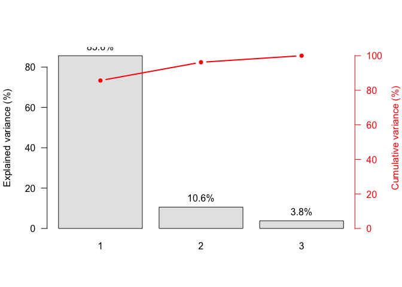<!-- -->

``` r
biplot(X, type = "form", labels = "variables")
```

<!-- -->

``` r
biplot(X, type = "covariance", labels = "variables")
```

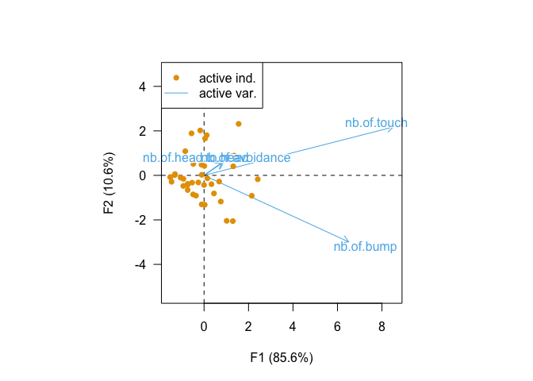<!-- -->

``` r
viz_variables(X)
```

<!-- -->

``` r
viz_individuals(
  x = X,
  extra_quali = data2$treatment,
  color = c("#4477AA", "#EE6677", "#228833", "#9477AA", "#AE6677", "#E28833"), 
  legend = list(x = "topright") ,
  ellipse = list(type = "tolerance", level = 0.95)
)
```

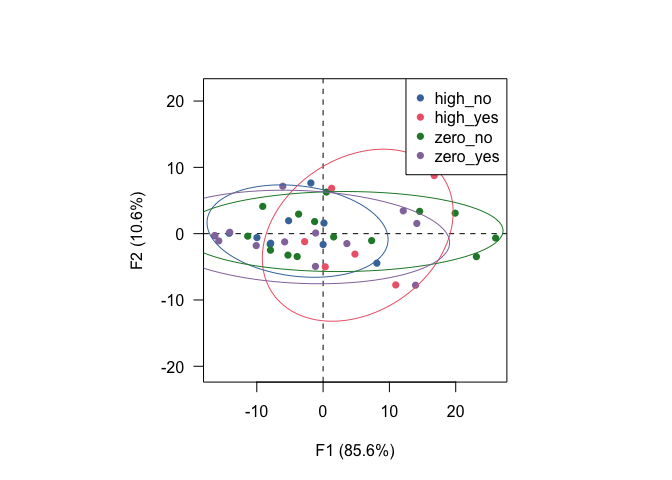<!-- -->

``` r
# Data Preparation for Vegan
stats_matrix <- data2[, sapply(data2, is.numeric)]
# Calculate Euclidean Distance Matrix // We use Euclidean because PCA preserves Euclidean distances.
dist_matrix <- vegdist(stats_matrix, method = "euclidean")

# Check for Homogeneity of Dispersion (Betadisper) "Do some groups have more variable behavior than others?" If this is significant, the groups have different shapes/spreads.
dispersion_mod <- betadisper(dist_matrix, df_behavior_reduce$treatment)
plot(dispersion_mod, main = "Multivariate Dispersion (Betadisper)")
```

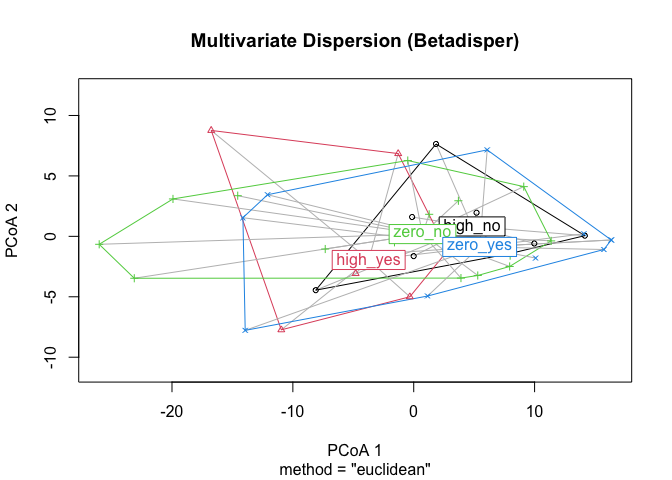<!-- -->

``` r
boxplot(dispersion_mod, main = "Distance to Centroid per Group")
```

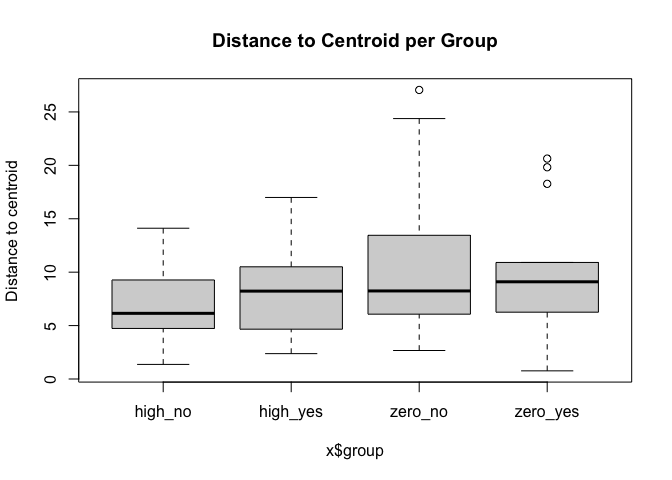<!-- -->

``` r
# BETADIASPER RESULT - Test significance of dispersion
permu_treat2x2 <- permutest(dispersion_mod, permutations = 10000)
permu_treat2x2
```

    ## 
    ## Permutation test for homogeneity of multivariate dispersions
    ## Permutation: free
    ## Number of permutations: 10000
    ## 
    ## Response: Distances
    ##           Df  Sum Sq Mean Sq      F N.Perm Pr(>F)
    ## Groups     3   97.69  32.563 0.8388  10000 0.4845
    ## Residuals 38 1475.25  38.822

``` r
# PERMANOVA (Adonis2) "Are the centers of the groups significantly different?"

ado_treat2x2 <- adonis2(dist_matrix ~ antibiotic*reinoculation, strata=df_behavior_reduce$year, data = df_behavior_reduce, method = "euclidean", permutations = 10000)
ado_treat2x2
```

    ## Permutation test for adonis under reduced model
    ## Blocks:  strata 
    ## Permutation: free
    ## Number of permutations: 10000
    ## 
    ## adonis2(formula = dist_matrix ~ antibiotic * reinoculation, data = df_behavior_reduce, permutations = 10000, method = "euclidean", strata = df_behavior_reduce$year)
    ##          Df SumOfSqs     R2      F Pr(>F)
    ## Model     3    582.2 0.1009 1.4214   0.21
    ## Residual 38   5187.9 0.8991              
    ## Total    41   5770.1 1.0000

``` r
ado_ant2x2 <- adonis2(dist_matrix ~ antibiotic, strata=df_behavior_reduce$year, data = df_behavior_reduce, method = "euclidean", permutations = 10000)
ado_gut2x2 <- adonis2(dist_matrix ~ reinoculation, strata=df_behavior_reduce$year, data = df_behavior_reduce, method = "euclidean", permutations = 10000)
```

## Save result for LMM and PCA 2 x 2 model

``` r
sink(here::here("activity-and-behavior", "result", "behavior", "behavior_2x2_summary.txt"), split = TRUE)
cat("=========================================================================\n")
```

    ## =========================================================================

``` r
cat("            2 x 2 FACTORIAL MODEL — BEHAVIORAL GLMM RESULTS\n")
```

    ##             2 x 2 FACTORIAL MODEL — BEHAVIORAL GLMM RESULTS

``` r
cat("=========================================================================\n\n")
```

    ## =========================================================================

``` r
cat("\n=====================================\n")
```

    ## 
    ## =====================================

``` r
cat("--- 1. Single Antennal Touch ---\n")
```

    ## --- 1. Single Antennal Touch ---

``` r
cat("=====================================\n")
```

    ## =====================================

``` r
cat("\n[1A. Full Model (Interaction Type III)]\n")
```

    ## 
    ## [1A. Full Model (Interaction Type III)]

``` r
print(Anova(model_nb2_single_touch_red, type = "III"))
```

    ## Analysis of Deviance Table (Type III Wald chisquare tests)
    ## 
    ## Response: nb.of.touch
    ##                             Chisq Df Pr(>Chisq)    
    ## (Intercept)              438.7479  1    < 2e-16 ***
    ## antibiotic                 0.0134  1    0.90786    
    ## reinoculation              0.0440  1    0.83393    
    ## antibiotic:reinoculation   3.5848  1    0.05831 .  
    ## ---
    ## Signif. codes:  0 '***' 0.001 '**' 0.01 '*' 0.05 '.' 0.1 ' ' 1

``` r
cat("\n[1B. Additive Model (Main Effects Type II)]\n")
```

    ## 
    ## [1B. Additive Model (Main Effects Type II)]

``` r
print(Anova(model_nb2_add_single_touch_red, type = "II"))
```

    ## Analysis of Deviance Table (Type II Wald chisquare tests)
    ## 
    ## Response: nb.of.touch
    ##                Chisq Df Pr(>Chisq)
    ## antibiotic    0.0004  1     0.9850
    ## reinoculation 0.1656  1     0.6841

``` r
cat("\n[1C. Likelihood Ratio Test (LRT)]\n")
```

    ## 
    ## [1C. Likelihood Ratio Test (LRT)]

``` r
print(anova(model_nb2_add_single_touch_red, model_nb2_single_touch_red))
```

    ## Data: df_behavior_reduce
    ## Models:
    ## model_nb2_add_single_touch_red: nb.of.touch ~ antibiotic + reinoculation + (1 | year), zi=~0, disp=~1
    ## model_nb2_single_touch_red: nb.of.touch ~ antibiotic * reinoculation + (1 | year), zi=~0, disp=~1
    ##                                Df    AIC    BIC  logLik deviance  Chisq Chi Df
    ## model_nb2_add_single_touch_red  5 306.26 314.95 -148.13   296.26              
    ## model_nb2_single_touch_red      6 304.82 315.25 -146.41   292.82 3.4392      1
    ##                                Pr(>Chisq)  
    ## model_nb2_add_single_touch_red             
    ## model_nb2_single_touch_red        0.06367 .
    ## ---
    ## Signif. codes:  0 '***' 0.001 '**' 0.01 '*' 0.05 '.' 0.1 ' ' 1

``` r
cat("\n=====================================\n")
```

    ## 
    ## =====================================

``` r
cat("--- 2. Head-to-Head Interaction ---\n")
```

    ## --- 2. Head-to-Head Interaction ---

``` r
cat("=====================================\n")
```

    ## =====================================

``` r
cat("\n[2A. Full Model (Interaction Type III)]\n")
```

    ## 
    ## [2A. Full Model (Interaction Type III)]

``` r
print(Anova(model_nb2_head_red, type = "III"))
```

    ## Analysis of Deviance Table (Type III Wald chisquare tests)
    ## 
    ## Response: nb.of.head.to.head
    ##                            Chisq Df Pr(>Chisq)    
    ## (Intercept)              15.4121  1  8.643e-05 ***
    ## antibiotic                4.4245  1    0.03543 *  
    ## reinoculation             1.7400  1    0.18714    
    ## antibiotic:reinoculation  2.0684  1    0.15038    
    ## ---
    ## Signif. codes:  0 '***' 0.001 '**' 0.01 '*' 0.05 '.' 0.1 ' ' 1

``` r
cat("\n[2B. Additive Model (Main Effects Type II)]\n")
```

    ## 
    ## [2B. Additive Model (Main Effects Type II)]

``` r
print(Anova(model_nb2_add_head_red, type = "II"))
```

    ## Analysis of Deviance Table (Type II Wald chisquare tests)
    ## 
    ## Response: nb.of.head.to.head
    ##                Chisq Df Pr(>Chisq)  
    ## antibiotic    3.3549  1     0.0670 .
    ## reinoculation 2.4237  1     0.1195  
    ## ---
    ## Signif. codes:  0 '***' 0.001 '**' 0.01 '*' 0.05 '.' 0.1 ' ' 1

``` r
cat("\n[2C. Likelihood Ratio Test (LRT)]\n")
```

    ## 
    ## [2C. Likelihood Ratio Test (LRT)]

``` r
print(anova(model_nb2_add_head_red, model_nb2_head_red))
```

    ## Data: df_behavior_reduce
    ## Models:
    ## model_nb2_add_head_red: nb.of.head.to.head ~ antibiotic + reinoculation + (1 | year), zi=~0, disp=~1
    ## model_nb2_head_red: nb.of.head.to.head ~ antibiotic * reinoculation + (1 | year), zi=~0, disp=~1
    ##                        Df    AIC    BIC  logLik deviance  Chisq Chi Df
    ## model_nb2_add_head_red  5 166.93 175.62 -78.465   156.93              
    ## model_nb2_head_red      6 166.90 177.33 -77.452   154.90 2.0269      1
    ##                        Pr(>Chisq)
    ## model_nb2_add_head_red           
    ## model_nb2_head_red         0.1545

``` r
cat("\n=====================================\n")
```

    ## 
    ## =====================================

``` r
cat("--- 3. Avoidance ---\n")
```

    ## --- 3. Avoidance ---

``` r
cat("=====================================\n")
```

    ## =====================================

``` r
cat("\n[3A. Full Model (Interaction Type III)]\n")
```

    ## 
    ## [3A. Full Model (Interaction Type III)]

``` r
print(Anova(model_nb2_avoid_red, type = "III"))
```

    ## Analysis of Deviance Table (Type III Wald chisquare tests)
    ## 
    ## Response: nb.of.avoidance
    ##                           Chisq Df Pr(>Chisq)  
    ## (Intercept)              1.3789  1    0.24029  
    ## antibiotic               0.8079  1    0.36874  
    ## reinoculation            0.3656  1    0.54540  
    ## antibiotic:reinoculation 4.3191  1    0.03769 *
    ## ---
    ## Signif. codes:  0 '***' 0.001 '**' 0.01 '*' 0.05 '.' 0.1 ' ' 1

``` r
cat("\n[3B. Additive Model (Main Effects Type II)]\n")
```

    ## 
    ## [3B. Additive Model (Main Effects Type II)]

``` r
print(Anova(model_nb2_add_avoid_red, type = "II"))
```

    ## Analysis of Deviance Table (Type II Wald chisquare tests)
    ## 
    ## Response: nb.of.avoidance
    ##                Chisq Df Pr(>Chisq)
    ## antibiotic    0.7054  1     0.4010
    ## reinoculation 0.0033  1     0.9544

``` r
cat("\n[3C. Likelihood Ratio Test (LRT)]\n")
```

    ## 
    ## [3C. Likelihood Ratio Test (LRT)]

``` r
print(anova(model_nb2_add_avoid_red, model_nb2_avoid_red))
```

    ## Data: df_behavior_reduce
    ## Models:
    ## model_nb2_add_avoid_red: nb.of.avoidance ~ antibiotic + reinoculation + (1 | year), zi=~0, disp=~1
    ## model_nb2_avoid_red: nb.of.avoidance ~ antibiotic * reinoculation + (1 | year), zi=~0, disp=~1
    ##                         Df    AIC   BIC  logLik deviance  Chisq Chi Df
    ## model_nb2_add_avoid_red  5 142.61 151.3 -66.304   132.61              
    ## model_nb2_avoid_red      6 140.58 151.0 -64.289   128.58 4.0286      1
    ##                         Pr(>Chisq)  
    ## model_nb2_add_avoid_red             
    ## model_nb2_avoid_red        0.04473 *
    ## ---
    ## Signif. codes:  0 '***' 0.001 '**' 0.01 '*' 0.05 '.' 0.1 ' ' 1

``` r
cat("\n=====================================\n")
```

    ## 
    ## =====================================

``` r
cat("--- 4. Bumps ---\n")
```

    ## --- 4. Bumps ---

``` r
cat("=====================================\n")
```

    ## =====================================

``` r
cat("\n[4A. Full Model (Interaction Type III)]\n")
```

    ## 
    ## [4A. Full Model (Interaction Type III)]

``` r
print(Anova(model_nb2_bump_red, type = "III"))
```

    ## Analysis of Deviance Table (Type III Wald chisquare tests)
    ## 
    ## Response: nb.of.bump
    ##                             Chisq Df Pr(>Chisq)    
    ## (Intercept)              160.3214  1    < 2e-16 ***
    ## antibiotic                 0.0173  1    0.89533    
    ## reinoculation              0.3014  1    0.58303    
    ## antibiotic:reinoculation   2.7889  1    0.09492 .  
    ## ---
    ## Signif. codes:  0 '***' 0.001 '**' 0.01 '*' 0.05 '.' 0.1 ' ' 1

``` r
cat("\n[4B. Additive Model (Main Effects Type II)]\n")
```

    ## 
    ## [4B. Additive Model (Main Effects Type II)]

``` r
print(Anova(model_nb2_add_bump_red, type = "II"))
```

    ## Analysis of Deviance Table (Type II Wald chisquare tests)
    ## 
    ## Response: nb.of.bump
    ##                Chisq Df Pr(>Chisq)
    ## antibiotic    0.0038  1     0.9508
    ## reinoculation 0.0001  1     0.9921

``` r
cat("\n[4C. Likelihood Ratio Test (LRT)]\n")
```

    ## 
    ## [4C. Likelihood Ratio Test (LRT)]

``` r
print(anova(model_nb2_add_bump_red, model_nb2_bump_red))
```

    ## Data: df_behavior_reduce
    ## Models:
    ## model_nb2_add_bump_red: nb.of.bump ~ antibiotic + reinoculation + (1 | year), zi=~0, disp=~1
    ## model_nb2_bump_red: nb.of.bump ~ antibiotic * reinoculation + (1 | year), zi=~0, disp=~1
    ##                        Df    AIC    BIC  logLik deviance  Chisq Chi Df
    ## model_nb2_add_bump_red  5 285.17 293.85 -137.58   275.17              
    ## model_nb2_bump_red      6 284.44 294.87 -136.22   272.44 2.7239      1
    ##                        Pr(>Chisq)  
    ## model_nb2_add_bump_red             
    ## model_nb2_bump_red        0.09885 .
    ## ---
    ## Signif. codes:  0 '***' 0.001 '**' 0.01 '*' 0.05 '.' 0.1 ' ' 1

``` r
cat("\n=====================================\n")
```

    ## 
    ## =====================================

``` r
cat("--- 5. PERMANOVA & PCA 2x2 ---\n")
```

    ## --- 5. PERMANOVA & PCA 2x2 ---

``` r
cat("=====================================\n")
```

    ## =====================================

``` r
cat("\n[5A. Homogeneity of Multivariate Dispersions]\n")
```

    ## 
    ## [5A. Homogeneity of Multivariate Dispersions]

``` r
print(permu_treat2x2)
```

    ## 
    ## Permutation test for homogeneity of multivariate dispersions
    ## Permutation: free
    ## Number of permutations: 10000
    ## 
    ## Response: Distances
    ##           Df  Sum Sq Mean Sq      F N.Perm Pr(>F)
    ## Groups     3   97.69  32.563 0.8388  10000 0.4845
    ## Residuals 38 1475.25  38.822

``` r
cat("\n[5B. Global PERMANOVA (Treatment)]\n")
```

    ## 
    ## [5B. Global PERMANOVA (Treatment)]

``` r
print(ado_treat2x2)
```

    ## Permutation test for adonis under reduced model
    ## Blocks:  strata 
    ## Permutation: free
    ## Number of permutations: 10000
    ## 
    ## adonis2(formula = dist_matrix ~ antibiotic * reinoculation, data = df_behavior_reduce, permutations = 10000, method = "euclidean", strata = df_behavior_reduce$year)
    ##          Df SumOfSqs     R2      F Pr(>F)
    ## Model     3    582.2 0.1009 1.4214   0.21
    ## Residual 38   5187.9 0.8991              
    ## Total    41   5770.1 1.0000

``` r
cat("\n[5C. PERMANOVA (Antibiotic Main Effect)]\n")
```

    ## 
    ## [5C. PERMANOVA (Antibiotic Main Effect)]

``` r
print(ado_ant2x2)
```

    ## Permutation test for adonis under reduced model
    ## Blocks:  strata 
    ## Permutation: free
    ## Number of permutations: 10000
    ## 
    ## adonis2(formula = dist_matrix ~ antibiotic, data = df_behavior_reduce, permutations = 10000, method = "euclidean", strata = df_behavior_reduce$year)
    ##          Df SumOfSqs      R2     F Pr(>F)
    ## Model     1     19.5 0.00339 0.136 0.8676
    ## Residual 40   5750.6 0.99661             
    ## Total    41   5770.1 1.00000

``` r
cat("\n[5D. PERMANOVA (Reinoculation Main Effect)]\n")
```

    ## 
    ## [5D. PERMANOVA (Reinoculation Main Effect)]

``` r
print(ado_gut2x2)
```

    ## Permutation test for adonis under reduced model
    ## Blocks:  strata 
    ## Permutation: free
    ## Number of permutations: 10000
    ## 
    ## adonis2(formula = dist_matrix ~ reinoculation, data = df_behavior_reduce, permutations = 10000, method = "euclidean", strata = df_behavior_reduce$year)
    ##          Df SumOfSqs      R2      F Pr(>F)
    ## Model     1     26.3 0.00456 0.1831 0.8215
    ## Residual 40   5743.8 0.99544              
    ## Total    41   5770.1 1.00000

``` r
cat("\n=====================================\n")
```

    ## 
    ## =====================================

``` r
cat("END OF ANALYSIS\n")
```

    ## END OF ANALYSIS

``` r
cat("=====================================\n")
```

    ## =====================================

``` r
sink()
```

\#============================== \# Analysis for interindividual data
\## Basic stats

``` r
moyenne_Mean_dist <- tapply(df_interind$mean.dist, df_interind$treatment, mean, na.rm = TRUE)
ecarts_Mean_dist <- tapply(df_interind$mean.dist, df_interind$treatment, sd, na.rm = TRUE)

resultats_mean_dist <- data.frame(
  Moyenne_cm = moyenne_Mean_dist,
  Ecart_Type_cm = ecarts_Mean_dist
)

resultats_mean_dist
```

    ##          Moyenne_cm Ecart_Type_cm
    ## zero_no    4.112153      1.118276
    ## high_no    3.619613      1.348782
    ## high_yes   4.654831      1.011918
    ## low_no     5.086799      1.326815
    ## low_yes    3.906526      1.814027
    ## zero_yes   4.765910      0.613853

``` r
#save table
dir.create(here::here("activity-and-behavior", "result", "inter_individual_dist"), recursive = TRUE, showWarnings = FALSE)

write.csv(resultats_mean_dist, here::here("activity-and-behavior", "result", "inter_individual_dist", "table_dist_interind.csv"), row.names = TRUE)
```

# LMM model on 3 x 2

``` r
hist(df_interind$mean.dist, breaks = 15)
```

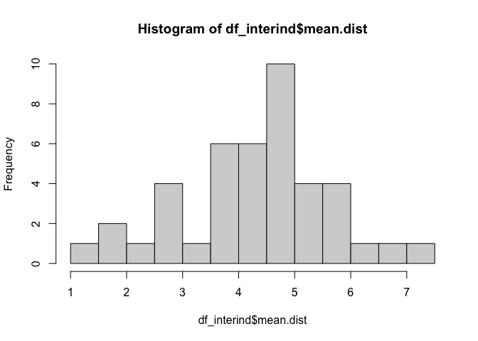<!-- -->

``` r
qqnorm(df_interind$mean.dist)
```

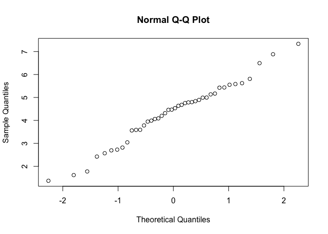<!-- -->

``` r
#fit the model
model_gauss <- lmer(mean.dist ~ antibiotic * reinoculation + (1 | year),data = df_interind)

#residuals tests
simulateResiduals(model_gauss) |> plot()
```

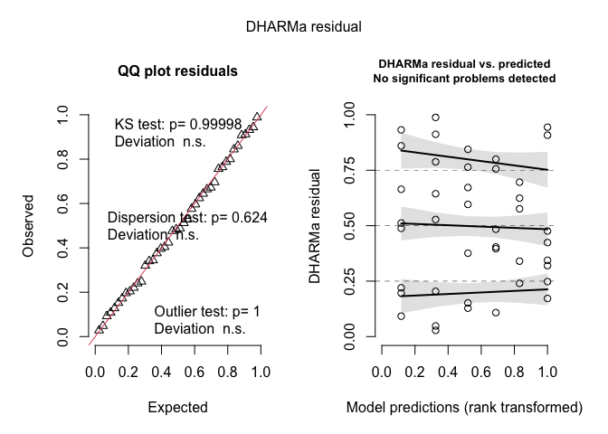<!-- -->

``` r
testDispersion(model_gauss)
```

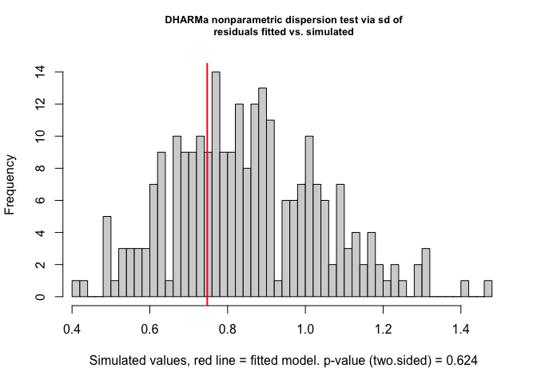<!-- -->

    ## 
    ##  DHARMa nonparametric dispersion test via sd of residuals fitted vs.
    ##  simulated
    ## 
    ## data:  simulationOutput
    ## dispersion = 0.87838, p-value = 0.624
    ## alternative hypothesis: two.sided

``` r
testResiduals(model_gauss)
```

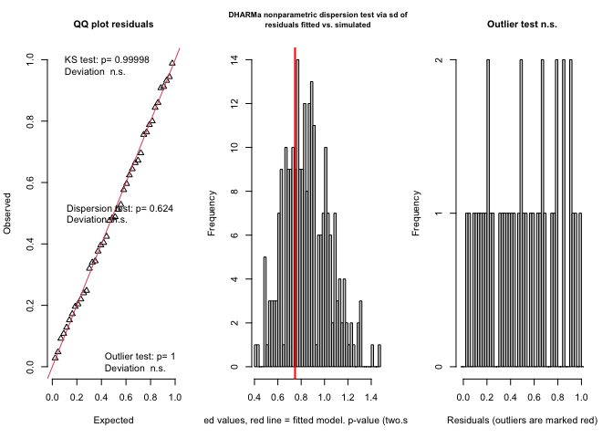<!-- -->

    ## $uniformity
    ## 
    ##  Exact one-sample Kolmogorov-Smirnov test
    ## 
    ## data:  simulationOutput$scaledResiduals
    ## D = 0.044381, p-value = 1
    ## alternative hypothesis: two-sided
    ## 
    ## 
    ## $dispersion
    ## 
    ##  DHARMa nonparametric dispersion test via sd of residuals fitted vs.
    ##  simulated
    ## 
    ## data:  simulationOutput
    ## dispersion = 0.87838, p-value = 0.624
    ## alternative hypothesis: two.sided
    ## 
    ## 
    ## $outliers
    ## 
    ##  DHARMa outlier test based on exact binomial test with approximate
    ##  expectations
    ## 
    ## data:  simulationOutput
    ## outliers at both margin(s) = 0, observations = 42, p-value = 1
    ## alternative hypothesis: true probability of success is not equal to 0.007968127
    ## 95 percent confidence interval:
    ##  0.00000000 0.08408385
    ## sample estimates:
    ## frequency of outliers (expected: 0.00796812749003984 ) 
    ##                                                      0

``` r
a1 <- Anova(model_gauss, type = "III")
a1
```

    ## Analysis of Deviance Table (Type III Wald chisquare tests)
    ## 
    ## Response: mean.dist
    ##                             Chisq Df Pr(>Chisq)    
    ## (Intercept)              250.7874  1    < 2e-16 ***
    ## antibiotic                 0.6479  2    0.72330    
    ## reinoculation              0.2505  1    0.61675    
    ## antibiotic:reinoculation   6.3745  2    0.04128 *  
    ## ---
    ## Signif. codes:  0 '***' 0.001 '**' 0.01 '*' 0.05 '.' 0.1 ' ' 1

``` r
#Additive Model
model_gauss_add <- lmer(mean.dist ~ antibiotic + reinoculation + (1 | year), data = df_interind)

a2 <- Anova(model_gauss_add, type = "II")
a2
```

    ## Analysis of Deviance Table (Type II Wald chisquare tests)
    ## 
    ## Response: mean.dist
    ##                Chisq Df Pr(>Chisq)
    ## antibiotic    0.7539  2     0.6860
    ## reinoculation 0.0273  1     0.8687

``` r
#to test if the interaction if significant
anova(model_gauss_add, model_gauss)  #Here the interaction model is a better fit
```

    ## Data: df_interind
    ## Models:
    ## model_gauss_add: mean.dist ~ antibiotic + reinoculation + (1 | year)
    ## model_gauss: mean.dist ~ antibiotic * reinoculation + (1 | year)
    ##                 npar    AIC    BIC  logLik -2*log(L) Chisq Df Pr(>Chisq)  
    ## model_gauss_add    6 154.21 164.64 -71.107    142.21                      
    ## model_gauss        8 151.70 165.60 -67.850    135.70 6.515  2    0.03848 *
    ## ---
    ## Signif. codes:  0 '***' 0.001 '**' 0.01 '*' 0.05 '.' 0.1 ' ' 1

``` r
emm <- emmeans(model_gauss, ~ antibiotic * reinoculation)
pairs(emm, by = "antibiotic")
```

    ## antibiotic = zero:
    ##  contrast estimate    SE   df t.ratio p.value
    ##  no - yes   -0.752 0.827 35.9  -0.909  0.3694
    ## 
    ## antibiotic = low:
    ##  contrast estimate    SE   df t.ratio p.value
    ##  no - yes    1.180 0.651 35.0   1.812  0.0785
    ## 
    ## antibiotic = high:
    ##  contrast estimate    SE   df t.ratio p.value
    ##  no - yes   -1.045 0.704 35.0  -1.484  0.1468
    ## 
    ## Degrees-of-freedom method: kenward-roger

``` r
pairs(emm, by = "reinoculation", adjust = "tukey")
```

    ## reinoculation = no:
    ##  contrast    estimate    SE   df t.ratio p.value
    ##  zero - low    -0.987 0.675 35.0  -1.461  0.3215
    ##  zero - high    0.480 0.675 35.0   0.711  0.7586
    ##  low - high     1.467 0.651 35.0   2.253  0.0763
    ## 
    ## reinoculation = yes:
    ##  contrast    estimate    SE   df t.ratio p.value
    ##  zero - low     0.945 0.794 36.0   1.191  0.4662
    ##  zero - high    0.188 0.827 35.9   0.227  0.9721
    ##  low - high    -0.758 0.704 35.0  -1.076  0.5349
    ## 
    ## Degrees-of-freedom method: kenward-roger 
    ## P value adjustment: tukey method for comparing a family of 3 estimates

### Visualisation

``` r
emm <- emmeans(model_gauss, ~ antibiotic * reinoculation)
emm_df <- as.data.frame(emm)
pairs(emm)
```

    ##  contrast            estimate    SE   df t.ratio p.value
    ##  zero no - low no      -0.987 0.675 35.0  -1.461  0.6901
    ##  zero no - high no      0.480 0.675 35.0   0.711  0.9793
    ##  zero no - zero yes    -0.752 0.827 35.9  -0.909  0.9417
    ##  zero no - low yes      0.193 0.675 35.0   0.286  0.9997
    ##  zero no - high yes    -0.565 0.728 35.1  -0.775  0.9699
    ##  low no - high no       1.467 0.651 35.0   2.253  0.2405
    ##  low no - zero yes      0.235 0.794 36.0   0.296  0.9997
    ##  low no - low yes       1.180 0.651 35.0   1.812  0.4714
    ##  low no - high yes      0.422 0.704 35.0   0.600  0.9904
    ##  high no - zero yes    -1.232 0.794 36.0  -1.552  0.6339
    ##  high no - low yes     -0.287 0.651 35.0  -0.441  0.9977
    ##  high no - high yes    -1.045 0.704 35.0  -1.484  0.6765
    ##  zero yes - low yes     0.945 0.794 36.0   1.191  0.8382
    ##  zero yes - high yes    0.188 0.827 35.9   0.227  0.9999
    ##  low yes - high yes    -0.758 0.704 35.0  -1.076  0.8875
    ## 
    ## Degrees-of-freedom method: kenward-roger 
    ## P value adjustment: tukey method for comparing a family of 6 estimates

``` r
p1 <- ggplot() +
  geom_errorbar(
    data = emm_df,
    aes(x = antibiotic, ymin = lower.CL, ymax = upper.CL, group = reinoculation),
    width = 0.1, 
    linewidth = 0.5,
    position = position_dodge(0.8)
  ) +
  geom_errorbar(
    data = emm_df,
    aes(x = antibiotic, ymin = emmean, ymax = emmean, group = reinoculation),
    width = 0.5, 
    linewidth = 1.2,
    position = position_dodge(0.8)
  ) +
  geom_point(
    data = df_interind,
    aes(x = antibiotic, y = mean.dist, fill = reinoculation),
    shape = 21,
    colour = "black",
    stroke = 0.3,
    size = 3.5,         
    alpha = 0.9,         
    position = position_jitterdodge(jitter.width = 0.37, dodge.width = 0.8, seed = 32)
  ) +
  scale_fill_manual(
    values = c("no" = "#4F77B4", "yes" = "#FFBF00"),
    labels = c("No", "Yes")
  ) +
  scale_x_discrete(expand = expansion(mult = c(0.05, 0.05))) +
  theme_classic() + 
  theme(
    panel.border = element_rect(color = "black", fill = NA, linewidth = 1),
    legend.position = "bottom",
    axis.text.x = element_text(margin = margin(t = 5))
  ) +
  labs(
    x = "Antibiotic dose",
    y = "Mean interindividual distance [cm]",
    fill = "Re-inoculation"
  )

p1
```

<!-- -->

``` r
ggsave(
  filename = here::here("activity-and-behavior", "result", "inter_individual_dist", "mean_interind_3x2_plot.png"), 
  plot = p1, 
  width = 12, 
  height = 8, 
  dpi = 300
)
```

# Reduced model

``` r
# Joining low and zero
df_interind_reduced <- df_interind
df_interind_reduced$antibiotic[df_interind_reduced$antibiotic %in% c("low", "zero")] <- "zero"

df_interind_reduced<- df_interind_reduced %>%
  mutate(treatment = paste(antibiotic, reinoculation, sep = "_"))

df_interind_reduced <- df_interind_reduced %>%
  mutate(treatment = factor(treatment),              
    treatment = relevel(treatment, ref = "zero_no"),
    antibiotic = factor(antibiotic),
    antibiotic = relevel(antibiotic, ref = "zero"),
    reinoculation = factor(reinoculation),
    reinoculation = relevel(reinoculation, ref = "no"),
    year = factor(year)   
  )

levels(df_interind_reduced$treatment)
```

    ## [1] "zero_no"  "high_no"  "high_yes" "zero_yes"

``` r
hist(df_interind_reduced$mean.dist, breaks = 15)
```

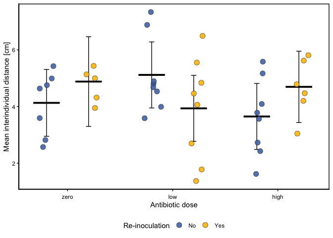<!-- -->

``` r
qqnorm(df_interind_reduced$mean.dist)
```

<!-- -->

``` r
#fit the model
model_gauss_red <- lmer(mean.dist ~ antibiotic * reinoculation + (1 | year),data = df_interind_reduced)

#residuals tests
simulateResiduals(model_gauss_red) |> plot()
```

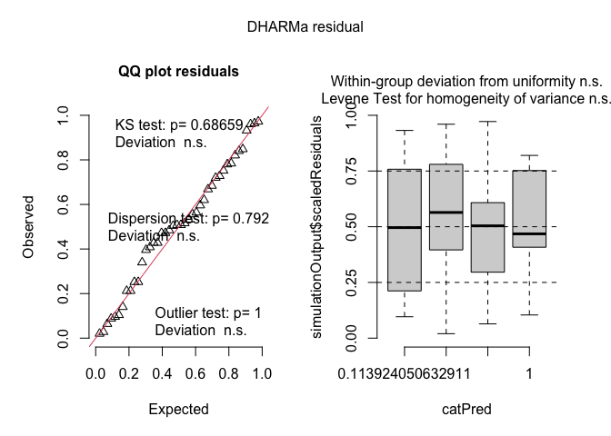<!-- -->

``` r
testDispersion(model_gauss_red)
```

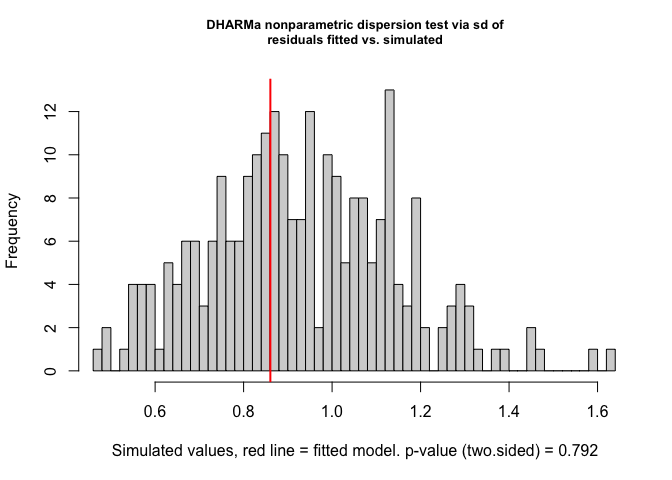<!-- -->

    ## 
    ##  DHARMa nonparametric dispersion test via sd of residuals fitted vs.
    ##  simulated
    ## 
    ## data:  simulationOutput
    ## dispersion = 0.92454, p-value = 0.792
    ## alternative hypothesis: two.sided

``` r
testResiduals(model_gauss_red)
```

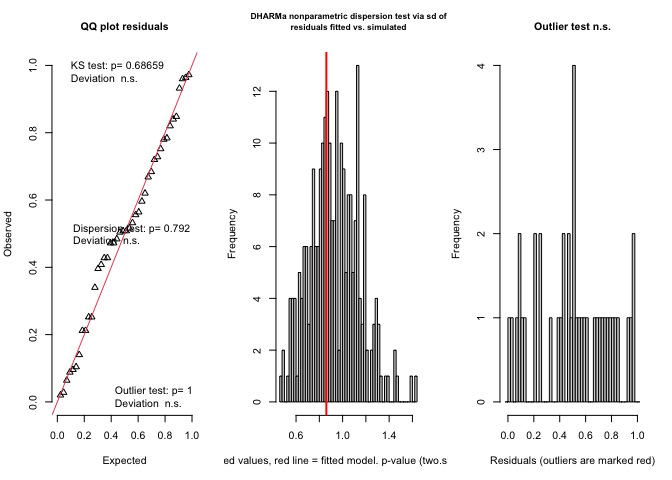<!-- -->

    ## $uniformity
    ## 
    ##  Asymptotic one-sample Kolmogorov-Smirnov test
    ## 
    ## data:  simulationOutput$scaledResiduals
    ## D = 0.11029, p-value = 0.6866
    ## alternative hypothesis: two-sided
    ## 
    ## 
    ## $dispersion
    ## 
    ##  DHARMa nonparametric dispersion test via sd of residuals fitted vs.
    ##  simulated
    ## 
    ## data:  simulationOutput
    ## dispersion = 0.92454, p-value = 0.792
    ## alternative hypothesis: two.sided
    ## 
    ## 
    ## $outliers
    ## 
    ##  DHARMa outlier test based on exact binomial test with approximate
    ##  expectations
    ## 
    ## data:  simulationOutput
    ## outliers at both margin(s) = 0, observations = 42, p-value = 1
    ## alternative hypothesis: true probability of success is not equal to 0.007968127
    ## 95 percent confidence interval:
    ##  0.00000000 0.08408385
    ## sample estimates:
    ## frequency of outliers (expected: 0.00796812749003984 ) 
    ##                                                      0

``` r
a3 <- Anova(model_gauss_red, type = "III")
a3
```

    ## Analysis of Deviance Table (Type III Wald chisquare tests)
    ## 
    ## Response: mean.dist
    ##                             Chisq Df Pr(>Chisq)    
    ## (Intercept)              377.1035  1     <2e-16 ***
    ## antibiotic                 0.4536  1     0.5006    
    ## reinoculation              0.5261  1     0.4683    
    ## antibiotic:reinoculation   2.6243  1     0.1052    
    ## ---
    ## Signif. codes:  0 '***' 0.001 '**' 0.01 '*' 0.05 '.' 0.1 ' ' 1

``` r
#additive Model
model_gauss_red_add <- lmer(mean.dist ~ antibiotic + reinoculation + (1 | year), data = df_interind_reduced)

a4 <- Anova(model_gauss_red_add, type = "II")
a4
```

    ## Analysis of Deviance Table (Type II Wald chisquare tests)
    ## 
    ## Response: mean.dist
    ##                Chisq Df Pr(>Chisq)
    ## antibiotic    0.7337  1     0.3917
    ## reinoculation 0.0344  1     0.8529

``` r
#to test if the interaction if significant
anova(model_gauss_red, model_gauss_red_add) 
```

    ## Data: df_interind_reduced
    ## Models:
    ## model_gauss_red_add: mean.dist ~ antibiotic + reinoculation + (1 | year)
    ## model_gauss_red: mean.dist ~ antibiotic * reinoculation + (1 | year)
    ##                     npar    AIC    BIC  logLik -2*log(L)  Chisq Df Pr(>Chisq)  
    ## model_gauss_red_add    5 152.26 160.95 -71.129    142.26                       
    ## model_gauss_red        6 151.45 161.88 -69.727    139.45 2.8048  1    0.09399 .
    ## ---
    ## Signif. codes:  0 '***' 0.001 '**' 0.01 '*' 0.05 '.' 0.1 ' ' 1

### Visualisation

``` r
emm <- emmeans(model_gauss_red, ~ antibiotic * reinoculation)
emm_df <- as.data.frame(emm)
pairs(emm)
```

    ##  contrast            estimate    SE   df t.ratio p.value
    ##  zero no - high no     1.0124 0.586 37.0   1.727  0.3247
    ##  zero no - zero yes    0.3949 0.529 38.0   0.746  0.8778
    ##  zero no - high yes   -0.0229 0.649 37.1  -0.035  1.0000
    ##  high no - zero yes   -0.6174 0.615 37.7  -1.004  0.7481
    ##  high no - high yes   -1.0352 0.724 37.0  -1.431  0.4889
    ##  zero yes - high yes  -0.4178 0.667 37.3  -0.627  0.9229
    ## 
    ## Degrees-of-freedom method: kenward-roger 
    ## P value adjustment: tukey method for comparing a family of 4 estimates

``` r
p2 <- ggplot() +
  geom_errorbar(
    data = emm_df,
    aes(x = antibiotic, ymin = lower.CL, ymax = upper.CL, group = reinoculation),
    width = 0.1, 
    linewidth = 0.5,
    position = position_dodge(0.8)
  ) +
  geom_errorbar(
    data = emm_df,
    aes(x = antibiotic, ymin = emmean, ymax = emmean, group = reinoculation),
    width = 0.5, 
    linewidth = 1.2,
    position = position_dodge(0.8)
  ) +
  geom_point(
    data = df_interind_reduced,
    aes(x = antibiotic, y = mean.dist, fill = reinoculation),
    shape = 21,
    colour = "black",
    stroke = 0.3,
    size = 3.5,         
    alpha = 0.9,         
    position = position_jitterdodge(jitter.width = 0.37, dodge.width = 0.8, seed = 32)
  ) +
  scale_fill_manual(
    values = c("no" = "#4F77B4", "yes" = "#FFBF00"),
    labels = c("No", "Yes")
  ) +
  scale_x_discrete(expand = expansion(mult = c(0.05, 0.05))) +
  theme_classic() + 
  theme(
    panel.border = element_rect(color = "black", fill = NA, linewidth = 1),
    legend.position = "bottom",
    axis.text.x = element_text(margin = margin(t = 5))
  ) +
  labs(
    x = "Antibiotic dose",
    y = "Mean interindividual distance [cm]",
    fill = "Re-inoculation"
  )

p2
```

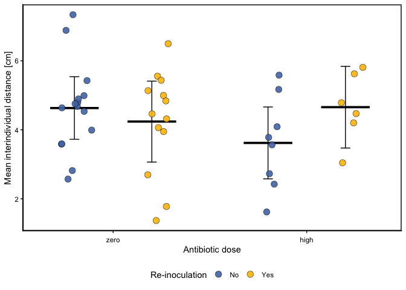<!-- -->

``` r
ggsave(
  filename = here::here("activity-and-behavior", "result", "inter_individual_dist", "mean_interind_2x2_plot.png"), 
  plot = p2, 
  width = 10, 
  height = 7, 
  dpi = 300
)
```

# Save the result in a .txt file

``` r
sink(here::here("activity-and-behavior", "result", "inter_individual_dist", "interind_dist_result.txt"), split = TRUE)
cat("=========================================================================\n")
```

    ## =========================================================================

``` r
cat("            MEAN INTERINDIVIDUAL DISTANCE — LMM RESULTS\n")
```

    ##             MEAN INTERINDIVIDUAL DISTANCE — LMM RESULTS

``` r
cat("=========================================================================\n\n")
```

    ## =========================================================================

``` r
cat("=====================================\n")
```

    ## =====================================

``` r
cat("--- 1. FULL MODEL (3 x 2) ---\n")
```

    ## --- 1. FULL MODEL (3 x 2) ---

``` r
cat("=====================================\n")
```

    ## =====================================

``` r
cat("\n[1A. Full Model (Interaction Type III)]\n")
```

    ## 
    ## [1A. Full Model (Interaction Type III)]

``` r
print(Anova(model_gauss, type = "III"))
```

    ## Analysis of Deviance Table (Type III Wald chisquare tests)
    ## 
    ## Response: mean.dist
    ##                             Chisq Df Pr(>Chisq)    
    ## (Intercept)              250.7874  1    < 2e-16 ***
    ## antibiotic                 0.6479  2    0.72330    
    ## reinoculation              0.2505  1    0.61675    
    ## antibiotic:reinoculation   6.3745  2    0.04128 *  
    ## ---
    ## Signif. codes:  0 '***' 0.001 '**' 0.01 '*' 0.05 '.' 0.1 ' ' 1

``` r
cat("\n[1B. Additive Model (Main Effects Type II)]\n")
```

    ## 
    ## [1B. Additive Model (Main Effects Type II)]

``` r
print(Anova(model_gauss_add, type = "II"))
```

    ## Analysis of Deviance Table (Type II Wald chisquare tests)
    ## 
    ## Response: mean.dist
    ##                Chisq Df Pr(>Chisq)
    ## antibiotic    0.7539  2     0.6860
    ## reinoculation 0.0273  1     0.8687

``` r
cat("\n[1C. Likelihood Ratio Test (LRT)]\n")
```

    ## 
    ## [1C. Likelihood Ratio Test (LRT)]

``` r
print(anova(model_gauss_add, model_gauss))
```

    ## Data: df_interind
    ## Models:
    ## model_gauss_add: mean.dist ~ antibiotic + reinoculation + (1 | year)
    ## model_gauss: mean.dist ~ antibiotic * reinoculation + (1 | year)
    ##                 npar    AIC    BIC  logLik -2*log(L) Chisq Df Pr(>Chisq)  
    ## model_gauss_add    6 154.21 164.64 -71.107    142.21                      
    ## model_gauss        8 151.70 165.60 -67.850    135.70 6.515  2    0.03848 *
    ## ---
    ## Signif. codes:  0 '***' 0.001 '**' 0.01 '*' 0.05 '.' 0.1 ' ' 1

``` r
cat("\n[1D. the interaction model is a better fit\n")
```

    ## 
    ## [1D. the interaction model is a better fit

``` r
emm <- emmeans(model_gauss, ~ antibiotic * reinoculation)
pairs(emm, by = "antibiotic")
```

    ## antibiotic = zero:
    ##  contrast estimate    SE   df t.ratio p.value
    ##  no - yes   -0.752 0.827 35.9  -0.909  0.3694
    ## 
    ## antibiotic = low:
    ##  contrast estimate    SE   df t.ratio p.value
    ##  no - yes    1.180 0.651 35.0   1.812  0.0785
    ## 
    ## antibiotic = high:
    ##  contrast estimate    SE   df t.ratio p.value
    ##  no - yes   -1.045 0.704 35.0  -1.484  0.1468
    ## 
    ## Degrees-of-freedom method: kenward-roger

``` r
pairs(emm, by = "reinoculation", adjust = "tukey")
```

    ## reinoculation = no:
    ##  contrast    estimate    SE   df t.ratio p.value
    ##  zero - low    -0.987 0.675 35.0  -1.461  0.3215
    ##  zero - high    0.480 0.675 35.0   0.711  0.7586
    ##  low - high     1.467 0.651 35.0   2.253  0.0763
    ## 
    ## reinoculation = yes:
    ##  contrast    estimate    SE   df t.ratio p.value
    ##  zero - low     0.945 0.794 36.0   1.191  0.4662
    ##  zero - high    0.188 0.827 35.9   0.227  0.9721
    ##  low - high    -0.758 0.704 35.0  -1.076  0.5349
    ## 
    ## Degrees-of-freedom method: kenward-roger 
    ## P value adjustment: tukey method for comparing a family of 3 estimates

``` r
cat("\n=====================================\n")
```

    ## 
    ## =====================================

``` r
cat("--- 2. REDUCED MODEL (2 x 2) ---\n")
```

    ## --- 2. REDUCED MODEL (2 x 2) ---

``` r
cat("=====================================\n")
```

    ## =====================================

``` r
cat("\n[2A. Full Model (Interaction Type III)]\n")
```

    ## 
    ## [2A. Full Model (Interaction Type III)]

``` r
print(Anova(model_gauss_red, type = "III"))
```

    ## Analysis of Deviance Table (Type III Wald chisquare tests)
    ## 
    ## Response: mean.dist
    ##                             Chisq Df Pr(>Chisq)    
    ## (Intercept)              377.1035  1     <2e-16 ***
    ## antibiotic                 0.4536  1     0.5006    
    ## reinoculation              0.5261  1     0.4683    
    ## antibiotic:reinoculation   2.6243  1     0.1052    
    ## ---
    ## Signif. codes:  0 '***' 0.001 '**' 0.01 '*' 0.05 '.' 0.1 ' ' 1

``` r
cat("\n[2B. Additive Model (Main Effects Type II)]\n")
```

    ## 
    ## [2B. Additive Model (Main Effects Type II)]

``` r
print(Anova(model_gauss_red_add, type = "II"))
```

    ## Analysis of Deviance Table (Type II Wald chisquare tests)
    ## 
    ## Response: mean.dist
    ##                Chisq Df Pr(>Chisq)
    ## antibiotic    0.7337  1     0.3917
    ## reinoculation 0.0344  1     0.8529

``` r
cat("\n[2C. Likelihood Ratio Test (LRT)]\n")
```

    ## 
    ## [2C. Likelihood Ratio Test (LRT)]

``` r
print(anova(model_gauss_red_add, model_gauss_red))
```

    ## Data: df_interind_reduced
    ## Models:
    ## model_gauss_red_add: mean.dist ~ antibiotic + reinoculation + (1 | year)
    ## model_gauss_red: mean.dist ~ antibiotic * reinoculation + (1 | year)
    ##                     npar    AIC    BIC  logLik -2*log(L)  Chisq Df Pr(>Chisq)  
    ## model_gauss_red_add    5 152.26 160.95 -71.129    142.26                       
    ## model_gauss_red        6 151.45 161.88 -69.727    139.45 2.8048  1    0.09399 .
    ## ---
    ## Signif. codes:  0 '***' 0.001 '**' 0.01 '*' 0.05 '.' 0.1 ' ' 1

``` r
cat("\n=====================================\n")
```

    ## 
    ## =====================================

``` r
cat("END OF ANALYSIS\n")
```

    ## END OF ANALYSIS

``` r
cat("=====================================\n")
```

    ## =====================================

``` r
sink()
```

\#============================== \#Analysis for activity (avg speed +
time spent moving) \## Basic stats

``` r
moyenne_speed <- tapply(df_move$average.speed, df_move$treatment, mean, na.rm = TRUE)
ecarts_speed <- tapply(df_move$average.speed, df_move$treatment, sd, na.rm = TRUE)

resultats_speed <- data.frame(
  Moyenne = moyenne_speed,
  Ecart_Type = ecarts_speed
)

moyenne_prop <- tapply(df_move$prop.time.moving, df_move$treatment, mean, na.rm = TRUE)
ecarts_prop <- tapply(df_move$prop.time.moving, df_move$treatment, sd, na.rm = TRUE)

resultats_prop <- data.frame(
  Moyenne = moyenne_prop,
  Ecart_Type = ecarts_prop
)

#save table
dir.create(here::here("activity-and-behavior", "result", "activity"), recursive = TRUE, showWarnings = FALSE)
write.csv(resultats_speed, here::here("activity-and-behavior", "result", "activity", "avg_speed_table.csv"), row.names = TRUE)
write.csv(resultats_prop, here::here("activity-and-behavior", "result", "activity", "prop_of_time_moving_table.csv"), row.names = TRUE)
```

\#—————————————————— \# Average speed analysis \## LLM full model

``` r
hist(df_move$average.speed, breaks = 50)
```

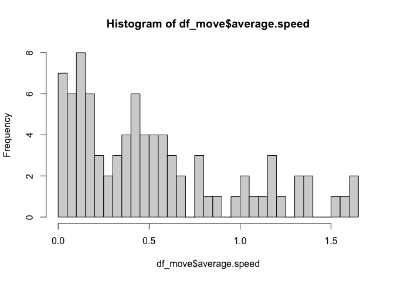<!-- -->

``` r
qqnorm(df_move$average.speed)
```

<!-- -->

``` r
#Full model
model_avg.speed <- lmer(average.speed ~ antibiotic * reinoculation + (1 | year:arena), data = df_move)
simulateResiduals(model_avg.speed) |> plot()
```

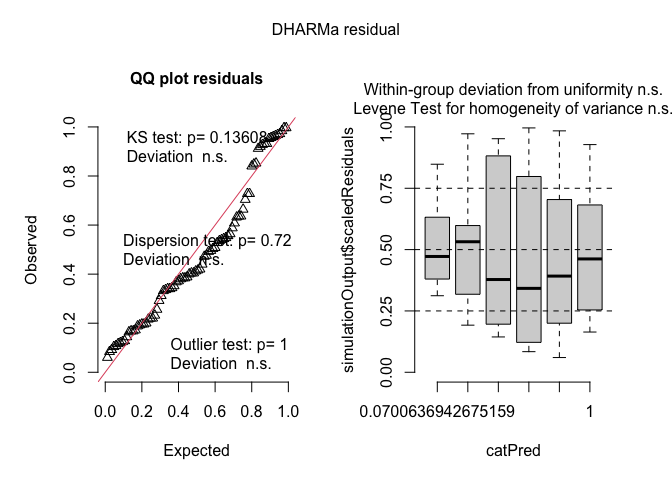<!-- -->

``` r
testDispersion(model_avg.speed)
```

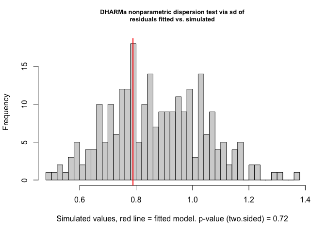<!-- -->

    ## 
    ##  DHARMa nonparametric dispersion test via sd of residuals fitted vs.
    ##  simulated
    ## 
    ## data:  simulationOutput
    ## dispersion = 0.90295, p-value = 0.72
    ## alternative hypothesis: two.sided

``` r
testResiduals(model_avg.speed)
```

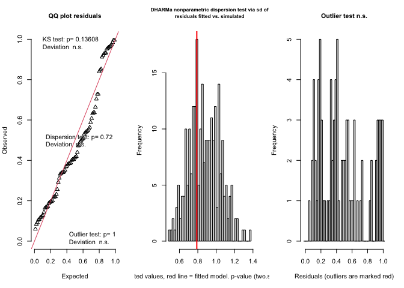<!-- -->

    ## $uniformity
    ## 
    ##  Asymptotic one-sample Kolmogorov-Smirnov test
    ## 
    ## data:  simulationOutput$scaledResiduals
    ## D = 0.12648, p-value = 0.1361
    ## alternative hypothesis: two-sided
    ## 
    ## 
    ## $dispersion
    ## 
    ##  DHARMa nonparametric dispersion test via sd of residuals fitted vs.
    ##  simulated
    ## 
    ## data:  simulationOutput
    ## dispersion = 0.90295, p-value = 0.72
    ## alternative hypothesis: two.sided
    ## 
    ## 
    ## $outliers
    ## 
    ##  DHARMa outlier test based on exact binomial test with approximate
    ##  expectations
    ## 
    ## data:  simulationOutput
    ## outliers at both margin(s) = 0, observations = 84, p-value = 1
    ## alternative hypothesis: true probability of success is not equal to 0.007968127
    ## 95 percent confidence interval:
    ##  0.00000000 0.04296492
    ## sample estimates:
    ## frequency of outliers (expected: 0.00796812749003984 ) 
    ##                                                      0

``` r
a1 <- Anova(model_avg.speed, type = "III")
a1 
```

    ## Analysis of Deviance Table (Type III Wald chisquare tests)
    ## 
    ## Response: average.speed
    ##                            Chisq Df Pr(>Chisq)    
    ## (Intercept)              67.8090  1    < 2e-16 ***
    ## antibiotic                0.9463  2    0.62304    
    ## reinoculation             0.2424  1    0.62251    
    ## antibiotic:reinoculation  5.6423  2    0.05954 .  
    ## ---
    ## Signif. codes:  0 '***' 0.001 '**' 0.01 '*' 0.05 '.' 0.1 ' ' 1

``` r
#Additive Model
model_avg.speed_add <- lmer(average.speed ~ antibiotic + reinoculation + (1 | year:arena), data = df_move)
a2 <- Anova(model_avg.speed_add, type = "II")
a2
```

    ## Analysis of Deviance Table (Type II Wald chisquare tests)
    ## 
    ## Response: average.speed
    ##                Chisq Df Pr(>Chisq)
    ## antibiotic    0.3647  2     0.8333
    ## reinoculation 0.1380  1     0.7103

``` r
#to test if the interaction if significant
anova(model_avg.speed_add, model_avg.speed)  #Here the interaction model is a better fit
```

    ## Data: df_move
    ## Models:
    ## model_avg.speed_add: average.speed ~ antibiotic + reinoculation + (1 | year:arena)
    ## model_avg.speed: average.speed ~ antibiotic * reinoculation + (1 | year:arena)
    ##                     npar    AIC    BIC  logLik -2*log(L)  Chisq Df Pr(>Chisq)  
    ## model_avg.speed_add    6 89.048 103.63 -38.524    77.048                       
    ## model_avg.speed        8 86.933 106.38 -35.466    70.933 6.1151  2      0.047 *
    ## ---
    ## Signif. codes:  0 '***' 0.001 '**' 0.01 '*' 0.05 '.' 0.1 ' ' 1

``` r
emm <- emmeans(model_avg.speed, ~ antibiotic * reinoculation)
pairs(emm, by = "antibiotic")
```

    ## antibiotic = zero:
    ##  contrast estimate    SE df t.ratio p.value
    ##  no - yes    0.404 0.236 36   1.713  0.0952
    ## 
    ## antibiotic = low:
    ##  contrast estimate    SE df t.ratio p.value
    ##  no - yes    0.125 0.201 36   0.619  0.5400
    ## 
    ## antibiotic = high:
    ##  contrast estimate    SE df t.ratio p.value
    ##  no - yes   -0.342 0.217 36  -1.573  0.1244
    ## 
    ## Degrees-of-freedom method: kenward-roger

``` r
pairs(emm, by = "reinoculation", adjust = "tukey")
```

    ## reinoculation = no:
    ##  contrast    estimate    SE df t.ratio p.value
    ##  zero - low    0.0362 0.208 36   0.173  0.9836
    ##  zero - high   0.2192 0.208 36   1.051  0.5499
    ##  low - high    0.1830 0.201 36   0.909  0.6383
    ## 
    ## reinoculation = yes:
    ##  contrast    estimate    SE df t.ratio p.value
    ##  zero - low   -0.2433 0.230 36  -1.060  0.5448
    ##  zero - high  -0.5270 0.244 36  -2.161  0.0919
    ##  low - high   -0.2837 0.217 36  -1.305  0.4019
    ## 
    ## Degrees-of-freedom method: kenward-roger 
    ## P value adjustment: tukey method for comparing a family of 3 estimates

## Visualisation

### Simple box plot

``` r
p_boxplot <- ggplot(df_move, aes(x = antibiotic, y = average.speed, fill = reinoculation)) +
  stat_boxplot(
    geom = "errorbar",
    width = 0.1,
    linewidth = 0.5,
    position = position_dodge(0.8)
  ) +
  stat_summary(
    fun = median,
    geom = "crossbar",
    mapping = aes(ymin = after_stat(y), ymax = after_stat(y)),
    width = 0.5,
    linewidth = 1.2,
    position = position_dodge(0.8)
  ) +
  geom_point(
    shape = 21,
    colour = "black",
    stroke = 0.3,
    size = 3.5,         
    alpha = 0.9,         
    position = position_jitterdodge(jitter.width = 0.37, dodge.width = 0.8, seed = 32)
  ) +
  scale_fill_manual(
    values = c("no" = "#4F77B4", "yes" = "#FFBF00"),
    labels = c("No", "Yes")
  ) +
  scale_x_discrete(expand = expansion(mult = c(0.05, 0.05))) +
  theme_classic() + 
  theme(
    panel.border = element_rect(color = "black", fill = NA, linewidth = 1),
    legend.position = "bottom",
    axis.text.x = element_text(margin = margin(t = 5))
  ) +
  labs(
    x = "Antibiotic dose",
    y = "Average speed [cm/sec]",
    fill = "Re-inoculation"
  )

p_boxplot
```

<!-- -->

``` r
ggsave(
  filename = here::here("activity-and-behavior", "result", "activity", "avg_speed_boxplot.pdf"), 
  plot = p_boxplot, 
  width = 9, 
  height = 5
)
```

### The model prediction

``` r
emm <- emmeans(model_avg.speed, ~ antibiotic * reinoculation)
emm_df <- as.data.frame(emm)

p_model <- ggplot() +
  geom_errorbar(
    data = emm_df,
    aes(x = antibiotic, ymin = lower.CL, ymax = upper.CL, group = reinoculation),
    width = 0.1, 
    linewidth = 0.5,
    position = position_dodge(0.8)
  ) +
  geom_errorbar(
    data = emm_df,
    aes(x = antibiotic, ymin = emmean, ymax = emmean, group = reinoculation),
    width = 0.5, 
    linewidth = 1.2,
    position = position_dodge(0.8)
  ) +
  geom_point(
    data = df_move, 
    aes(x = antibiotic, y = average.speed, fill = reinoculation), 
    shape = 21,            
    colour = "black",       
    stroke = 0.3,          
    alpha = 0.9, 
    size = 3.5, 
    position = position_jitterdodge(jitter.width = 0.37, dodge.width = 0.8, seed = 32)
  ) +
  scale_fill_manual(
    values = c("no" = "#4F77B4", "yes" = "#FFBF00"),
    labels = c("No", "Yes")
  ) +
  scale_x_discrete(expand = expansion(mult = c(0.05, 0.05))) +
  theme_classic() + 
  theme(
    panel.border = element_rect(color = "black", fill = NA, linewidth = 1),
    legend.position = "bottom",
    axis.text.x = element_text(margin = margin(t = 5))
  ) +
  labs(
    x = "Antibiotic dose",
    y = "Average speed [cm/sec]",
    fill = "Re-inoculation"   
  )

p_model
```

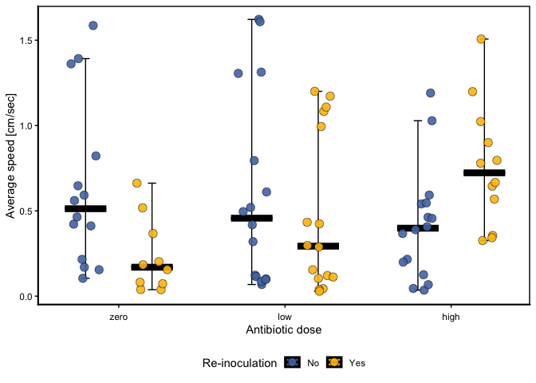<!-- -->

``` r
ggsave(
  filename = here::here("activity-and-behavior", "result", "activity", "avg_speed_model_pred.pdf"), 
  plot = p_model, 
  width = 9, 
  height = 5
)
```

## Reduced model

``` r
#Same stats but joining low and zero
df_move_red <- df_move
df_move_red$antibiotic[df_move_red$antibiotic %in% c("low", "zero")] <- "zero"
df_move_red<- df_move_red %>%
  mutate(treatment = paste(antibiotic, reinoculation, sep = "_"))

df_move_red <- df_move_red %>%
  mutate(
    treatment = factor(treatment),                  
    treatment = relevel(treatment, ref = "zero_no"),
    antibiotic = factor(antibiotic),
    antibiotic = relevel(antibiotic, ref = "zero"),
    reinoculation = factor(reinoculation),
    reinoculation = relevel(reinoculation, ref = "no"),
    year = factor(year),
    arena = factor(arena)
  )
df_move_red$antibiotic <- factor(df_move_red$antibiotic, levels = c("zero", "high"))

hist(df_move_red$average.speed, breaks = 50)
```

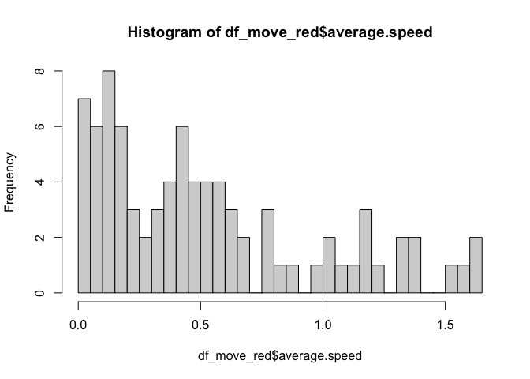<!-- -->

``` r
qqnorm(df_move_red$average.speed)
```

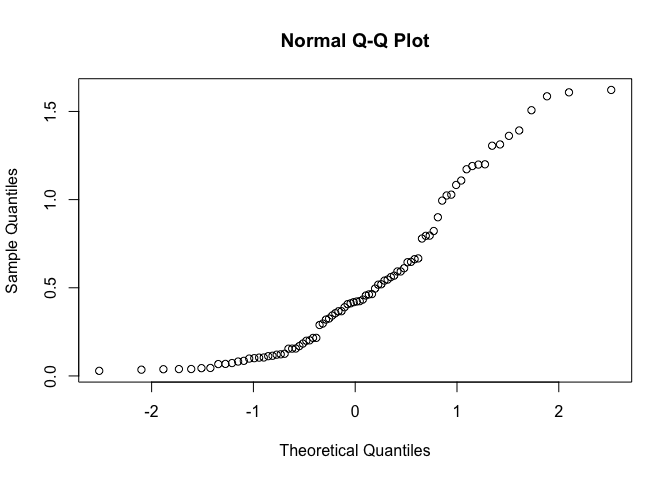<!-- -->

``` r
#Full model
model_avg.speed_red <- lmer(average.speed ~ antibiotic * reinoculation + (1 | year:arena), data = df_move_red)
simulateResiduals(model_avg.speed_red) |> plot()
```

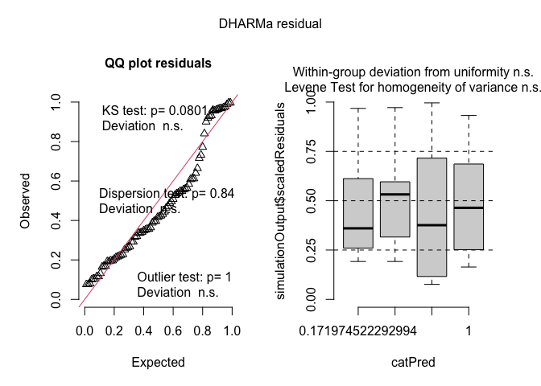<!-- -->

``` r
testDispersion(model_avg.speed_red)
```

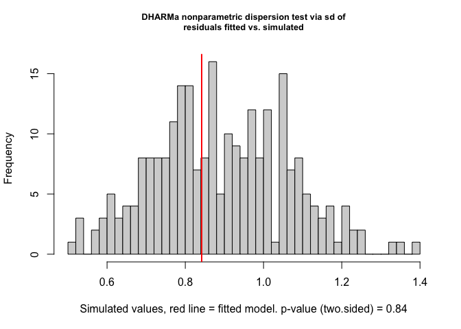<!-- -->

    ## 
    ##  DHARMa nonparametric dispersion test via sd of residuals fitted vs.
    ##  simulated
    ## 
    ## data:  simulationOutput
    ## dispersion = 0.94362, p-value = 0.84
    ## alternative hypothesis: two.sided

``` r
testResiduals(model_avg.speed_red)
```

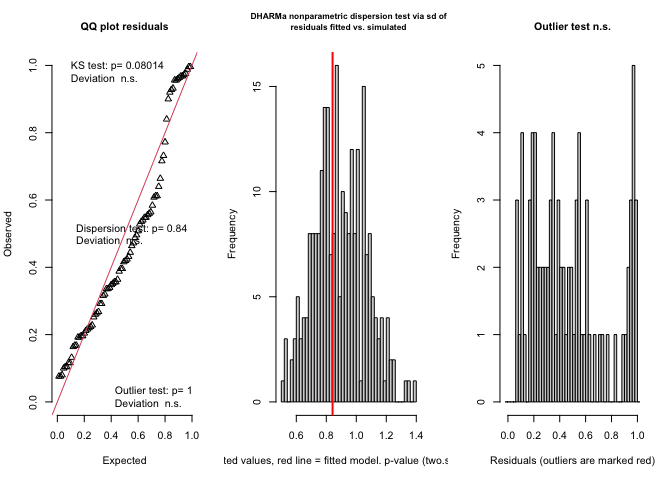<!-- -->

    ## $uniformity
    ## 
    ##  Asymptotic one-sample Kolmogorov-Smirnov test
    ## 
    ## data:  simulationOutput$scaledResiduals
    ## D = 0.13838, p-value = 0.08014
    ## alternative hypothesis: two-sided
    ## 
    ## 
    ## $dispersion
    ## 
    ##  DHARMa nonparametric dispersion test via sd of residuals fitted vs.
    ##  simulated
    ## 
    ## data:  simulationOutput
    ## dispersion = 0.94362, p-value = 0.84
    ## alternative hypothesis: two.sided
    ## 
    ## 
    ## $outliers
    ## 
    ##  DHARMa outlier test based on exact binomial test with approximate
    ##  expectations
    ## 
    ## data:  simulationOutput
    ## outliers at both margin(s) = 0, observations = 84, p-value = 1
    ## alternative hypothesis: true probability of success is not equal to 0.007968127
    ## 95 percent confidence interval:
    ##  0.00000000 0.04296492
    ## sample estimates:
    ## frequency of outliers (expected: 0.00796812749003984 ) 
    ##                                                      0

``` r
a3 <- Anova(model_avg.speed_red, type = "III")
a3 
```

    ## Analysis of Deviance Table (Type III Wald chisquare tests)
    ## 
    ## Response: average.speed
    ##                            Chisq Df Pr(>Chisq)    
    ## (Intercept)              68.4938  1    < 2e-16 ***
    ## antibiotic                0.4562  1    0.49941    
    ## reinoculation             0.1663  1    0.68345    
    ## antibiotic:reinoculation  4.8270  1    0.02802 *  
    ## ---
    ## Signif. codes:  0 '***' 0.001 '**' 0.01 '*' 0.05 '.' 0.1 ' ' 1

``` r
#Additive Model
model_avg.speed_red_add <- lmer(average.speed ~ antibiotic + reinoculation + (1 | year:arena), data = df_move_red)
a4 <- Anova(model_avg.speed_red_add, type = "II")
a4
```

    ## Analysis of Deviance Table (Type II Wald chisquare tests)
    ## 
    ## Response: average.speed
    ##                Chisq Df Pr(>Chisq)
    ## antibiotic    0.1578  1     0.6912
    ## reinoculation 0.1188  1     0.7303

``` r
#to test if the interaction if significant
anova(model_avg.speed_red_add, model_avg.speed_red)  #Here the interaction model is a better fit
```

    ## Data: df_move_red
    ## Models:
    ## model_avg.speed_red_add: average.speed ~ antibiotic + reinoculation + (1 | year:arena)
    ## model_avg.speed_red: average.speed ~ antibiotic * reinoculation + (1 | year:arena)
    ##                         npar    AIC    BIC  logLik -2*log(L)  Chisq Df
    ## model_avg.speed_red_add    5 87.279 99.433 -38.640    77.279          
    ## model_avg.speed_red        6 84.257 98.842 -36.128    72.257 5.0224  1
    ##                         Pr(>Chisq)  
    ## model_avg.speed_red_add             
    ## model_avg.speed_red        0.02502 *
    ## ---
    ## Signif. codes:  0 '***' 0.001 '**' 0.01 '*' 0.05 '.' 0.1 ' ' 1

``` r
emm <- emmeans(model_avg.speed_red, ~ antibiotic * reinoculation)
pairs(emm, by = "antibiotic")
```

    ## antibiotic = zero:
    ##  contrast estimate    SE df t.ratio p.value
    ##  no - yes    0.235 0.151 38   1.558  0.1276
    ## 
    ## antibiotic = high:
    ##  contrast estimate    SE df t.ratio p.value
    ##  no - yes   -0.342 0.215 38  -1.591  0.1199
    ## 
    ## Degrees-of-freedom method: kenward-roger

``` r
pairs(emm, by = "reinoculation", adjust = "tukey")
```

    ## reinoculation = no:
    ##  contrast    estimate    SE df t.ratio p.value
    ##  zero - high    0.200 0.174 38   1.146  0.2588
    ## 
    ## reinoculation = yes:
    ##  contrast    estimate    SE df t.ratio p.value
    ##  zero - high   -0.377 0.197 38  -1.920  0.0624
    ## 
    ## Degrees-of-freedom method: kenward-roger

## Save the result in a .txt file

``` r
sink(here::here("activity-and-behavior", "result", "activity", "avg_speed_result.txt"), split = TRUE)

cat("=========================================================================\n")
```

    ## =========================================================================

``` r
cat("                AVERAGE SPEED ANALYSIS — LMM RESULTS\n")
```

    ##                 AVERAGE SPEED ANALYSIS — LMM RESULTS

``` r
cat("=========================================================================\n\n")
```

    ## =========================================================================

``` r
cat("=====================================\n")
```

    ## =====================================

``` r
cat("--- 1. FULL MODEL (3 x 2) ---\n")
```

    ## --- 1. FULL MODEL (3 x 2) ---

``` r
cat("=====================================\n")
```

    ## =====================================

``` r
cat("\n[1A. Full Model (Interaction Type III)]\n")
```

    ## 
    ## [1A. Full Model (Interaction Type III)]

``` r
print(Anova(model_avg.speed, type = "III"))
```

    ## Analysis of Deviance Table (Type III Wald chisquare tests)
    ## 
    ## Response: average.speed
    ##                            Chisq Df Pr(>Chisq)    
    ## (Intercept)              67.8090  1    < 2e-16 ***
    ## antibiotic                0.9463  2    0.62304    
    ## reinoculation             0.2424  1    0.62251    
    ## antibiotic:reinoculation  5.6423  2    0.05954 .  
    ## ---
    ## Signif. codes:  0 '***' 0.001 '**' 0.01 '*' 0.05 '.' 0.1 ' ' 1

``` r
cat("\n[1B. Additive Model (Main Effects Type II)]\n")
```

    ## 
    ## [1B. Additive Model (Main Effects Type II)]

``` r
print(Anova(model_avg.speed_add, type = "II"))
```

    ## Analysis of Deviance Table (Type II Wald chisquare tests)
    ## 
    ## Response: average.speed
    ##                Chisq Df Pr(>Chisq)
    ## antibiotic    0.3647  2     0.8333
    ## reinoculation 0.1380  1     0.7103

``` r
cat("\n[1C. Likelihood Ratio Test (LRT)]\n")
```

    ## 
    ## [1C. Likelihood Ratio Test (LRT)]

``` r
print(anova(model_avg.speed_add, model_avg.speed))
```

    ## Data: df_move
    ## Models:
    ## model_avg.speed_add: average.speed ~ antibiotic + reinoculation + (1 | year:arena)
    ## model_avg.speed: average.speed ~ antibiotic * reinoculation + (1 | year:arena)
    ##                     npar    AIC    BIC  logLik -2*log(L)  Chisq Df Pr(>Chisq)  
    ## model_avg.speed_add    6 89.048 103.63 -38.524    77.048                       
    ## model_avg.speed        8 86.933 106.38 -35.466    70.933 6.1151  2      0.047 *
    ## ---
    ## Signif. codes:  0 '***' 0.001 '**' 0.01 '*' 0.05 '.' 0.1 ' ' 1

``` r
cat("\n[1D. Post-Hoc Simple Effects Breakdown]\n")
```

    ## 
    ## [1D. Post-Hoc Simple Effects Breakdown]

``` r
emm_full <- emmeans(model_avg.speed, ~ antibiotic * reinoculation)
cat("\n* Reinoculation effect within each Antibiotic dose:\n")
```

    ## 
    ## * Reinoculation effect within each Antibiotic dose:

``` r
print(pairs(emm_full, by = "antibiotic"))
```

    ## antibiotic = zero:
    ##  contrast estimate    SE df t.ratio p.value
    ##  no - yes    0.404 0.236 36   1.713  0.0952
    ## 
    ## antibiotic = low:
    ##  contrast estimate    SE df t.ratio p.value
    ##  no - yes    0.125 0.201 36   0.619  0.5400
    ## 
    ## antibiotic = high:
    ##  contrast estimate    SE df t.ratio p.value
    ##  no - yes   -0.342 0.217 36  -1.573  0.1244
    ## 
    ## Degrees-of-freedom method: kenward-roger

``` r
cat("\n* Antibiotic effect within each Reinoculation status (Tukey HSD):\n")
```

    ## 
    ## * Antibiotic effect within each Reinoculation status (Tukey HSD):

``` r
print(pairs(emm_full, by = "reinoculation", adjust = "tukey"))
```

    ## reinoculation = no:
    ##  contrast    estimate    SE df t.ratio p.value
    ##  zero - low    0.0362 0.208 36   0.173  0.9836
    ##  zero - high   0.2192 0.208 36   1.051  0.5499
    ##  low - high    0.1830 0.201 36   0.909  0.6383
    ## 
    ## reinoculation = yes:
    ##  contrast    estimate    SE df t.ratio p.value
    ##  zero - low   -0.2433 0.230 36  -1.060  0.5448
    ##  zero - high  -0.5270 0.244 36  -2.161  0.0919
    ##  low - high   -0.2837 0.217 36  -1.305  0.4019
    ## 
    ## Degrees-of-freedom method: kenward-roger 
    ## P value adjustment: tukey method for comparing a family of 3 estimates

``` r
cat("\n=====================================\n")
```

    ## 
    ## =====================================

``` r
cat("--- 2. REDUCED MODEL (2 x 2) ---\n")
```

    ## --- 2. REDUCED MODEL (2 x 2) ---

``` r
cat("=====================================\n")
```

    ## =====================================

``` r
cat("\n[2A. Full Model (Interaction Type III)]\n")
```

    ## 
    ## [2A. Full Model (Interaction Type III)]

``` r
print(Anova(model_avg.speed_red, type = "III"))
```

    ## Analysis of Deviance Table (Type III Wald chisquare tests)
    ## 
    ## Response: average.speed
    ##                            Chisq Df Pr(>Chisq)    
    ## (Intercept)              68.4938  1    < 2e-16 ***
    ## antibiotic                0.4562  1    0.49941    
    ## reinoculation             0.1663  1    0.68345    
    ## antibiotic:reinoculation  4.8270  1    0.02802 *  
    ## ---
    ## Signif. codes:  0 '***' 0.001 '**' 0.01 '*' 0.05 '.' 0.1 ' ' 1

``` r
cat("\n[2B. Additive Model (Main Effects Type II)]\n")
```

    ## 
    ## [2B. Additive Model (Main Effects Type II)]

``` r
print(Anova(model_avg.speed_red_add, type = "II"))
```

    ## Analysis of Deviance Table (Type II Wald chisquare tests)
    ## 
    ## Response: average.speed
    ##                Chisq Df Pr(>Chisq)
    ## antibiotic    0.1578  1     0.6912
    ## reinoculation 0.1188  1     0.7303

``` r
cat("\n[2C. Likelihood Ratio Test (LRT)]\n")
```

    ## 
    ## [2C. Likelihood Ratio Test (LRT)]

``` r
print(anova(model_avg.speed_red_add, model_avg.speed_red))
```

    ## Data: df_move_red
    ## Models:
    ## model_avg.speed_red_add: average.speed ~ antibiotic + reinoculation + (1 | year:arena)
    ## model_avg.speed_red: average.speed ~ antibiotic * reinoculation + (1 | year:arena)
    ##                         npar    AIC    BIC  logLik -2*log(L)  Chisq Df
    ## model_avg.speed_red_add    5 87.279 99.433 -38.640    77.279          
    ## model_avg.speed_red        6 84.257 98.842 -36.128    72.257 5.0224  1
    ##                         Pr(>Chisq)  
    ## model_avg.speed_red_add             
    ## model_avg.speed_red        0.02502 *
    ## ---
    ## Signif. codes:  0 '***' 0.001 '**' 0.01 '*' 0.05 '.' 0.1 ' ' 1

``` r
cat("\n[2D. Post-Hoc Simple Effects Breakdown]\n")
```

    ## 
    ## [2D. Post-Hoc Simple Effects Breakdown]

``` r
emm_red <- emmeans(model_avg.speed_red, ~ antibiotic * reinoculation)
cat("\n* Reinoculation effect within each Antibiotic dose:\n")
```

    ## 
    ## * Reinoculation effect within each Antibiotic dose:

``` r
print(pairs(emm_red, by = "antibiotic"))
```

    ## antibiotic = zero:
    ##  contrast estimate    SE df t.ratio p.value
    ##  no - yes    0.235 0.151 38   1.558  0.1276
    ## 
    ## antibiotic = high:
    ##  contrast estimate    SE df t.ratio p.value
    ##  no - yes   -0.342 0.215 38  -1.591  0.1199
    ## 
    ## Degrees-of-freedom method: kenward-roger

``` r
cat("\n* Antibiotic effect within each Reinoculation status (Tukey HSD):\n")
```

    ## 
    ## * Antibiotic effect within each Reinoculation status (Tukey HSD):

``` r
print(pairs(emm_red, by = "reinoculation", adjust = "tukey"))
```

    ## reinoculation = no:
    ##  contrast    estimate    SE df t.ratio p.value
    ##  zero - high    0.200 0.174 38   1.146  0.2588
    ## 
    ## reinoculation = yes:
    ##  contrast    estimate    SE df t.ratio p.value
    ##  zero - high   -0.377 0.197 38  -1.920  0.0624
    ## 
    ## Degrees-of-freedom method: kenward-roger

``` r
cat("\n=====================================\n")
```

    ## 
    ## =====================================

``` r
cat("END OF ANALYSIS\n")
```

    ## END OF ANALYSIS

``` r
cat("=====================================\n")
```

    ## =====================================

``` r
sink()
```

# ——————————————————

# Proportion of time spent moving

# LLM Full model

``` r
hist(df_move$prop.time.moving, breaks = 35)
```

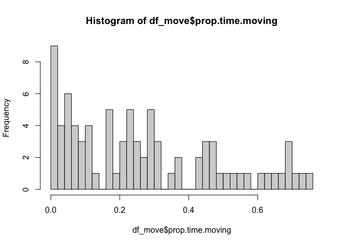<!-- -->

``` r
qqnorm(df_move$prop.time.moving)
```

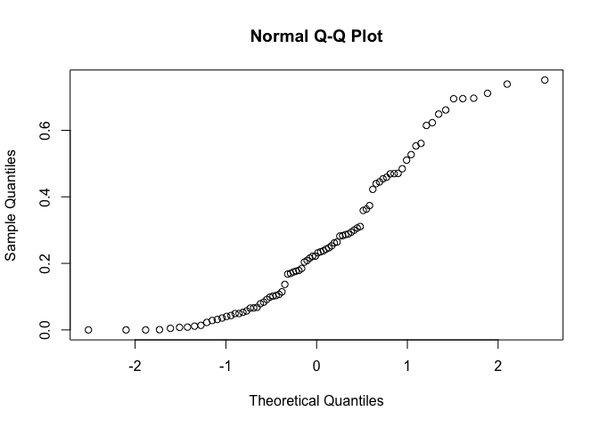<!-- -->

``` r
range(df_move$prop.time.moving)
```

    ## [1] 0.0000000 0.7512279

``` r
# transform y to (0,1) range
n <- length(df_move$prop.time.moving)
y_adj <- (df_move$prop.time.moving * (n - 1) + 0.5) / n
df_move$prop_time_adj <- y_adj
range(df_move$prop_time_adj)
```

    ## [1] 0.005952381 0.748237112

``` r
model_beta <- glmmTMB(prop_time_adj ~ antibiotic * reinoculation + (1|year:arena),
                      family = beta_family(link="logit"), #Beta-regression is best suited for this
                      data=df_move) 

#Verifications check
res <- simulateResiduals(model_beta)
plot(res); 
```

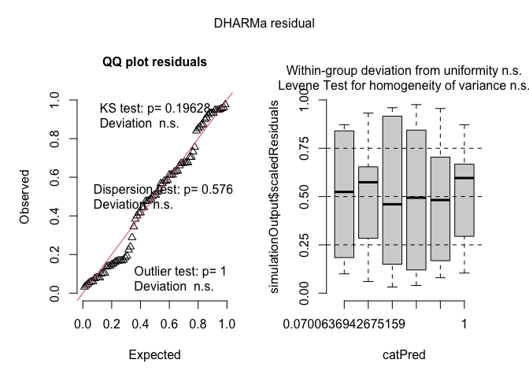<!-- -->

``` r
testDispersion(res)
```

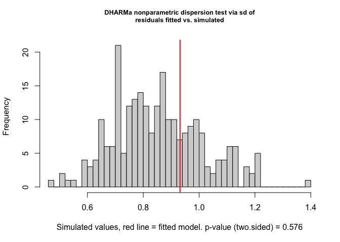<!-- -->

    ## 
    ##  DHARMa nonparametric dispersion test via sd of residuals fitted vs.
    ##  simulated
    ## 
    ## data:  simulationOutput
    ## dispersion = 1.0916, p-value = 0.576
    ## alternative hypothesis: two.sided

``` r
testUniformity(res)
```

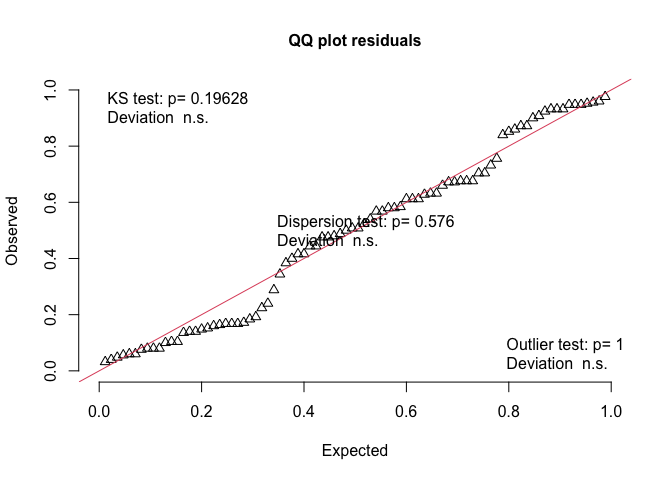<!-- -->

    ## 
    ##  Asymptotic one-sample Kolmogorov-Smirnov test
    ## 
    ## data:  simulationOutput$scaledResiduals
    ## D = 0.11752, p-value = 0.1963
    ## alternative hypothesis: two-sided

``` r
testResiduals(res) 
```

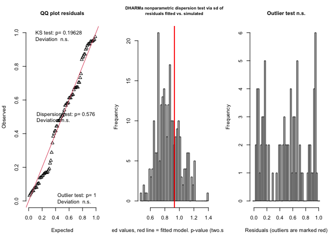<!-- -->

    ## $uniformity
    ## 
    ##  Asymptotic one-sample Kolmogorov-Smirnov test
    ## 
    ## data:  simulationOutput$scaledResiduals
    ## D = 0.11752, p-value = 0.1963
    ## alternative hypothesis: two-sided
    ## 
    ## 
    ## $dispersion
    ## 
    ##  DHARMa nonparametric dispersion test via sd of residuals fitted vs.
    ##  simulated
    ## 
    ## data:  simulationOutput
    ## dispersion = 1.0916, p-value = 0.576
    ## alternative hypothesis: two.sided
    ## 
    ## 
    ## $outliers
    ## 
    ##  DHARMa outlier test based on exact binomial test with approximate
    ##  expectations
    ## 
    ## data:  simulationOutput
    ## outliers at both margin(s) = 0, observations = 84, p-value = 1
    ## alternative hypothesis: true probability of success is not equal to 0.007968127
    ## 95 percent confidence interval:
    ##  0.00000000 0.04296492
    ## sample estimates:
    ## frequency of outliers (expected: 0.00796812749003984 ) 
    ##                                                      0

``` r
testZeroInflation(model_beta) 
```

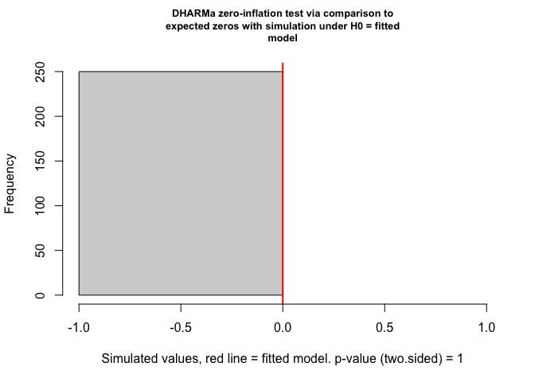<!-- -->

    ## 
    ##  DHARMa zero-inflation test via comparison to expected zeros with
    ##  simulation under H0 = fitted model
    ## 
    ## data:  simulationOutput
    ## ratioObsSim = NaN, p-value = 1
    ## alternative hypothesis: two.sided

``` r
a1 <- Anova(model_beta, type = "III")
a1 
```

    ## Analysis of Deviance Table (Type III Wald chisquare tests)
    ## 
    ## Response: prop_time_adj
    ##                            Chisq Df Pr(>Chisq)    
    ## (Intercept)              58.5230  1  2.009e-14 ***
    ## antibiotic                1.3733  2     0.5033    
    ## reinoculation             0.6184  1     0.4317    
    ## antibiotic:reinoculation  8.8797  2     0.0118 *  
    ## ---
    ## Signif. codes:  0 '***' 0.001 '**' 0.01 '*' 0.05 '.' 0.1 ' ' 1

``` r
#Additive Model
model_beta_add <- glmmTMB(prop_time_adj ~ antibiotic + reinoculation + (1|year:arena),
                      family = beta_family(link="logit"), #Beta-regression is best suited for this
                      data=df_move) 

a2 <- Anova(model_beta_add, type = "II")
a2
```

    ## Analysis of Deviance Table (Type II Wald chisquare tests)
    ## 
    ## Response: prop_time_adj
    ##                Chisq Df Pr(>Chisq)
    ## antibiotic    0.4478  2     0.7994
    ## reinoculation 0.3232  1     0.5697

``` r
#to test if the interaction if significant
anova(model_beta_add, model_beta)  #Here the interaction model is a better fit
```

    ## Data: df_move
    ## Models:
    ## model_beta_add: prop_time_adj ~ antibiotic + reinoculation + (1 | year:arena), zi=~0, disp=~1
    ## model_beta: prop_time_adj ~ antibiotic * reinoculation + (1 | year:arena), zi=~0, disp=~1
    ##                Df     AIC     BIC logLik deviance  Chisq Chi Df Pr(>Chisq)  
    ## model_beta_add  6 -76.761 -62.176 44.381  -88.761                           
    ## model_beta      8 -80.932 -61.485 48.466  -96.932 8.1708      2    0.01682 *
    ## ---
    ## Signif. codes:  0 '***' 0.001 '**' 0.01 '*' 0.05 '.' 0.1 ' ' 1

``` r
emm <- emmeans(model_beta, ~ antibiotic * reinoculation)
pairs(emm, by = "antibiotic")
```

    ## antibiotic = zero:
    ##  contrast estimate    SE  df z.ratio p.value
    ##  no - yes    1.301 0.602 Inf   2.160  0.0308
    ## 
    ## antibiotic = low:
    ##  contrast estimate    SE  df z.ratio p.value
    ##  no - yes    0.483 0.502 Inf   0.962  0.3358
    ## 
    ## antibiotic = high:
    ##  contrast estimate    SE  df z.ratio p.value
    ##  no - yes   -1.037 0.539 Inf  -1.922  0.0546
    ## 
    ## Results are given on the log odds ratio (not the response) scale.

``` r
pairs(emm, by = "reinoculation", adjust = "tukey")
```

    ## reinoculation = no:
    ##  contrast    estimate    SE  df z.ratio p.value
    ##  zero - low     0.151 0.514 Inf   0.293  0.9537
    ##  zero - high    0.696 0.520 Inf   1.338  0.3738
    ##  low - high     0.545 0.503 Inf   1.082  0.5253
    ## 
    ## reinoculation = yes:
    ##  contrast    estimate    SE  df z.ratio p.value
    ##  zero - low    -0.667 0.590 Inf  -1.131  0.4951
    ##  zero - high   -1.642 0.620 Inf  -2.650  0.0220
    ##  low - high    -0.975 0.538 Inf  -1.812  0.1658
    ## 
    ## Results are given on the log odds ratio (not the response) scale. 
    ## P value adjustment: tukey method for comparing a family of 3 estimates

## Visualisation

### Simple boxplot

``` r
p_boxplot_beta <- ggplot(df_move, aes(x = antibiotic, y = prop_time_adj, fill = reinoculation)) +
  stat_boxplot(
    geom = "errorbar",
    width = 0.1,
    linewidth = 0.5,
    position = position_dodge(0.8)
  ) +
  stat_summary(
    fun = median,
    geom = "crossbar",
    mapping = aes(ymin = after_stat(y), ymax = after_stat(y)),
    width = 0.5,
    linewidth = 1.2,
    position = position_dodge(0.8)
  ) +
  geom_point(
    shape = 21,
    colour = "black",
    stroke = 0.3,
    size = 3.5,         
    alpha = 0.9,         
    position = position_jitterdodge(jitter.width = 0.37, dodge.width = 0.8, seed = 32)
  ) +
  scale_fill_manual(
    values = c("no" = "#4F77B4", "yes" = "#FFBF00"),
    labels = c("No", "Yes")
  ) +
  scale_y_continuous(labels = scales::percent_format(accuracy = 1)) +
  scale_x_discrete(expand = expansion(mult = c(0.05, 0.05))) +
  theme_classic() + 
  theme(
    panel.border = element_rect(color = "black", fill = NA, linewidth = 1),
    legend.position = "bottom",
    axis.text.x = element_text(margin = margin(t = 5))
  ) +
  labs(
    x = "Antibiotic dose",
    y = "Proportion of time moving",
    fill = "Re-inoculation"
  )

p_boxplot_beta
```

<!-- -->

``` r
ggsave(
  filename = here::here("activity-and-behavior", "result", "activity", "prop_box_plot.pdf"), 
  plot = p_boxplot_beta, 
  width = 9, 
  height = 5
)
```

### The model prediction

``` r
emm <- emmeans(model_beta, ~ antibiotic * reinoculation, type = "response") 
emm_df <- as.data.frame(emm)

p_pred_model_prop <- ggplot() +
  geom_errorbar(
    data = emm_df,
    aes(x = antibiotic, ymin = asymp.LCL, ymax = asymp.UCL, group = reinoculation),
    width = 0.1, 
    linewidth = 0.5,
    position = position_dodge(0.8)
  ) +
  geom_errorbar(
    data = emm_df,
    aes(x = antibiotic, ymin = response, ymax = response, group = reinoculation),
    width = 0.5, 
    linewidth = 1.2,
    position = position_dodge(0.8)
  ) +
  geom_point(
    data = df_move, 
    aes(x = antibiotic, y = prop_time_adj, fill = reinoculation), 
    shape = 21,            
    colour = "black",       
    stroke = 0.3,          
    alpha = 0.9, 
    size = 3.5, 
    position = position_jitterdodge(jitter.width = 0.37, dodge.width = 0.8, seed = 32)
  ) +
  scale_fill_manual(
    values = c("no" = "#4F77B4", "yes" = "#FFBF00"),
    labels = c("No", "Yes")
  ) +
  scale_y_continuous(labels = scales::percent_format(accuracy = 1)) +
  scale_x_discrete(expand = expansion(mult = c(0.05, 0.05))) +
  theme_classic() + 
  theme(
    panel.border = element_rect(color = "black", fill = NA, linewidth = 1),
    legend.position = "bottom",
    axis.text.x = element_text(margin = margin(t = 5))
  ) +
  labs(
    x = "Antibiotic dose",
    y = "Proportion of time moving",
    fill = "Re-inoculation"   
  )

p_pred_model_prop
```

<!-- -->

``` r
ggsave(
  filename = here::here("activity-and-behavior", "result", "activity", "prop_pred_model.pdf"), 
  plot = p_pred_model_prop, 
  width = 9, 
  height = 5
)
```

# Reduced model

## LLM reduced

``` r
hist(df_move_red$prop.time.moving, breaks = 35)
```

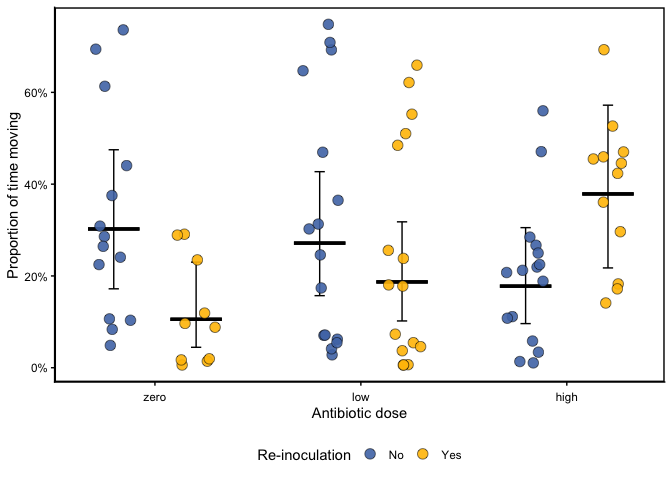<!-- -->

``` r
qqnorm(df_move_red$prop.time.moving)
```

<!-- -->

``` r
range(df_move_red$prop.time.moving)
```

    ## [1] 0.0000000 0.7512279

``` r
# transform y to (0,1) range
n <- length(df_move_red$prop.time.moving)
y_adj <- (df_move_red$prop.time.moving * (n - 1) + 0.5) / n
df_move_red$prop_time_adj <- y_adj
range(df_move_red$prop_time_adj)
```

    ## [1] 0.005952381 0.748237112

``` r
model_beta_red <- glmmTMB(prop_time_adj ~ antibiotic * reinoculation + (1|year/arena),
                      family = beta_family(link="logit"),
                      data=df_move_red) 

#Verifications check
res <- simulateResiduals(model_beta_red)
plot(res); 
```

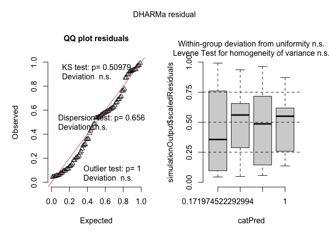<!-- -->

``` r
testDispersion(res)
```

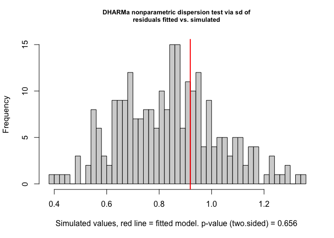<!-- -->

    ## 
    ##  DHARMa nonparametric dispersion test via sd of residuals fitted vs.
    ##  simulated
    ## 
    ## data:  simulationOutput
    ## dispersion = 1.0935, p-value = 0.656
    ## alternative hypothesis: two.sided

``` r
testUniformity(res)
```

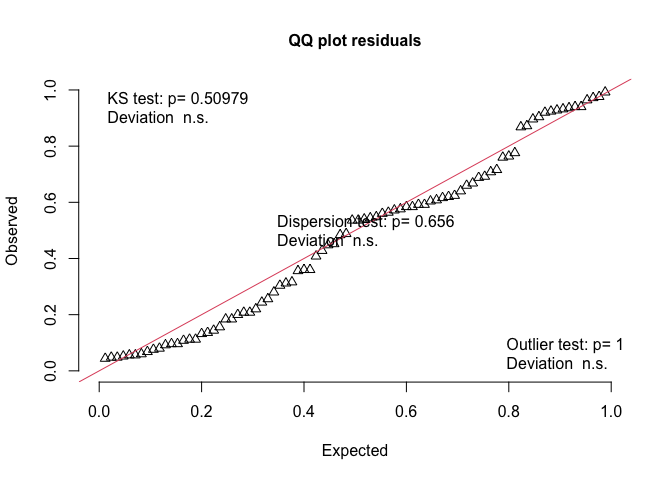<!-- -->

    ## 
    ##  Asymptotic one-sample Kolmogorov-Smirnov test
    ## 
    ## data:  simulationOutput$scaledResiduals
    ## D = 0.089619, p-value = 0.5098
    ## alternative hypothesis: two-sided

``` r
testResiduals(res) 
```

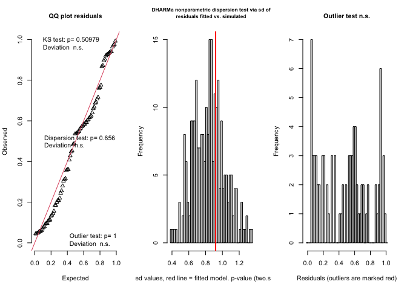<!-- -->

    ## $uniformity
    ## 
    ##  Asymptotic one-sample Kolmogorov-Smirnov test
    ## 
    ## data:  simulationOutput$scaledResiduals
    ## D = 0.089619, p-value = 0.5098
    ## alternative hypothesis: two-sided
    ## 
    ## 
    ## $dispersion
    ## 
    ##  DHARMa nonparametric dispersion test via sd of residuals fitted vs.
    ##  simulated
    ## 
    ## data:  simulationOutput
    ## dispersion = 1.0935, p-value = 0.656
    ## alternative hypothesis: two.sided
    ## 
    ## 
    ## $outliers
    ## 
    ##  DHARMa outlier test based on exact binomial test with approximate
    ##  expectations
    ## 
    ## data:  simulationOutput
    ## outliers at both margin(s) = 0, observations = 84, p-value = 1
    ## alternative hypothesis: true probability of success is not equal to 0.007968127
    ## 95 percent confidence interval:
    ##  0.00000000 0.04296492
    ## sample estimates:
    ## frequency of outliers (expected: 0.00796812749003984 ) 
    ##                                                      0

``` r
testZeroInflation(model_beta_red) 
```

<!-- -->

    ## 
    ##  DHARMa zero-inflation test via comparison to expected zeros with
    ##  simulation under H0 = fitted model
    ## 
    ## data:  simulationOutput
    ## ratioObsSim = NaN, p-value = 1
    ## alternative hypothesis: two.sided

``` r
a3 <- Anova(model_beta_red, type=3)
a3
```

    ## Analysis of Deviance Table (Type III Wald chisquare tests)
    ## 
    ## Response: prop_time_adj
    ##                            Chisq Df Pr(>Chisq)    
    ## (Intercept)              17.1265  1  3.497e-05 ***
    ## antibiotic                0.7718  1   0.379653    
    ## reinoculation             0.2538  1   0.614432    
    ## antibiotic:reinoculation  7.4575  1   0.006317 ** 
    ## ---
    ## Signif. codes:  0 '***' 0.001 '**' 0.01 '*' 0.05 '.' 0.1 ' ' 1

``` r
#Additive Model
model_beta_red_add <- glmmTMB(prop_time_adj ~ antibiotic + reinoculation + (1|year:arena),
                      family = beta_family(link="logit"), #Beta-regression is best suited for this
                      data=df_move_red) 

a4 <- Anova(model_beta_red_add, type = "II")
a4
```

    ## Analysis of Deviance Table (Type II Wald chisquare tests)
    ## 
    ## Response: prop_time_adj
    ##                Chisq Df Pr(>Chisq)
    ## antibiotic    0.3312  1     0.5649
    ## reinoculation 0.2962  1     0.5862

``` r
#to test if the interaction if significant
anova(model_beta_red_add, model_beta_red)  #Here the interaction model is a better fit
```

    ## Data: df_move_red
    ## Models:
    ## model_beta_red_add: prop_time_adj ~ antibiotic + reinoculation + (1 | year:arena), zi=~0, disp=~1
    ## model_beta_red: prop_time_adj ~ antibiotic * reinoculation + (1 | year/arena), zi=~0, disp=~1
    ##                    Df     AIC     BIC logLik deviance  Chisq Chi Df Pr(>Chisq)
    ## model_beta_red_add  5 -78.645 -66.491 44.323  -88.645                         
    ## model_beta_red      7 -82.524 -65.509 48.262  -96.524 7.8793      2    0.01946
    ##                     
    ## model_beta_red_add  
    ## model_beta_red     *
    ## ---
    ## Signif. codes:  0 '***' 0.001 '**' 0.01 '*' 0.05 '.' 0.1 ' ' 1

``` r
emm <- emmeans(model_beta_red, ~ antibiotic * reinoculation)
pairs(emm, by = "antibiotic")
```

    ## antibiotic = zero:
    ##  contrast estimate    SE  df z.ratio p.value
    ##  no - yes    0.727 0.383 Inf   1.899  0.0576
    ## 
    ## antibiotic = high:
    ##  contrast estimate    SE  df z.ratio p.value
    ##  no - yes   -1.057 0.530 Inf  -1.993  0.0463
    ## 
    ## Results are given on the log odds ratio (not the response) scale.

``` r
pairs(emm, by = "reinoculation", adjust = "tukey")
```

    ## reinoculation = no:
    ##  contrast    estimate    SE  df z.ratio p.value
    ##  zero - high    0.606 0.435 Inf   1.394  0.1633
    ## 
    ## reinoculation = yes:
    ##  contrast    estimate    SE  df z.ratio p.value
    ##  zero - high   -1.178 0.486 Inf  -2.424  0.0154
    ## 
    ## Results are given on the log odds ratio (not the response) scale.

\#Save the result in a .txt file

``` r
sink(here::here("activity-and-behavior", "result", "activity", "prop_time_moving_result.txt"), split = TRUE)
cat("=========================================================================\n")
```

    ## =========================================================================

``` r
cat("          PROPORTION OF TIME SPENT MOVING — GLMM BETA RESULTS\n")
```

    ##           PROPORTION OF TIME SPENT MOVING — GLMM BETA RESULTS

``` r
cat("=========================================================================\n\n")
```

    ## =========================================================================

``` r
cat("=====================================\n")
```

    ## =====================================

``` r
cat("--- 1. FULL MODEL (3 x 2) ---\n")
```

    ## --- 1. FULL MODEL (3 x 2) ---

``` r
cat("=====================================\n")
```

    ## =====================================

``` r
cat("\n[1A. Full Model (Interaction Type III)]\n")
```

    ## 
    ## [1A. Full Model (Interaction Type III)]

``` r
print(Anova(model_beta, type = "III"))
```

    ## Analysis of Deviance Table (Type III Wald chisquare tests)
    ## 
    ## Response: prop_time_adj
    ##                            Chisq Df Pr(>Chisq)    
    ## (Intercept)              58.5230  1  2.009e-14 ***
    ## antibiotic                1.3733  2     0.5033    
    ## reinoculation             0.6184  1     0.4317    
    ## antibiotic:reinoculation  8.8797  2     0.0118 *  
    ## ---
    ## Signif. codes:  0 '***' 0.001 '**' 0.01 '*' 0.05 '.' 0.1 ' ' 1

``` r
cat("\n[1B. Additive Model (Main Effects Type II)]\n")
```

    ## 
    ## [1B. Additive Model (Main Effects Type II)]

``` r
print(Anova(model_beta_add, type = "II"))
```

    ## Analysis of Deviance Table (Type II Wald chisquare tests)
    ## 
    ## Response: prop_time_adj
    ##                Chisq Df Pr(>Chisq)
    ## antibiotic    0.4478  2     0.7994
    ## reinoculation 0.3232  1     0.5697

``` r
cat("\n[1C. Likelihood Ratio Test (LRT)]\n")
```

    ## 
    ## [1C. Likelihood Ratio Test (LRT)]

``` r
print(anova(model_beta_add, model_beta))
```

    ## Data: df_move
    ## Models:
    ## model_beta_add: prop_time_adj ~ antibiotic + reinoculation + (1 | year:arena), zi=~0, disp=~1
    ## model_beta: prop_time_adj ~ antibiotic * reinoculation + (1 | year:arena), zi=~0, disp=~1
    ##                Df     AIC     BIC logLik deviance  Chisq Chi Df Pr(>Chisq)  
    ## model_beta_add  6 -76.761 -62.176 44.381  -88.761                           
    ## model_beta      8 -80.932 -61.485 48.466  -96.932 8.1708      2    0.01682 *
    ## ---
    ## Signif. codes:  0 '***' 0.001 '**' 0.01 '*' 0.05 '.' 0.1 ' ' 1

``` r
cat("\n[1D. Post-Hoc Simple Effects Breakdown (Back-transformed to Real Proportions)]\n")
```

    ## 
    ## [1D. Post-Hoc Simple Effects Breakdown (Back-transformed to Real Proportions)]

``` r
emm_full <- emmeans(model_beta, ~ antibiotic * reinoculation, type = "response")
cat("\n* Reinoculation effect within each Antibiotic dose:\n")
```

    ## 
    ## * Reinoculation effect within each Antibiotic dose:

``` r
print(pairs(emm_full, by = "antibiotic"))
```

    ## antibiotic = zero:
    ##  contrast odds.ratio    SE  df null z.ratio p.value
    ##  no / yes      3.673 2.210 Inf    1   2.160  0.0308
    ## 
    ## antibiotic = low:
    ##  contrast odds.ratio    SE  df null z.ratio p.value
    ##  no / yes      1.621 0.813 Inf    1   0.962  0.3358
    ## 
    ## antibiotic = high:
    ##  contrast odds.ratio    SE  df null z.ratio p.value
    ##  no / yes      0.355 0.191 Inf    1  -1.922  0.0546
    ## 
    ## Tests are performed on the log odds ratio scale

``` r
cat("\n* Antibiotic effect within each Reinoculation status (Tukey HSD):\n")
```

    ## 
    ## * Antibiotic effect within each Reinoculation status (Tukey HSD):

``` r
print(pairs(emm_full, by = "reinoculation", adjust = "tukey"))
```

    ## reinoculation = no:
    ##  contrast    odds.ratio    SE  df null z.ratio p.value
    ##  zero / low       1.163 0.598 Inf    1   0.293  0.9537
    ##  zero / high      2.005 1.040 Inf    1   1.338  0.3738
    ##  low / high       1.724 0.868 Inf    1   1.082  0.5253
    ## 
    ## reinoculation = yes:
    ##  contrast    odds.ratio    SE  df null z.ratio p.value
    ##  zero / low       0.513 0.303 Inf    1  -1.131  0.4951
    ##  zero / high      0.194 0.120 Inf    1  -2.650  0.0220
    ##  low / high       0.377 0.203 Inf    1  -1.812  0.1658
    ## 
    ## P value adjustment: tukey method for comparing a family of 3 estimates 
    ## Tests are performed on the log odds ratio scale

``` r
cat("\n=====================================\n")
```

    ## 
    ## =====================================

``` r
cat("--- 2. REDUCED MODEL (2 x 2) ---\n")
```

    ## --- 2. REDUCED MODEL (2 x 2) ---

``` r
cat("=====================================\n")
```

    ## =====================================

``` r
cat("\n[2A. Reduced Model (Interaction Type III)]\n")
```

    ## 
    ## [2A. Reduced Model (Interaction Type III)]

``` r
print(Anova(model_beta_red, type = "III"))
```

    ## Analysis of Deviance Table (Type III Wald chisquare tests)
    ## 
    ## Response: prop_time_adj
    ##                            Chisq Df Pr(>Chisq)    
    ## (Intercept)              17.1265  1  3.497e-05 ***
    ## antibiotic                0.7718  1   0.379653    
    ## reinoculation             0.2538  1   0.614432    
    ## antibiotic:reinoculation  7.4575  1   0.006317 ** 
    ## ---
    ## Signif. codes:  0 '***' 0.001 '**' 0.01 '*' 0.05 '.' 0.1 ' ' 1

``` r
cat("\n[2B. Reduced Additive Model (Main Effects Type II)]\n")
```

    ## 
    ## [2B. Reduced Additive Model (Main Effects Type II)]

``` r
print(Anova(model_beta_red_add, type = "II"))
```

    ## Analysis of Deviance Table (Type II Wald chisquare tests)
    ## 
    ## Response: prop_time_adj
    ##                Chisq Df Pr(>Chisq)
    ## antibiotic    0.3312  1     0.5649
    ## reinoculation 0.2962  1     0.5862

``` r
cat("\n[2C. Likelihood Ratio Test (LRT) for Reduced Model]\n")
```

    ## 
    ## [2C. Likelihood Ratio Test (LRT) for Reduced Model]

``` r
print(anova(model_beta_red_add, model_beta_red))
```

    ## Data: df_move_red
    ## Models:
    ## model_beta_red_add: prop_time_adj ~ antibiotic + reinoculation + (1 | year:arena), zi=~0, disp=~1
    ## model_beta_red: prop_time_adj ~ antibiotic * reinoculation + (1 | year/arena), zi=~0, disp=~1
    ##                    Df     AIC     BIC logLik deviance  Chisq Chi Df Pr(>Chisq)
    ## model_beta_red_add  5 -78.645 -66.491 44.323  -88.645                         
    ## model_beta_red      7 -82.524 -65.509 48.262  -96.524 7.8793      2    0.01946
    ##                     
    ## model_beta_red_add  
    ## model_beta_red     *
    ## ---
    ## Signif. codes:  0 '***' 0.001 '**' 0.01 '*' 0.05 '.' 0.1 ' ' 1

``` r
cat("\n[2D. Post-Hoc Simple Effects Breakdown (Back-transformed to Real Proportions)]\n")
```

    ## 
    ## [2D. Post-Hoc Simple Effects Breakdown (Back-transformed to Real Proportions)]

``` r
emm_red <- emmeans(model_beta_red, ~ antibiotic * reinoculation, type = "response")
cat("\n* Reinoculation effect within each Antibiotic dose:\n")
```

    ## 
    ## * Reinoculation effect within each Antibiotic dose:

``` r
print(pairs(emm_red, by = "antibiotic"))
```

    ## antibiotic = zero:
    ##  contrast odds.ratio    SE  df null z.ratio p.value
    ##  no / yes      2.068 0.792 Inf    1   1.899  0.0576
    ## 
    ## antibiotic = high:
    ##  contrast odds.ratio    SE  df null z.ratio p.value
    ##  no / yes      0.348 0.184 Inf    1  -1.993  0.0463
    ## 
    ## Tests are performed on the log odds ratio scale

``` r
cat("\n* Antibiotic effect within each Reinoculation status (Tukey HSD):\n")
```

    ## 
    ## * Antibiotic effect within each Reinoculation status (Tukey HSD):

``` r
print(pairs(emm_red, by = "reinoculation", adjust = "tukey"))
```

    ## reinoculation = no:
    ##  contrast    odds.ratio    SE  df null z.ratio p.value
    ##  zero / high      1.833 0.797 Inf    1   1.394  0.1633
    ## 
    ## reinoculation = yes:
    ##  contrast    odds.ratio    SE  df null z.ratio p.value
    ##  zero / high      0.308 0.150 Inf    1  -2.424  0.0154
    ## 
    ## Tests are performed on the log odds ratio scale

``` r
cat("\n=====================================\n")
```

    ## 
    ## =====================================

``` r
cat("END OF ANALYSIS\n")
```

    ## END OF ANALYSIS

``` r
cat("=====================================\n")
```

    ## =====================================

``` r
sink()
```

\#=============================== \# PCA ON 7 METRICS \### PCA for
Treatment (3 x 2 levels)

``` r
data2 <- df_pca_7[, !(names(df_pca_7) %in% c("treatment", "year", "arena", "antibiotic", "reinoculation"))]
head(data2)
```

    ## # A tibble: 6 × 7
    ##   moy_prop_time_moving moy_average_speed nb.of.bump nb.of.avoidance
    ##                  <dbl>             <dbl>      <int>           <int>
    ## 1               0.271             0.549          24               0
    ## 2               0.723             1.47           26               0
    ## 3               0.334             0.622           5               0
    ## 4               0.434             0.656          23               4
    ## 5               0.170             0.314           7               0
    ## 6               0.0343            0.0993          1               0
    ## # ℹ 3 more variables: nb.of.head.to.head <int>, nb.of.touch <int>,
    ## #   mean.dist <dbl>

``` r
X <- dimensio::pca(data2, center = TRUE, scale = TRUE)
eig <- get_eigenvalues(X)
eig
```

    ##    eigenvalues  variance cumulative
    ## F1   4.1146662 58.916257   58.91626
    ## F2   1.0278710 14.717673   73.63393
    ## F3   0.8245317 11.806140   85.44007
    ## F4   0.6559203  9.391861   94.83193
    ## F5   0.2275042  3.257541   98.08947
    ## F6   0.1334298  1.910528  100.00000

``` r
screeplot(X, cumulative = TRUE)
```

<!-- -->

``` r
viz_variables(X)
```

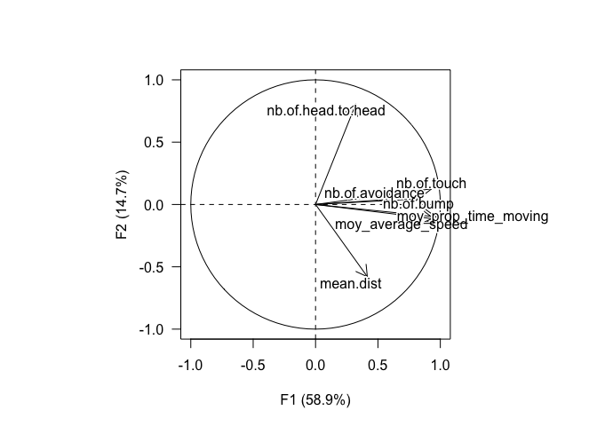<!-- -->

``` r
viz_individuals(
  x = X,
  extra_quali = df_pca_7$treatment,
  color = c("#4477AA", "#EE6677", "#528833", "#9477AA", "#AE6677", "#E28833"), 
  legend = list(x = "topright") ,
  ellipse = list(type = "tolerance", level = 0.95)
)
```

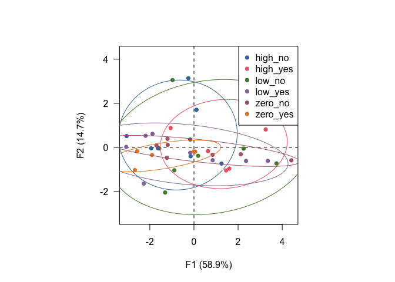<!-- -->

``` r
set.seed(67) 
# Data Preparation for Vegan
dist_matrix <- vegdist(stats_matrix, method = "euclidean")

# B. Check for Homogeneity of Dispersion (Betadisper) "Do some groups have more variable behavior than others?" If this is significant, the groups have different shapes/spreads.
dispersion_mod <- betadisper(dist_matrix,df_pca_7$treatment)

# Visualize the dispersion
plot(dispersion_mod, main = "Multivariate Dispersion (Betadisper)")
```

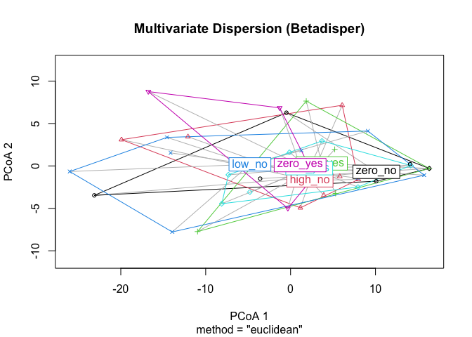<!-- -->

``` r
boxplot(dispersion_mod, main = "Distance to Centroid per Group")
```

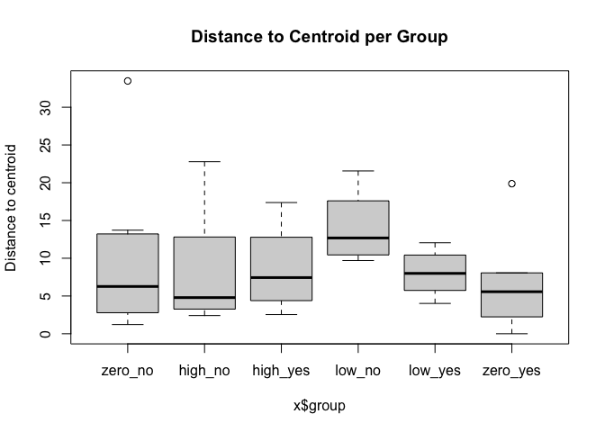<!-- -->

``` r
# BETADIASPER RESULT - Test significance of dispersion
permu_treat <- permutest(dispersion_mod, permutations = 10000)
permu_treat
```

    ## 
    ## Permutation test for homogeneity of multivariate dispersions
    ## Permutation: free
    ## Number of permutations: 10000
    ## 
    ## Response: Distances
    ##           Df  Sum Sq Mean Sq      F N.Perm Pr(>F)
    ## Groups     5  232.75  46.550 0.9563  10000 0.4577
    ## Residuals 36 1752.33  48.676

``` r
# C. PERMANOVA (Adonis2)
# This tests: "Are the centers of the groups significantly different?" Test 1: Simple effect of Treatment
ado_treat <- adonis2(dist_matrix ~ antibiotic*reinoculation, strata = df_pca_7$year, data = df_pca_7, method = "euclidean", permutations = 10000)
ado_treat
```

    ## Permutation test for adonis under reduced model
    ## Blocks:  strata 
    ## Permutation: free
    ## Number of permutations: 10000
    ## 
    ## adonis2(formula = dist_matrix ~ antibiotic * reinoculation, data = df_pca_7, permutations = 10000, method = "euclidean", strata = df_pca_7$year)
    ##          Df SumOfSqs      R2      F Pr(>F)
    ## Model     5    422.1 0.07316 0.5683 0.7622
    ## Residual 36   5348.0 0.92684              
    ## Total    41   5770.1 1.00000

``` r
ado_ant <- adonis2(dist_matrix ~ antibiotic, strata=df_pca_7$year, data = df_pca_7, method = "euclidean", permutations = 10000)
ado_ant
```

    ## Permutation test for adonis under reduced model
    ## Blocks:  strata 
    ## Permutation: free
    ## Number of permutations: 10000
    ## 
    ## adonis2(formula = dist_matrix ~ antibiotic, data = df_pca_7, permutations = 10000, method = "euclidean", strata = df_pca_7$year)
    ##          Df SumOfSqs      R2      F Pr(>F)
    ## Model     2     51.0 0.00883 0.1738 0.9409
    ## Residual 39   5719.1 0.99117              
    ## Total    41   5770.1 1.00000

``` r
ado_reino <- adonis2(dist_matrix ~ reinoculation, strata=df_pca_7$year, data = df_pca_7, method = "euclidean", permutations = 10000)
ado_reino
```

    ## Permutation test for adonis under reduced model
    ## Blocks:  strata 
    ## Permutation: free
    ## Number of permutations: 10000
    ## 
    ## adonis2(formula = dist_matrix ~ reinoculation, data = df_pca_7, permutations = 10000, method = "euclidean", strata = df_pca_7$year)
    ##          Df SumOfSqs      R2      F Pr(>F)
    ## Model     1     43.9 0.00761 0.3068 0.6885
    ## Residual 40   5726.2 0.99239              
    ## Total    41   5770.1 1.00000

### PCA on the PC1

``` r
#### extract the PC1
data3 <- df_pca_7[, !(names(df_pca_7) %in% c("year", "arena", "antibiotic", "reinoculation"))]
head(data3)
```

    ## # A tibble: 6 × 8
    ##   treatment moy_prop_time_moving moy_average_speed nb.of.bump nb.of.avoidance
    ##   <fct>                    <dbl>             <dbl>      <int>           <int>
    ## 1 low_yes                 0.271             0.549          24               0
    ## 2 low_no                  0.723             1.47           26               0
    ## 3 high_no                 0.334             0.622           5               0
    ## 4 high_yes                0.434             0.656          23               4
    ## 5 zero_no                 0.170             0.314           7               0
    ## 6 low_yes                 0.0343            0.0993          1               0
    ## # ℹ 3 more variables: nb.of.head.to.head <int>, nb.of.touch <int>,
    ## #   mean.dist <dbl>

``` r
X <- dimensio::pca(data3, center = TRUE, scale = TRUE, sup_quali = "treatment")
get_eigenvalues(X)
```

    ##    eigenvalues  variance cumulative
    ## F1   4.1146662 58.916257   58.91626
    ## F2   1.0278710 14.717673   73.63393
    ## F3   0.8245317 11.806140   85.44007
    ## F4   0.6559203  9.391861   94.83193
    ## F5   0.2275042  3.257541   98.08947
    ## F6   0.1334298  1.910528  100.00000

``` r
screeplot(X, cumulative = TRUE)
```

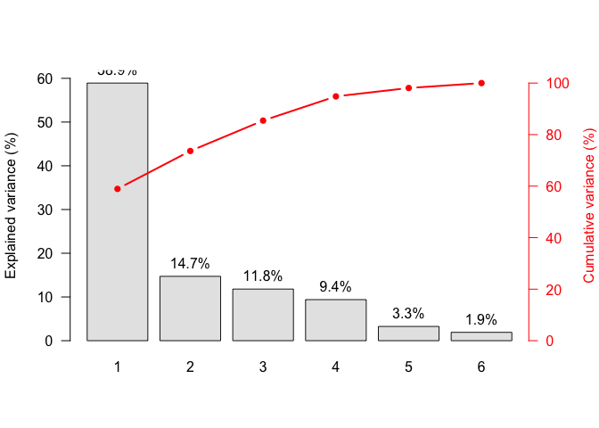<!-- -->

``` r
biplot(X, type = "form", labels = "variables")
```

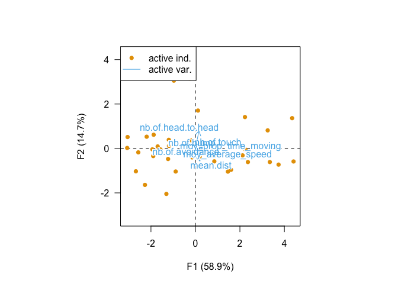<!-- -->

``` r
biplot(X, type = "covariance", labels = "variables")
```

<!-- -->

``` r
viz_variables(X)
```

<!-- -->

``` r
pca_scores <- get_coordinates(X)

combined_interaction_data <- pca_scores$F1

df_pca_7$combined <- combined_interaction_data
```

#### LMM on PC1

``` r
hist(df_pca_7$combined, breaks = 10)
```

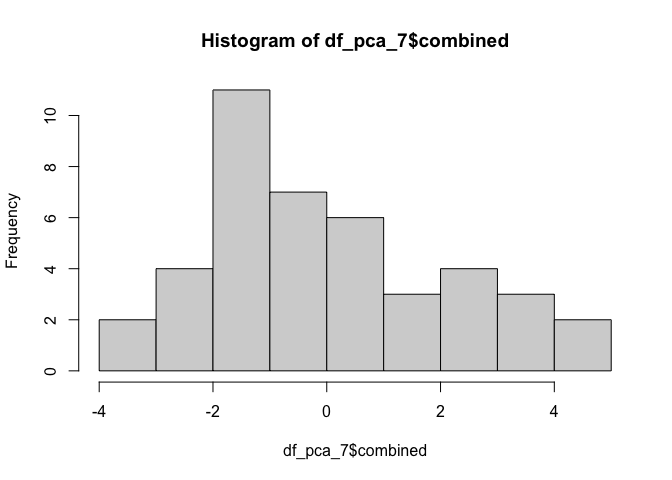<!-- -->

``` r
qqnorm(df_pca_7$combined)
```

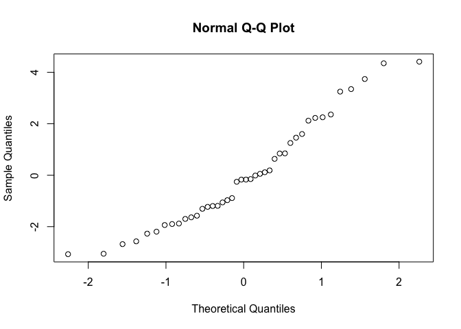<!-- -->

``` r
model_lmm <- lmer(combined ~ antibiotic * reinoculation + (1 | year), data = df_pca_7)

res <- simulateResiduals(model_lmm)
plot(res)
```

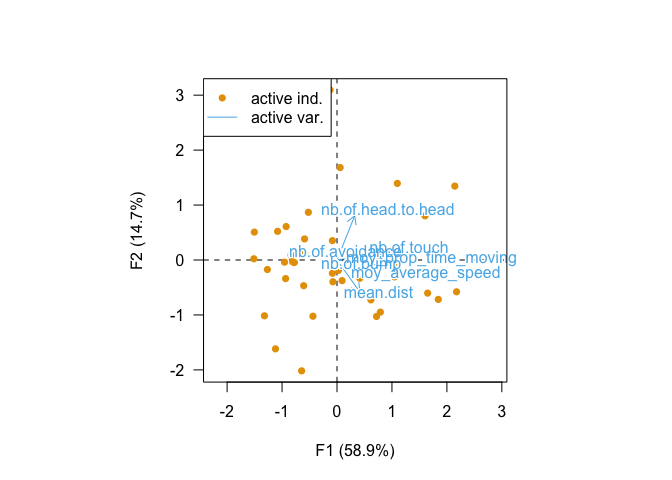<!-- -->

``` r
testDispersion(res)
```

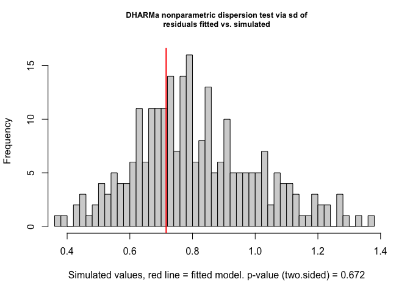<!-- -->

    ## 
    ##  DHARMa nonparametric dispersion test via sd of residuals fitted vs.
    ##  simulated
    ## 
    ## data:  simulationOutput
    ## dispersion = 0.88346, p-value = 0.672
    ## alternative hypothesis: two.sided

``` r
testUniformity(res) # This is the standard test for residual distribution
```

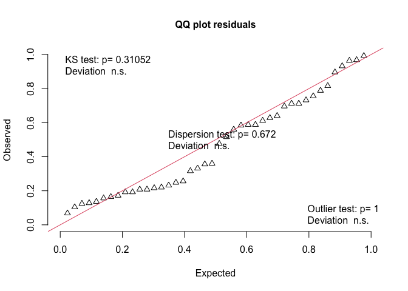<!-- -->

    ## 
    ##  Asymptotic one-sample Kolmogorov-Smirnov test
    ## 
    ## data:  simulationOutput$scaledResiduals
    ## D = 0.14876, p-value = 0.3105
    ## alternative hypothesis: two-sided

``` r
a1 <- Anova(model_lmm, type=3)
a1
```

    ## Analysis of Deviance Table (Type III Wald chisquare tests)
    ## 
    ## Response: combined
    ##                           Chisq Df Pr(>Chisq)  
    ## (Intercept)              0.0541  1    0.81602  
    ## antibiotic               1.0355  2    0.59586  
    ## reinoculation            0.0271  1    0.86931  
    ## antibiotic:reinoculation 6.8812  2    0.03205 *
    ## ---
    ## Signif. codes:  0 '***' 0.001 '**' 0.01 '*' 0.05 '.' 0.1 ' ' 1

``` r
emm <- emmeans(model_lmm, ~ antibiotic * reinoculation)
pairs(emm, by = "antibiotic")
```

    ## antibiotic = zero:
    ##  contrast estimate    SE   df t.ratio p.value
    ##  no - yes     1.32 1.180 35.8   1.117  0.2716
    ## 
    ## antibiotic = low:
    ##  contrast estimate    SE   df t.ratio p.value
    ##  no - yes     1.10 0.955 35.0   1.153  0.2567
    ## 
    ## antibiotic = high:
    ##  contrast estimate    SE   df t.ratio p.value
    ##  no - yes    -2.12 1.030 35.0  -2.054  0.0475
    ## 
    ## Degrees-of-freedom method: kenward-roger

``` r
pairs(emm, by = "reinoculation", adjust = "tukey")
```

    ## reinoculation = no:
    ##  contrast    estimate    SE   df t.ratio p.value
    ##  zero - low    -0.479 0.990 35.0  -0.484  0.8794
    ##  zero - high    0.974 0.990 35.0   0.984  0.5920
    ##  low - high     1.452 0.955 35.0   1.520  0.2938
    ## 
    ## reinoculation = yes:
    ##  contrast    estimate    SE   df t.ratio p.value
    ##  zero - low    -0.695 1.140 35.7  -0.611  0.8152
    ##  zero - high   -2.464 1.190 35.5  -2.065  0.1117
    ##  low - high    -1.769 1.030 35.0  -1.714  0.2144
    ## 
    ## Degrees-of-freedom method: kenward-roger 
    ## P value adjustment: tukey method for comparing a family of 3 estimates

### Visualisation

``` r
emm <- emmeans(model_lmm, ~ antibiotic * reinoculation)
all_pairwise <- pairs(emm)
emm_df <- as.data.frame(emm)

p1 <- ggplot() +
  # 1. Résultats du modèle LMM : Moustaches IC95 (En noir, fines)
  geom_errorbar(
    data = emm_df,
    aes(x = antibiotic, ymin = lower.CL, ymax = upper.CL, group = reinoculation),
    width = 0.1, 
    linewidth = 0.5,
    position = position_dodge(0.8)
  ) +
  # 2. Résultats du modèle LMM : Ligne horizontale pour la Moyenne prédite
  geom_errorbar(
    data = emm_df,
    aes(x = antibiotic, ymin = emmean, ymax = emmean, group = reinoculation),
    width = 0.5, 
    linewidth = 1.2,
    position = position_dodge(0.8)
  ) +
  # 3. Données brutes : Points individuels avec contour noir (style habituel)
  geom_point(
    data = df_pca_7, 
    aes(x = antibiotic, y = combined, fill = reinoculation), 
    shape = 21,            
    colour = "black",       
    stroke = 0.3,          
    alpha = 0.9, 
    size = 3.5, 
    position = position_jitterdodge(jitter.width = 0.37, dodge.width = 0.8, seed = 32)
  ) +
  # 4. Palette de couleurs et étiquettes épurées
  scale_fill_manual(
    values = c("no" = "#4F77B4", "yes" = "#FFBF00"),
    labels = c("No", "Yes")
  ) +
  scale_x_discrete(expand = expansion(mult = c(0.05, 0.05))) +
  # 5. Thème classique épuré (Cadre noir complet, pas de lignes d'axes)
  theme_classic() + 
  theme(
    panel.border = element_rect(color = "black", fill = NA, linewidth = 1),
    legend.position = "bottom",
    axis.text.x = element_text(margin = margin(t = 5))
  ) +
  labs(
    x = "Antibiotic dose",
    y = "PC1 value",
    fill = "Re-inoculation"   
  )

p1
```

<!-- -->

``` r
dir.create(
  path = here::here("activity-and-behavior", "result", "PCA_on_7metrics"), 
  showWarnings = FALSE, 
  recursive = TRUE
)

ggsave(
  filename = here::here("activity-and-behavior", "result", "PCA_on_7metrics", "PC1_Plot.pdf"), 
  plot = p1, 
  width = 9, 
  height = 5
)
```

# Save the result in a .txt file

``` r
sink(
  file = here::here("activity-and-behavior", "result", "PCA_on_7metrics", "pca_result.txt"), 
  split = TRUE
)

cat("=========================================================================\n")
```

    ## =========================================================================

``` r
cat("          MULTIVARIATE PCA (7 METRICS) & LMM ON PC1 RESULTS\n")
```

    ##           MULTIVARIATE PCA (7 METRICS) & LMM ON PC1 RESULTS

``` r
cat("=========================================================================\n\n")
```

    ## =========================================================================

``` r
cat("=====================================\n")
```

    ## =====================================

``` r
cat("--- 1. MULTIVARIATE DIMENSIONALITY ---\n")
```

    ## --- 1. MULTIVARIATE DIMENSIONALITY ---

``` r
cat("=====================================\n")
```

    ## =====================================

``` r
cat("\n[1A. Eigenvalues & Variance Explained]\n")
```

    ## 
    ## [1A. Eigenvalues & Variance Explained]

``` r
print(eig)
```

    ##    eigenvalues  variance cumulative
    ## F1   4.1146662 58.916257   58.91626
    ## F2   1.0278710 14.717673   73.63393
    ## F3   0.8245317 11.806140   85.44007
    ## F4   0.6559203  9.391861   94.83193
    ## F5   0.2275042  3.257541   98.08947
    ## F6   0.1334298  1.910528  100.00000

``` r
cat("\n=====================================\n")
```

    ## 
    ## =====================================

``` r
cat("--- 2. MULTIVARIATE DISPERSION & PERMANOVA ---\n")
```

    ## --- 2. MULTIVARIATE DISPERSION & PERMANOVA ---

``` r
cat("=====================================\n")
```

    ## =====================================

``` r
cat("\n[2A. Homogeneity of Multivariate Dispersions (Betadisper)]\n")
```

    ## 
    ## [2A. Homogeneity of Multivariate Dispersions (Betadisper)]

``` r
print(permu_treat)
```

    ## 
    ## Permutation test for homogeneity of multivariate dispersions
    ## Permutation: free
    ## Number of permutations: 10000
    ## 
    ## Response: Distances
    ##           Df  Sum Sq Mean Sq      F N.Perm Pr(>F)
    ## Groups     5  232.75  46.550 0.9563  10000 0.4577
    ## Residuals 36 1752.33  48.676

``` r
cat("\n[2B. Global PERMANOVA (Interaction antibiotic * reinoculation)]\n")
```

    ## 
    ## [2B. Global PERMANOVA (Interaction antibiotic * reinoculation)]

``` r
print(ado_treat)
```

    ## Permutation test for adonis under reduced model
    ## Blocks:  strata 
    ## Permutation: free
    ## Number of permutations: 10000
    ## 
    ## adonis2(formula = dist_matrix ~ antibiotic * reinoculation, data = df_pca_7, permutations = 10000, method = "euclidean", strata = df_pca_7$year)
    ##          Df SumOfSqs      R2      F Pr(>F)
    ## Model     5    422.1 0.07316 0.5683 0.7622
    ## Residual 36   5348.0 0.92684              
    ## Total    41   5770.1 1.00000

``` r
cat("\n[2C. PERMANOVA (Antibiotic Main Effect)]\n")
```

    ## 
    ## [2C. PERMANOVA (Antibiotic Main Effect)]

``` r
print(ado_ant)
```

    ## Permutation test for adonis under reduced model
    ## Blocks:  strata 
    ## Permutation: free
    ## Number of permutations: 10000
    ## 
    ## adonis2(formula = dist_matrix ~ antibiotic, data = df_pca_7, permutations = 10000, method = "euclidean", strata = df_pca_7$year)
    ##          Df SumOfSqs      R2      F Pr(>F)
    ## Model     2     51.0 0.00883 0.1738 0.9409
    ## Residual 39   5719.1 0.99117              
    ## Total    41   5770.1 1.00000

``` r
cat("\n[2D. PERMANOVA (Reinoculation Main Effect)]\n")
```

    ## 
    ## [2D. PERMANOVA (Reinoculation Main Effect)]

``` r
print(ado_reino)
```

    ## Permutation test for adonis under reduced model
    ## Blocks:  strata 
    ## Permutation: free
    ## Number of permutations: 10000
    ## 
    ## adonis2(formula = dist_matrix ~ reinoculation, data = df_pca_7, permutations = 10000, method = "euclidean", strata = df_pca_7$year)
    ##          Df SumOfSqs      R2      F Pr(>F)
    ## Model     1     43.9 0.00761 0.3068 0.6885
    ## Residual 40   5726.2 0.99239              
    ## Total    41   5770.1 1.00000

``` r
cat("\n=====================================\n")
```

    ## 
    ## =====================================

``` r
cat("--- 3. LINEAR MIXED MODEL (LMM) ON PC1 ---\n")
```

    ## --- 3. LINEAR MIXED MODEL (LMM) ON PC1 ---

``` r
cat("=====================================\n")
```

    ## =====================================

``` r
cat("\n[3A. Type III Wald Chisquare Tests (Anova)]\n")
```

    ## 
    ## [3A. Type III Wald Chisquare Tests (Anova)]

``` r
print(Anova(model_lmm, type = 3))
```

    ## Analysis of Deviance Table (Type III Wald chisquare tests)
    ## 
    ## Response: combined
    ##                           Chisq Df Pr(>Chisq)  
    ## (Intercept)              0.0541  1    0.81602  
    ## antibiotic               1.0355  2    0.59586  
    ## reinoculation            0.0271  1    0.86931  
    ## antibiotic:reinoculation 6.8812  2    0.03205 *
    ## ---
    ## Signif. codes:  0 '***' 0.001 '**' 0.01 '*' 0.05 '.' 0.1 ' ' 1

``` r
cat("\n[3B. Post-Hoc Breakdown: Reinoculation effect within each Antibiotic dose]\n")
```

    ## 
    ## [3B. Post-Hoc Breakdown: Reinoculation effect within each Antibiotic dose]

``` r
print(pairs(emm, by = "antibiotic"))
```

    ## antibiotic = zero:
    ##  contrast estimate    SE   df t.ratio p.value
    ##  no - yes     1.32 1.180 35.8   1.117  0.2716
    ## 
    ## antibiotic = low:
    ##  contrast estimate    SE   df t.ratio p.value
    ##  no - yes     1.10 0.955 35.0   1.153  0.2567
    ## 
    ## antibiotic = high:
    ##  contrast estimate    SE   df t.ratio p.value
    ##  no - yes    -2.12 1.030 35.0  -2.054  0.0475
    ## 
    ## Degrees-of-freedom method: kenward-roger

``` r
cat("\n[3C. Post-Hoc Breakdown: Antibiotic effect within each Reinoculation status]\n")
```

    ## 
    ## [3C. Post-Hoc Breakdown: Antibiotic effect within each Reinoculation status]

``` r
print(pairs(emm, by = "reinoculation", adjust = "tukey"))
```

    ## reinoculation = no:
    ##  contrast    estimate    SE   df t.ratio p.value
    ##  zero - low    -0.479 0.990 35.0  -0.484  0.8794
    ##  zero - high    0.974 0.990 35.0   0.984  0.5920
    ##  low - high     1.452 0.955 35.0   1.520  0.2938
    ## 
    ## reinoculation = yes:
    ##  contrast    estimate    SE   df t.ratio p.value
    ##  zero - low    -0.695 1.140 35.7  -0.611  0.8152
    ##  zero - high   -2.464 1.190 35.5  -2.065  0.1117
    ##  low - high    -1.769 1.030 35.0  -1.714  0.2144
    ## 
    ## Degrees-of-freedom method: kenward-roger 
    ## P value adjustment: tukey method for comparing a family of 3 estimates

``` r
cat("\n[3D. All Pairwise Comparisons]\n")
```

    ## 
    ## [3D. All Pairwise Comparisons]

``` r
print(all_pairwise)
```

    ##  contrast            estimate    SE   df t.ratio p.value
    ##  zero no - low no      -0.479 0.990 35.0  -0.484  0.9964
    ##  zero no - high no      0.974 0.990 35.0   0.984  0.9201
    ##  zero no - zero yes     1.318 1.180 35.8   1.117  0.8713
    ##  zero no - low yes      0.623 0.990 35.0   0.629  0.9880
    ##  zero no - high yes    -1.147 1.070 35.1  -1.076  0.8878
    ##  low no - high no       1.452 0.955 35.0   1.520  0.6538
    ##  low no - zero yes      1.796 1.140 35.7   1.579  0.6171
    ##  low no - low yes       1.101 0.955 35.0   1.153  0.8555
    ##  low no - high yes     -0.668 1.030 35.0  -0.647  0.9864
    ##  high no - zero yes     0.344 1.140 35.7   0.302  0.9996
    ##  high no - low yes     -0.351 0.955 35.0  -0.367  0.9990
    ##  high no - high yes    -2.120 1.030 35.0  -2.054  0.3342
    ##  zero yes - low yes    -0.695 1.140 35.7  -0.611  0.9895
    ##  zero yes - high yes   -2.464 1.190 35.5  -2.065  0.3279
    ##  low yes - high yes    -1.769 1.030 35.0  -1.714  0.5323
    ## 
    ## Degrees-of-freedom method: kenward-roger 
    ## P value adjustment: tukey method for comparing a family of 6 estimates

``` r
sink()
```
